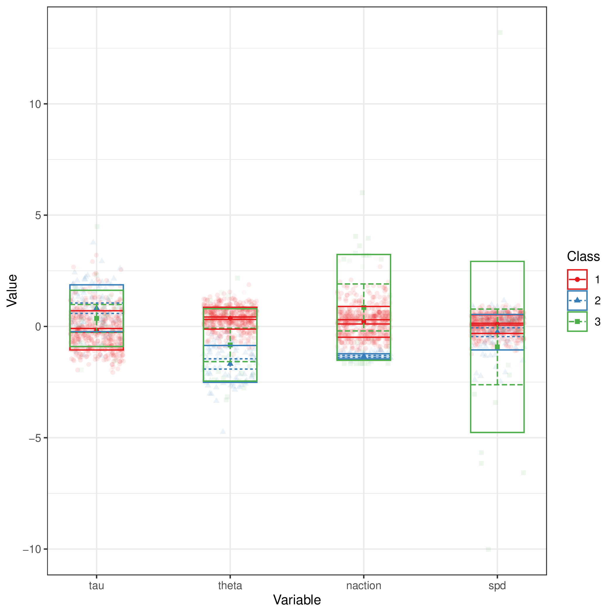
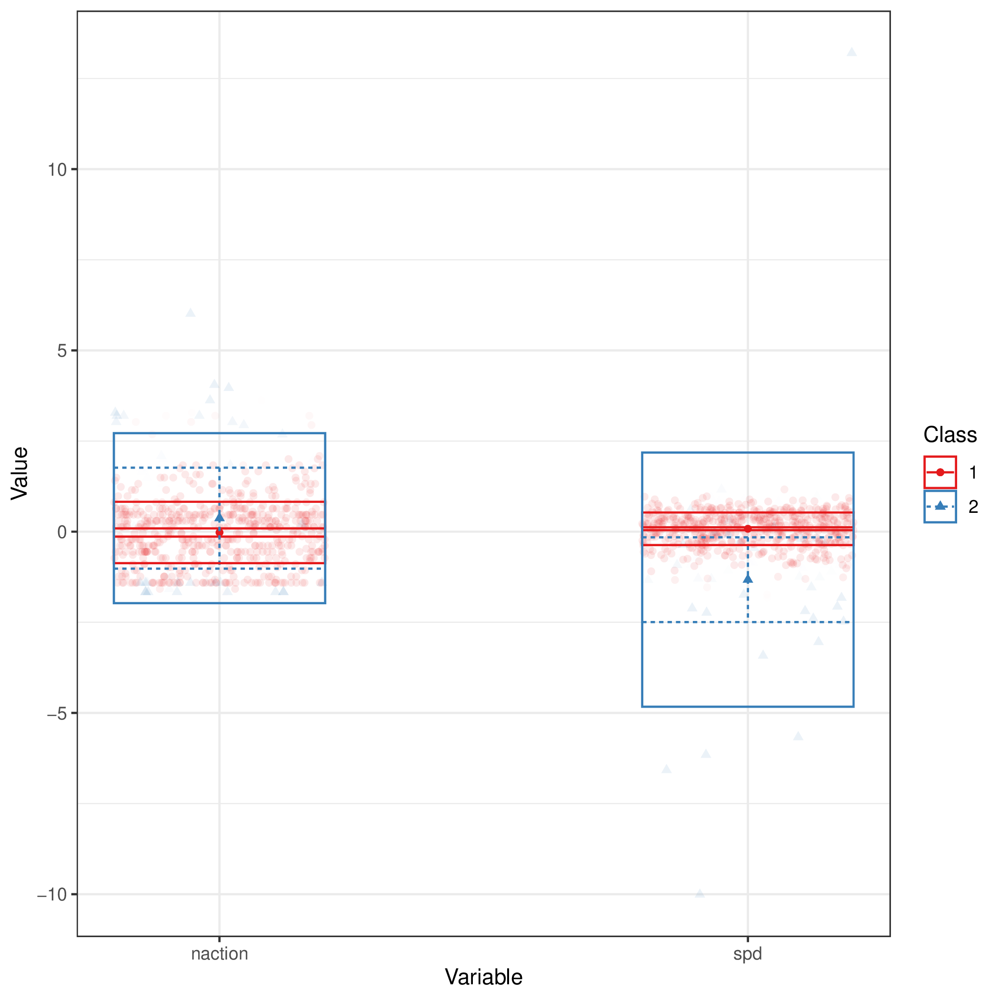

+++
title = "book_order"
author = ["Jonghyun Yun"]
lastmod = 2021-12-21T14:54:20-06:00
draft = false
weight = 3
chapter = true
+++

Table of Contents

- [collocations](#collocations)
- [visual clusters](#visual-clusters)

<!--endtoc-->

# collocations {#collocations}

## Class  3

|bigram                                                                                                      | likelihood_ratio|
|:-----------------------------------------------------------------------------------------------------------|----------------:|
|('TEXTLINK-pg1_txt7.href=u07_pg1_popup1.target=popup', 'BUTTON_close-popup1_txt2')                          |        208.86637|
|('CHECK_pg7-pg7_txt4', 'BUTTON_close-popup4_txt3')                                                          |        195.79144|
|('TEXTLINK-default_txt18.href=unit7page7.target=self', 'CHECK_pg7-pg7_txt4')                                |        164.30067|
|('TEXTLINK-default_txt9.href=unit7page3.target=self', 'TEXTLINK-pg3_txt5.href=unit7page8.target=self')      |        157.00750|
|('TEXTLINK-default_txt3.href=unit7page1.target=self', 'TEXTLINK-pg1_txt7.href=u07_pg1_popup1.target=popup') |        151.54740|
|('TEXTLINK-pg6_txt12.href=u07_pg6_popup3.target=popup', 'BUTTON_close-popup3_txt2')                         |        142.00070|
|('TOOLBAR_back-toolbar_back_btn', 'TEXTLINK-default_txt12.href=unit7page4.target=self')                     |        126.70172|
|('BUYNOW_pg4-pg4_txt11', 'BUYBOOK_pg4_ok-pg4_pu6_okbtn')                                                    |        118.39287|
|('TOOLBAR_back-toolbar_back_btn', 'TEXTLINK-default_txt9.href=unit7page3.target=self')                      |        114.73986|
|('BUYBOOK_pg4_ok-pg4_pu6_okbtn', 'NEXT_INQUIRY-REQUEST')                                                    |         87.20094|
## Class  2

|bigram                                                                         | likelihood_ratio|
|:------------------------------------------------------------------------------|----------------:|
|('BUYNOW_pg7-pg7_txt19', 'BUYBOOK_pg7_ok-pg7_pu6_okbtn')                       |        207.41883|
|('TEXTLINK-default_txt18.href=unit7page7.target=self', 'BUYNOW_pg7-pg7_txt19') |        188.35084|
|('BUYNOW_pg1-pg1_txt8', 'BUYBOOK_pg1_ok-pg1_pu6_okbtn')                        |        186.42648|
|('BUYNOW_pg3-pg3_txt4', 'BUYBOOK_pg3_ok-pg3_pu6_okbtn')                        |        175.03323|
|('TEXTLINK-default_txt3.href=unit7page1.target=self', 'BUYNOW_pg1-pg1_txt8')   |        167.84040|
|('TEXTLINK-default_txt9.href=unit7page3.target=self', 'BUYNOW_pg3-pg3_txt4')   |        131.17740|
|('BUYBOOK_pg7_ok-pg7_pu6_okbtn', 'NEXT_INQUIRY-REQUEST')                       |         98.52990|
|('BUYNOW_pg4-pg4_txt11', 'BUYBOOK_pg4_ok-pg4_pu6_okbtn')                       |         94.84852|
|('TEXTLINK-default_txt12.href=unit7page4.target=self', 'BUYNOW_pg4-pg4_txt11') |         94.84852|
|('BUYBOOK_pg1_ok-pg1_pu6_okbtn', 'NEXT_INQUIRY-REQUEST')                       |         90.13419|
## Class  1

|bigram                                                                                                      | likelihood_ratio|
|:-----------------------------------------------------------------------------------------------------------|----------------:|
|('BUYNOW_pg4-pg4_txt11', 'BUYBOOK_pg4_ok-pg4_pu6_okbtn')                                                    |         2993.405|
|('TEXTLINK-pg1_txt7.href=u07_pg1_popup1.target=popup', 'BUTTON_close-popup1_txt2')                          |         2772.062|
|('CHECK_pg7-pg7_txt4', 'BUTTON_close-popup4_txt3')                                                          |         2701.893|
|('TEXTLINK-default_txt9.href=unit7page3.target=self', 'TEXTLINK-pg3_txt5.href=unit7page8.target=self')      |         2658.989|
|('BUYBOOK_pg4_ok-pg4_pu6_okbtn', 'NEXT_INQUIRY-REQUEST')                                                    |         2609.485|
|('TEXTLINK-default_txt18.href=unit7page7.target=self', 'CHECK_pg7-pg7_txt4')                                |         2227.420|
|('TEXTLINK-default_txt3.href=unit7page1.target=self', 'TEXTLINK-pg1_txt7.href=u07_pg1_popup1.target=popup') |         2219.096|
|('TOOLBAR_back-toolbar_back_btn', 'TEXTLINK-default_txt12.href=unit7page4.target=self')                     |         2146.316|
|('TOOLBAR_back-toolbar_back_btn', 'TOOLBAR_back-toolbar_back_btn')                                          |         1956.254|
|('TEXTLINK-pg3_txt5.href=unit7page8.target=self', 'TOOLBAR_back-toolbar_back_btn')                          |         1230.032|

# visual clusters {#visual-clusters}



Response: the larger, the better

### w/ tau and theta

|          tau|        theta|      naction|          spd|         res|             n|
|------------:|------------:|------------:|------------:|-----------:|-------------:|
| -0.18 (0.88)|  0.37 (0.49)|  0.21 (0.68)|  0.11 (0.42)| 2.27 (2.45)| 450.00 (0.00)|
|  0.83 (1.06)| -1.67 (0.83)| -1.34 (0.12)| -0.25 (0.80)| 6.32 (1.92)|  88.00 (0.00)|
|  0.31 (1.32)| -0.79 (1.73)|  0.95 (2.48)| -0.96 (3.97)| 4.23 (3.05)|  26.00 (0.00)|

### w/o tau and theta

|      naction|          spd|      CPROB1|      CPROB2|         res|             n|
|------------:|------------:|-----------:|-----------:|-----------:|-------------:|
| -0.04 (0.83)|  0.08 (0.45)| 0.99 (0.03)| 0.01 (0.03)| 2.91 (2.80)| 535.00 (0.00)|
|  0.73 (2.54)| -1.45 (3.73)| 0.11 (0.16)| 0.89 (0.16)| 4.52 (3.01)|  29.00 (0.00)|
