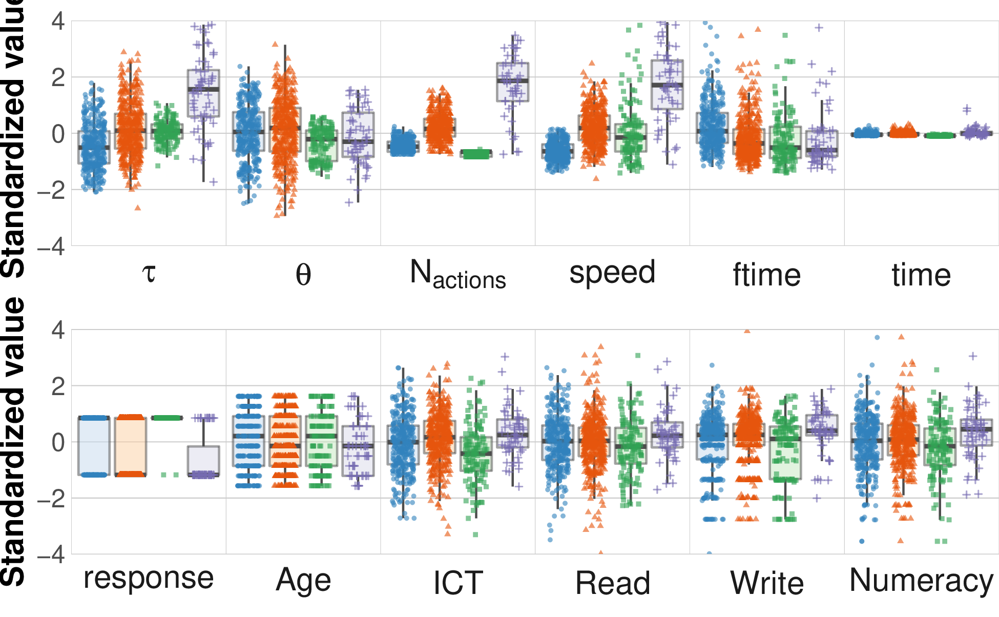
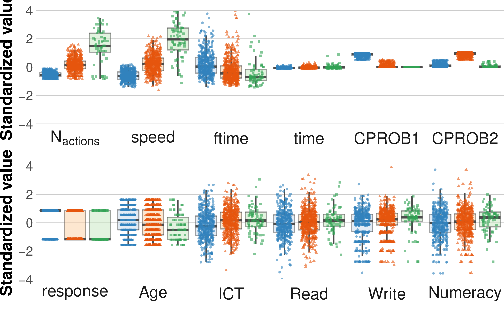

+++
title = "cd_tally"
author = ["Jonghyun Yun"]
lastmod = 2021-12-23T15:03:39-06:00
draft = false
weight = 3
chapter = true
+++

<div class="ox-hugo-toc toc">
<div></div>

<div class="heading">Table of Contents</div>

- [collocations](#collocations)
- [visualise cluster](#visualise-cluster)
- [response](#response)

</div>
<!--endtoc-->


# collocations {#collocations}


# visualise cluster {#visualise-cluster}

```sh
cd $out_dir
cd figure
convert -density 300 lpa_box_all_3.pdf lpa_box_all_3.png
convert -density 300 lpa_box_all_2.pdf lpa_box_all_2.png
```




```sh
cd $out_dir/figure;
convert -density 300 lpa_vio_all_3.pdf lpa_vio_all_3.png;
convert -density 300 lpa_vio_all_2.pdf lpa_vio_all_2.png;
```

```emacs-lisp
(concat
  (format "[[file:%s]]\n" (concat out_dir "/figure/lpa_vio_all_2.png"))
  (format "[[file:%s]]\n" (concat out_dir "/figure/lpa_vio_all_3.png")))
```




# response {#response}


### w/ tau and theta


|          tau|        theta|      naction|          spd|     AGEG5LFS|             n|
|------------:|------------:|------------:|------------:|------------:|-------------:|
|  1.01 (1.39)| -0.40 (0.91)|  1.06 (1.57)|  0.66 (1.06)| -0.19 (1.07)| 181.00 (0.00)|
| -0.69 (0.50)|  0.30 (0.89)|  0.32 (0.49)| -0.18 (0.71)|  0.15 (0.98)| 270.00 (0.00)|
|  0.18 (0.57)|  0.66 (0.34)| -0.30 (0.24)|  0.55 (0.70)| -0.33 (0.89)| 304.00 (0.00)|
| -0.25 (0.75)| -0.96 (0.94)| -0.86 (0.33)| -1.11 (0.44)|  0.44 (0.91)| 215.00 (0.00)|

### w/o tau and theta


|      naction|          spd|      CPROB1|      CPROB2|     AGEG5LFS|             n|
|------------:|------------:|-----------:|-----------:|------------:|-------------:|
|  2.61 (1.42)|  1.00 (1.26)| 0.91 (0.15)| 0.09 (0.15)|  0.02 (1.00)|  69.00 (0.00)|
|  0.27 (0.48)|  0.25 (0.84)| 0.06 (0.08)| 0.88 (0.13)| -0.10 (1.04)| 429.00 (0.00)|
| -0.43 (0.11)|  0.06 (0.78)| 0.01 (0.01)| 0.26 (0.07)| -0.08 (0.94)| 321.00 (0.00)|
| -1.05 (0.21)| -1.29 (0.35)| 0.00 (0.00)| 0.07 (0.09)|  0.46 (0.89)| 151.00 (0.00)|
