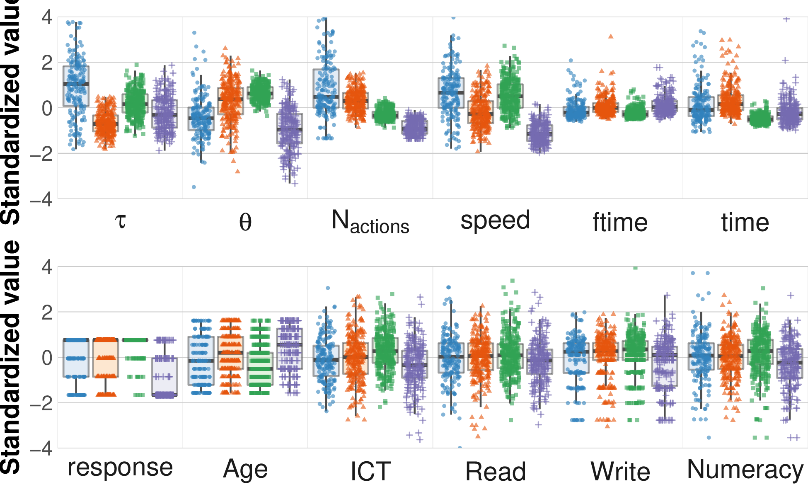

+++
title = "party_invitations-1"
author = ["Jonghyun Yun"]
lastmod = 2021-12-23T15:03:39-06:00
draft = false
weight = 3
chapter = true
+++

<div class="ox-hugo-toc toc">
<div></div>

<div class="heading">Table of Contents</div>

- [collocation](#collocation)
- [visual cluster](#visual-cluster)
- [response](#response)
- [archive](#archive)

</div>
<!--endtoc-->


# collocation {#collocation}

## Class  1


|bigram                                                                                                                                                                                                           | likelihood_ratio|
|:----------------------------------------------------------------------------------------------------------------------------------------------------------------------------------------------------------------|----------------:|
|('FOLDER_VIEWED-PartyFolder', 'FOLDER_VIEWED-CanComeFolder')                                                                                                                                                     |        17.688138|
|('MAIL_DRAG-item202', 'FOLDER_VIEWED-undefined')                                                                                                                                                                 |        17.282805|
|('NEXT_INQUIRY-REQUEST', 'END_CANCEL-endtask_txt4')                                                                                                                                                              |        13.154464|
|('TEXTBOX_ONFOCUS-endtask_txt2.value=Are_you_sure_you_want_to_continue_to_the_next_part_of_this_task?', 'TEXTBOX_KILLFOCUS-endtask_txt2.value=Are_you_sure_you_want_to_continue_to_the_next_part_of_this_task?') |        12.467555|
|('MAIL_VIEWED-item102', 'MAIL_DRAG-item102')                                                                                                                                                                     |        11.986592|
|('FOLDER_VIEWED-PartyFolder', 'MAIL_MOVED-item104.PartyFolder')                                                                                                                                                  |        10.989428|
|('FOLDER_VIEWED-SentFolder', 'FOLDER_VIEWED-InboxFolder')                                                                                                                                                        |         9.941930|
|('FOLDER_VIEWED-TrashFolder', 'MAIL_DRAG-item301')                                                                                                                                                               |         9.694967|
|('MAIL_MOVED-item102.CanComeFolder', 'MAIL_VIEWED-item201')                                                                                                                                                      |         9.694967|
|('MAIL_DRAG-item104', 'FOLDER_VIEWED-undefined')                                                                                                                                                                 |         9.653278|
## Class  2


|bigram                                                                    | likelihood_ratio|
|:-------------------------------------------------------------------------|----------------:|
|('FOLDER_VIEWED-CannotComeFolder', 'MAIL_MOVED-item102.CannotComeFolder') |        2502.6131|
|('FOLDER_VIEWED-CanComeFolder', 'MAIL_MOVED-item101.CanComeFolder')       |        1968.2782|
|('FOLDER_VIEWED-CanComeFolder', 'MAIL_MOVED-item104.CanComeFolder')       |        1873.9550|
|('MAIL_VIEWED-item102', 'MAIL_DRAG-item102')                              |        1486.8755|
|('MAIL_DRAG-item104', 'FOLDER_VIEWED-CanComeFolder')                      |         718.7690|
|('MAIL_MOVED-item104.CanComeFolder', 'MAIL_VIEWED-item105')               |         672.6594|
|('MAIL_VIEWED-item104', 'MAIL_DRAG-item104')                              |         580.9381|
|('MAIL_MOVED-item101.CanComeFolder', 'MAIL_DRAG-item104')                 |         462.8913|
|('MAIL_DRAG-item102', 'FOLDER_VIEWED-CannotComeFolder')                   |         448.0094|
|('MAIL_VIEWED-item201', 'MAIL_VIEWED-item202')                            |         436.9725|
## Class  3


|bigram                                                                    | likelihood_ratio|
|:-------------------------------------------------------------------------|----------------:|
|('NEXT_INQUIRY-REQUEST', 'END_CANCEL-endtask_txt4')                       |         556.4045|
|('FOLDER_VIEWED-CanComeFolder', 'MAIL_MOVED-item101.CanComeFolder')       |         443.5316|
|('FOLDER_VIEWED-CannotComeFolder', 'MAIL_MOVED-item102.CannotComeFolder') |         396.8755|
|('FOLDER_VIEWED-CanComeFolder', 'MAIL_MOVED-item104.CanComeFolder')       |         358.4323|
|('MAIL_VIEWED-item102', 'MAIL_DRAG-item102')                              |         324.5675|
|('FOLDER_VIEWED-CannotComeFolder', 'MAIL_VIEWED-item301')                 |         289.3671|
|('FOLDER_VIEWED-CanComeFolder', 'MAIL_VIEWED-item201')                    |         167.4030|
|('FOLDER_VIEWED-CanComeFolder', 'MOVE_FOLDER_ok-moveValidation')          |         147.3766|
|('MAIL_VIEWED-item103', 'MAIL_VIEWED-item104')                            |         140.9344|
|('FOLDER_VIEWED-CanComeFolder', 'FOLDER_VIEWED-CanComeFolder')            |         129.5768|
## Class  4


|bigram                                                                    | likelihood_ratio|
|:-------------------------------------------------------------------------|----------------:|
|('FOLDER_VIEWED-CanComeFolder', 'MAIL_MOVED-item101.CanComeFolder')       |         893.0519|
|('FOLDER_VIEWED-CannotComeFolder', 'MAIL_MOVED-item102.CannotComeFolder') |         753.8523|
|('NEXT_INQUIRY-REQUEST', 'END_CANCEL-endtask_txt4')                       |         499.8053|
|('FOLDER_VIEWED-CanComeFolder', 'MAIL_MOVED-item104.CanComeFolder')       |         485.6045|
|('MAIL_VIEWED-item102', 'MAIL_DRAG-item102')                              |         465.2566|
|('FOLDER_VIEWED-TrashFolder', 'MAIL_MOVED-item103.target=TrashFolder')    |         372.2541|
|('FOLDER_VIEWED-CannotComeFolder', 'MAIL_VIEWED-item301')                 |         340.5003|
|('FOLDER_VIEWED-TrashFolder', 'MAIL_MOVED-item105.target=TrashFolder')    |         328.1632|
|('FOLDER_VIEWED-InboxFolder', 'MAIL_MOVED-item103.InboxFolder')           |         289.7540|
|('FOLDER_VIEWED-CannotComeFolder', 'MAIL_MOVED-item301.CannotComeFolder') |         279.3375|


# visual cluster {#visual-cluster}

```sh
cd $out_dir
cd figure
convert -density 300 lpa_box_all_3.pdf lpa_box_all_3.png
convert -density 300 lpa_box_all_2.pdf lpa_box_all_2.png
```




```sh
cd $out_dir/figure;
convert -density 300 lpa_vio_all_3.pdf lpa_vio_all_3.png;
convert -density 300 lpa_vio_all_2.pdf lpa_vio_all_2.png;
```

```emacs-lisp
(concat
  (format "[[file:%s]]\n" (concat out_dir "/figure/lpa_vio_all_2.png"))
  (format "[[file:%s]]\n" (concat out_dir "/figure/lpa_vio_all_3.png")))
```




# response {#response}

Response: the larger, the better


### w/ tau and theta


|          tau|        theta|      naction|          spd|     AGEG5LFS|             n|
|------------:|------------:|------------:|------------:|------------:|-------------:|
|  1.01 (1.39)| -0.40 (0.91)|  1.06 (1.57)|  0.66 (1.06)| -0.19 (1.07)| 181.00 (0.00)|
| -0.69 (0.50)|  0.30 (0.89)|  0.32 (0.49)| -0.18 (0.71)|  0.15 (0.98)| 270.00 (0.00)|
|  0.18 (0.57)|  0.66 (0.34)| -0.30 (0.24)|  0.55 (0.70)| -0.33 (0.89)| 304.00 (0.00)|
| -0.25 (0.75)| -0.96 (0.94)| -0.86 (0.33)| -1.11 (0.44)|  0.44 (0.91)| 215.00 (0.00)|

### w/o tau and theta


|      naction|          spd|      CPROB1|      CPROB2|     AGEG5LFS|             n|
|------------:|------------:|-----------:|-----------:|------------:|-------------:|
|  2.61 (1.42)|  1.00 (1.26)| 0.91 (0.15)| 0.09 (0.15)|  0.02 (1.00)|  69.00 (0.00)|
|  0.27 (0.48)|  0.25 (0.84)| 0.06 (0.08)| 0.88 (0.13)| -0.10 (1.04)| 429.00 (0.00)|
| -0.43 (0.11)|  0.06 (0.78)| 0.01 (0.01)| 0.26 (0.07)| -0.08 (0.94)| 321.00 (0.00)|
| -1.05 (0.21)| -1.29 (0.35)| 0.00 (0.00)| 0.07 (0.09)|  0.46 (0.89)| 151.00 (0.00)|


# archive {#archive}




```sh
out_dir="party_invitations-1/"
cd $out_dir
cd figure
convert -density 300 lpa_box4.pdf lpa_box4.png
convert -density 300 lpa_box_back.pdf lpa_box_back.png
```


