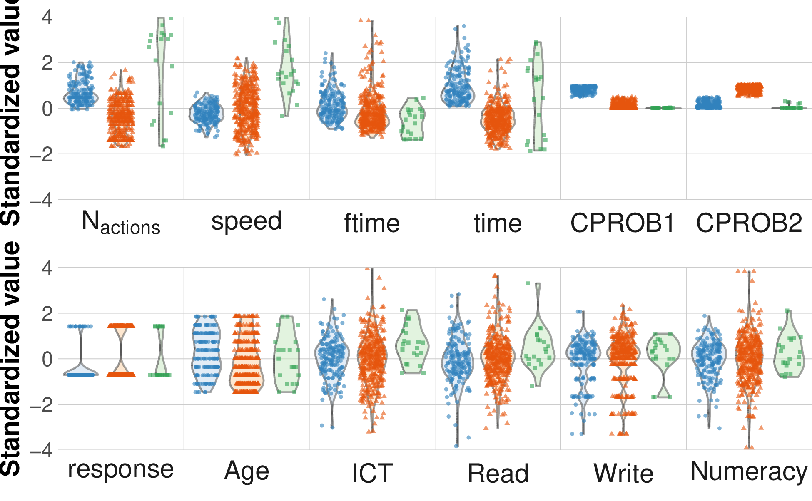

+++
title = "Draft"
author = ["Jonghyun Yun"]
lastmod = 2022-07-21T16:17:18-05:00
draft = false
weight = 30
chapter = false
+++

Table of Contents

- [Introduction](#introduction)
    - [what's process data](#what-s-process-data)
    - [Benefits of process data](#benefits-of-process-data)
    - [Challenges](#challenges)
    - [Exisitng methods and limitations](#exisitng-methods-and-limitations)
    - [Motivation and our Aim](#motivation-and-our-aim)
    - [Advantages of the proposed method](#advantages-of-the-proposed-method)
    - [paper org.](#paper-org-dot)
- [Motivating example](#motivating-example)
    - [Intro - PIACC-PSTRE](#intro-piacc-pstre)
    - [Specific item - Tickets](#specific-item-tickets)
        - [Illustrate a ticket example:](#illustrate-a-ticket-example)
        - [address challenges in details](#address-challenges-in-details)
        - [Questions we like to answer (from Dr. Jeon's proposal)](#questions-we-like-to-answer--from-dr-dot-jeon-s-proposal----posts-dot-org)
- [Methods](#methods)
    - [notations](#notations)
    - [Action embedding](#action-embedding)
    - [data structure](#data-structure)
    - [Multistate model (general)](#multistate-model--general)
    - [Multistate model (intercept only)](#multistate-model--intercept-only)
- [Estimation](#estimation)
    - [software](#software)
    - [likelihood](#likelihood)
    - [prior](#prior)
    - [update \\(\kappa\_{m}\\):](#update-kappa-m)
    - [update \\(\tau\_{k}\\)](#update-tau-k)
    - [update \\(\theta\_{k}\\)](#update-theta-k)
    - [update \\(\sigma^{2}\\)](#update-sigma-2)
- [Applications](#applications)
    - [cd\_tally](#cd-tally)
        - [collocations (4 < 2 < 1 < 3): with &tau; and &theta;](#collocations--4-2-1-3--with-and-tau-and-and-theta)
        - [collocations (3 < 2 < 1): with NO &tau; and &theta;](#collocations--3-2-1--with-no-and-tau-and-and-theta)
        - [visualise cluster](#visualise-cluster)
            - [cluster boxplots](#cluster-boxplots)
            - [cluster violins](#cluster-violins)
        - [response](#response)
    - [book\_order](#book-order)
        - [collocations (1 < 2 < 4 < 3): with &tau; and &theta;](#collocations--1-2-4-3--with-and-tau-and-and-theta)
        - [collocations (1 < 3 < 2): with NO &tau; and &theta;](#collocations--1-3-2--with-no-and-tau-and-and-theta)
        - [visual clusters](#visual-clusters)
            - [cluster boxplots](#cluster-boxplots)
            - [cluster violins](#cluster-violins)
        - [response](#response)
- [Discussion](#discussion)
- [References](#references)

<!--endtoc-->

[NEAP proposal](~/Dropbox/research/procmod/ies_naep/main.tex)

# Introduction {#introduction}

%%% stolen from the neap proposal

## what's process data {#what-s-process-data}

%Advances in technology have expanded opportunities for educational measurement through changes to item design, item delivery and data collection. Some examples include simulation-, scenario-, and game-based assessment and learning environments.

The NAEP computerized testing format provides an interactive environment for students.
Students can choose among a set of available actions and take one or more steps to finish a task. All student actions are automatically recorded in system log (Kerr, Chung, \\& Iseli, 2011), which can be used immediately for providing instant feedback to students
for diagnostic and scoring purposes (DiCerbo \\& Behrens, 2014).

## Benefits of process data {#benefits-of-process-data}

The availability of process data open new research opportunities including to better understand test-takers' behavior patterns, ..., and ....

## Challenges {#challenges}

While the availability of rich response process data during problem solving comes the great challenge of building appropriate psychometric models to analyze these data. The raw process data are usually formatted as lines of coded and time-stamped strings. The variable length of the process and the sparsity of the process remain challenging to the quantitative model development.
The vast amount of data on students' potential trial-and-error process makes it less than straightforward to detect patterns in problem solving.

## Exisitng methods and limitations {#exisitng-methods-and-limitations}

Several data analysis techniques and models have been explored to uncover problem-solving patterns. For example, researchers used methods such as cluster analysis <&bergner_visualization_2014> and editing distance <&zhu_using_2016>.
Other researchers explored the method of combining Markov movesl and item response theory (IRT) framework. Process mining techniques such as Petri net were also used to study behavioral patterns <&howard_reflecting_2010>
In addition, researchers used digraphs to visualize and analyze sequential process data collected from assessment.
<&zhu_using_2016> used network visualization and analysis for understanding process data.

-   <&chen_statistical_2019>
-   <&chen_continuous-time_2020> Markov decision process, a human expert needs to score utilities of actions.
-   <&tang_latent_2019> MDS usgin the dissimlarity of actions sequences
-   <&he_identifying_2015>
-   Graph model to cluster action sequences <&ulitzsch_combining_2021>

<&qiao_data_2018>
<&wang_subtask_2020>

-   recurrent neural network to encode action sequences to fixed sized vectors. <&tang_exploratory_2019>

n-gram
<&van_der_ark_identifying_2015>

## Motivation and our Aim {#motivation-and-our-aim}

Students' response outcomes are a result of a sequence of actions that they take.
The quality as well as quantity of actions vary across individuals as well as across items.
Understanding the action sequence and its relation to response outcomes will help us better understand the nature of response process and individual differences in the process.
Models that relate process data to process outcomes are rare in the current literature.

We propose to develop a new, network modeling framework for analyzing time-stamped sequences of actions taken by NAEP test takers. The innovative aspect of our proposal is that we view test takers’ sequences of actions collected in the computer-assisted NAEP assessment system as directed paths between actions in a network of possible actions.  With our framework, researchers and policymakers can quantify and better understand how learners with disabilities process mathematics test items.

We have successfully collaborated to develop novel network-based modeling approaches for analyzing conventional assessment data on two papers (Jin \\& Jeon, 2018; Jeon, Jin, Schweinberger, \\& Baugh, 2020), with more papers in the pipeline. We will extend this model-based framework for analyzing NAEP process data. Since the number of possible actions is large and many test takers will choose a small subset of the possible actions, the data is sparse. To deal with the sparsity of the data, we use machine learning techniques. These machine learning techniques penalize models that are more complex than warranted by the data.

## Advantages of the proposed method {#advantages-of-the-proposed-method}

Advantage I. An important advantage of our network-based approach is the introduction of a virtual, two-dimensional Euclidean map of the interplay between actions for different test takers. This interactive map could offer substantially enhanced insights into how and why learners with and without disabilities are different in their response behavior on the current NAEP mathematics assessment.

Advantage II. A second advantage of our network-based approach is that we can easily link the network of actions with test takers’ mathematics performance outcomes, their background information, as well as any technical accommodations they utilized during the test, which allows educators to identify which accommodations might be more effective than others in helping learners with disabilities to display their full ability within the digitalized NAEP assessment environment.

## paper org. {#paper-org-dot}

We first develop xxx. We further develop xxx. The
remainder of this article is organized as follows.
In Section, we introduce . In Section , we present. Applications are given in
Section, followed by conclusions given in
Section.
x

# Motivating example {#motivating-example}

## Intro - PIACC-PSTRE {#intro-piacc-pstre}

Interactive tasks as implemented in the problem solving in a technology-rich
environment (PSTRE) domain in the Programme for the International Assessment of
Adult Competencies (PIAAC, <&oecd_technical_2019>) assesses the
proficiency of adults in key information-processing skills - literacy, numeracy
and problem solving. During the PIAAC assessement, user interactions were logged
automatically. This means that most of the users’ actions within the assessment
tool were recorded and stored with time stamps in separate files called log
files.

Th survey of adult skills (PIAAC) log data has been downloaded from <https://piaac-logdata.tba-hosting.de/>

## Specific item - Tickets {#specific-item-tickets}

% stolen from <&chen_statistical_2019>
We introduce a specific item, Ticket Reservation (Tickets), to demonstrate the data structure and to motivate our research questions.

### Illustrate a ticket example: {#illustrate-a-ticket-example}



This  item  involves  a  scenario  in  which  the respondent  is asked to reserve all fooball game tickets that an entire group can attend. A group of friend provides thier availabilities via an online calendar. Respondents  access  and  evaluate  information from ticket-reservation web pages and online calendars in simulated web environment. Respondents are able to:

-   Click on tabs for ticket reservation web pages and online calendar;
-   Click on checkboxes to choose game dates;
-   Manipulate drop-down menus for events, locations, and number of tikcets; and
-   Click on menu items or navigation icons.

  <a href="#table--tab:df-action">Table 1</a>:
  An example action sequence of one respondent. A sequence of actions (2nd column) taken is recorded with timestamp (3rd column).

| ID   | Action                            | Time (sec) |
|------|-----------------------------------|------------|
| 4016 | START                             | 0.0        |
| 4016 | COMBOBOX-default\_menu1.index=7   | 47.3       |
| 4016 | COMBOBOX-default\_menu2.index=2   | 51.8       |
| 4016 | BUTTON\_search-default\_txt23     | 65.0       |
| 4016 | CHECKBOX-check2                   | 93.2       |
| 4016 | BUTTON\_available-pg1\_txt47      | 96.0       |
| 4016 | BUTTON\_available-pg7\_txt47      | 108.2      |
| 4016 | COMBOBOX-pg2\_menu1.index=19      | 136.7      |
| 4016 | COMBOBOX-pg2\_menu6.index=19      | 144.5      |
| 4016 | BUTTON\_submit-pg2\_txt33         | 146.1      |
| 4016 | BUTTON\_submit\_ok-u21p2pu5\_txt2 | 148.9      |
| 4016 | NEXT\_INQUIRY-REQUEST             | 155.8      |
| 4016 | END                               | 157.3      |

There are 172 unique observed actions.
On average, repondents spend 182 (IQR: 107) seconds on this time, and take 23 (IQR: 10) actions.

### address challenges in details {#address-challenges-in-details}

The process data consists of pairs of actions and time stamps of each respondents.
Major challenges to establish a statistcal model taking the process data as an input are 1) unequal length of respondents' actions sequences; 2) high cardinality of actions; and 3)

### [Questions we like to answer (from Dr. Jeon's proposal)](posts/.org) {#questions-we-like-to-answer--from-dr-dot-jeon-s-proposal----posts-dot-org}

While correct responses to such tasks can be assumed to stem from examinees
having the skill set and the motivation required to solve the task, incorrect
responses can occur for a variety of different reasons, ranging from lack of
different subskills and/or metacompetencies required to solve the task through
misinterpreting instructions to examinees not exerting their best effort and
interacting quickly and superficially with the task at hand.

-   which sequences or actions are effective? given the person's ability and item difficulty
-   is the same sequence (strategy) effective for all items or not?
-   is the same sequence effective for all people?
-   if effective sequences are not the same across all items, can we extract some common features of effective sequences ?
-   which sequences or actions are more or less effective for students with disability?
-   any other person covariates? ability? that is, does the effectiveness of sequences depend on person abilities? (interaction between sequence and ability)
-   does the effect of the sequence change depending on how long it took? for instance,  when it was taken in a shorter time, a sequence might have a positive effect, while it might have a negative effect when it was taken in a longer time.
-   instead of using the log time (continuous), it may be better or useful to use a categorical variable?
-   the effect of sequences on the success probability may be a function of item difficulty or other item features, for instance, item position, item types (e.g., multiple-choice vs. open-ended), item contents (algebra, geometry) ?

# Methods {#methods}

We propose to develop a new modeling framework for analyzing time-stamped
sequences of actions. The innovative aspect of our proposed model is that we
view users' sequences of actions as Markov processes of actions embedded in Euclidean space.

## notations {#notations}

Let \\(S\\) denotes a set of all possible actions. For each action \\(m \in S\\), \\(A\_{m}\\)
denotes a set of competing actions \\(\\{l\_1, \ldots, l\_{n\_m}\\}\\) that can be taken
directly after \\(m\\). Let \\(t\_{k,n}\\) denote entry time that the \\(k\\)-th
respondent starts his/her \\(n\\)-th action. So, his/her sojourn time in the $n$-th
action is denoted by \\(\dd t\_{k,n} = t\_{k,n+1} - t\_{k,n}\\) for \\(n < M\_{k} - 1\\).
Respondents are assumed to begin problem solving processes at time \\(t=0\\). Let
\\(Y\_k(t)\\) denote an action being taken by the $k$-th respondent at time \\(t\\).
Then, a sequence of the $k$-th respondent's actions is \\(S\_{k} =
\\{y\_{k}(t\_{k,1}), y\_{k}(t\_{k,1}),y\_{k}(t\_{k,2}), \ldots, y\_{k}(t\_{k,M\_{k}})\\}\\) whose
length is \\(M\_{k}\\). We define \\( \delta\_{k,n,m} = 1 \\) if respondent \\(k\\)'s $n$-th
action is \\(m\\); \\(0\\) otherwise. Thus, \\( \delta\_{k,n,m} \delta\_{k,n+1,l} = 1 \\) means
respondent \\(k\\)'s \\(n\\)-th transition (\\(n < M\_{k}\\)) is from action \\(m\\) to action
\\(l\\).

## Action embedding {#action-embedding}

Instead of using the action symbol as an input in the model, ...

A goal for action embedding is to substitute a symbolic representation with a vectoric representation of actions. Similar procedures in natual language processing context is well established, and we will adapot a skip-gram model for the action embedding purpose.

A skip-gram model which predict actions within a certain range before and after the current action in the same sentence. This model learns parameters that lead to a high-valued cosine similarity for embeddings of frequently co-occuring actions, where the cosine similarity between two vectors \\(u\_{i}, v\_i \in \mathbb{R}^{d}\\) is calculated as
\\[
  \frac{\sum\_{i=1}^{d} u\_{i} v\_{i}}{\sqrt{\sum\_{i=1}^{d} u\_{i}^{2}} \cdot \sqrt{\sum\_{i=1}^{d} v\_{i}^{2}}}.
\\]
Actions that tend to “behave similarly” end up close to one another in the embedding space. The notion of "behavior" could refer to syntactic categorization or semantic association.

The training objective of the skip-gram model is to maximize the probability of predicting neighboring actions given the target action. The objective can be written as the average log probability
\\[
\frac{1}{T} \sum\_{t=1}^{T} \sum\_{-c \leq j \leq c, j \neq 0} \log p\left(m\_{t+j} \mid m\_{t}\right)
\\]
where `c` is the window size of neighboring actions. The skip-gram formulation defines this probability using the softmax function.

\begin{equation}
\label{eq:skip-gram}
  p\left(m\_{j} \mid m\_{0}, u, v\right)=\frac{\exp(u\left(m\_{0}\right)' v\left(m\_{j}\right))}{\sum\_{m \in S} \exp(u\left(m\_{0}\right)' v(m))}
\end{equation}

where \\(u: S \rightarrow \mathbb{R}^{d} \\) and \\(v: S \rightarrow \mathbb{R}^{d}\\) are functions which map actions to a action embedding.

The negative sampling <&mikolov_context_2012> is a computational technique proposed by to resolve the intractable denominator in <eq:skip-gram>.
Skip-gram modeling of the above form coupled with negative sampling is often referred to as a `word2vec` model <&mikolov_distributed_2013>.

The closer the cosine value to 1, the greater the similarity between actions. The closer the cosine value to -1, the greater the dis-similarity between actions.

Online visualization tool
Embedding projector
RegExp (regular expression) for metadata
<https://projector.tensorflow.org/>

How to convert an action sequence to a sequence??

## data structure {#data-structure}

<https://www.rdocumentation.org/packages/msm/versions/1.6.8/topics/msm2Surv>
Given a configured transition matrix, we use \texttt{msm} <&jackson_multi-state_2011> to transform data to a desired "long" format:

| person | entry | exit | from | to | observed | cov1           | cov2                   | time cov |
|--------|-------|------|------|----|----------|----------------|------------------------|----------|
| 1      | 0     | 10   | 1    | 2  | 1        | D12 | &theta; D12 |          |
| 1      | 0     | 10   | 1    | 3  | 0        | D12 | &theta; D12 |          |

## Multistate model (general) {#multistate-model--general}

The intensity function \\(q\_{ml}(t)\\) represents the instantaneous rate of jumping from action \\(m\\) to \\(l\\) at time \\(t\\):

\begin{align\*}
q\_{ml}\left(t ; Y\_{t}\right)= & \lim \_{\delta t \rightarrow 0} \frac{P\left(Y(t+\delta t)=l \mid Y(t)=m, \mathcal{F}\_{t}\right)}{\delta t},
\end{align\*}

where \\(m \neq l\\), \\(m, l \in S\\), and \\(\mathcal{Y}\_t\\) denotes the process up to time \\(t\\).

Action transition is assumed to follow Semi-Markovian, which means the intensity depends on the sojourn time (\\(t - t\_{m}\\) ; time spent on the current action). This is often called "clock reset" approach as opposed to "clock forward" approach. Let \\(dt\_{m}\\) denote the sojourn time.

Cox model

\begin{align\*}
q\_{ml}\left(t ; \mathcal{F}\_{t}\right) = & q\_{ml} (t - t\_{m}; \bm{\lambda}, \bm{\beta}, \mathbf{z}(t))\\\\
= & \lambda\_{ml}(dt\_{m})  e^{(\bm{\beta}' \mathbf{z}(t) +  \theta\_{k}) D\_{ml}},
\end{align\*}

for person \\(k = 1,\ldots,N\\), where \\(\mathbf{z}(t)\\) is time-varying covariates, \\(\lambda\_{kml}(t)\\) is a baseline intensity function, \\(D\_{ml} \in [-1,1]\\) denotes the cosine similarity between actions \\(m\\) and \\(l\\). The cosine similarity is obtained using `word2vec` on action sequences of an item. The closer the cosine value to 1, the greater the similarity between actions. The closer the cosine value to -1, the greater the dis-similarity between actions. This mean there are \\(n\_{m}\\) corresponding intensity functions for state \\(m\\), and overall \\(\sum\_{m in S} n\_m\\) intensity functions.

We use the constant baseline hazard based on out-of-state transition speed and person's transition speed:
\\[
  \lambda\_{ml}(dt) = \kappa\_{m} \tau\_{k} \text{ for } l \in A\_{m}.
\\]

A running model has no coviarate terms:
\\[
q\_{ml}\left(t ; \mathcal{F}\_{t}\right) = q\_{ml}(dt) = \kappa\_{m} \tau\_{k} e^{\theta\_{k} D\_{ml} }.
\\]

-   larger \\(\kappa\_{m}\\) shorter time staying on action \\(m\\) (faster out-of-state transition)
-   larger \\(\tau\_{k}\\), faster transition speed
-   larger \\(\theta\_{k}\\), larger trasition rate towards a similar action. A person with large \\(\theta\_{k}\\) tends to choose more coherent actions

    %% stolen from the neap proposal
    [multi-state survival model]

%We take one-partite network view.
We take a network view on action sequences, where nodes are a set of predefined action and links represent action transitions.
Given that item \\(k\\) is chosen,
the action network of student \\(i\\) is represented by \\(L \times L\\) adjacency matrix.
Suppose student \\(i\\) at item \\(k\\) has chosen action \\(A\_{i,k,l}\\). The transition probability of moving from \\(A\_{i,k,l}\\) to some other action \\(A\_{i,k,m}\\) among \\(L\\) actions is modeled with a multinomial logistic model

\begin{equation}\label{eq:action}
     \mathbb{P} ( A\_{i,k,m}  |  A\_{i,k,l} )
= \frac{ \exp( \alpha^{(A)}\_m + \alpha^{(A)}\_l + \alpha^{(A)}\_{m,l} + \beta\_{m,l}^{(A)} z\_{i,k,l,m} ) }{ \exp( \alpha^{(A)}\_m + \alpha^{(A)}\_l + \alpha^{(A)}\_{m,l}+ \beta\_{m,l}^{(A)} z\_{i,k,l,1} ) + \cdots + \exp( \alpha^{(A)}\_m + \alpha^{(A)}\_l + \alpha^{(A)}\_{m,l}+ \beta\_{m,l}^{(A)} z\_{i,k,l,L} )},
\end{equation}

\noindent
where $ &alpha;(A)\_m$ and \\(\alpha^{(A)}\_l\\)  are the main effects of the current and previous actions \\(m\\) and \\(l\\), and  \\(\alpha^{(A)}\_{m,l}\\) is the interaction effect of the two actions.
\\(\beta\_{m,l}^{(A)}\\) represents the effect of moving from action \\(A\_{i,k,l}\\) to \\(A\_{i,k,m}\\), while
$ zi,k,l,m$ indicate observed or unobserved covariates that capture the movement.
For example, \\(z\_{i,k,l,m}\\) can represent a distance between the two actions as in a latent space modeling approach (reference).
Figure xxx illustrates the direct paths for the sequences of actions taken by
two students, one represented with dashed paths  and the other with solid paths.

\textcolor{red}{MJ: can we handle directions? choosing the same actions? }

\textcolor{cyan}{JY: incorporating action times in the transition probability...}  
We assume symmetric transition probabilities between actions.
We define a function describing transition intensity (hazard) between actions \\(m\\) and \\(l\\) (\\(m \neq l\\)):

\begin{align\*}
  h (t ;  A\_{i,k,l} \rightarrow  A\_{i,k,m}  ) = & \lim\_{\delta t \to 0}  \frac{P(A\_{i,k}(t + \delta t) = m | A\_{i,k}(t) = l)}{\delta t} \\\\
  = & \lambda\_{k,l\rightarrow m}(t) \exp( \alpha^{(A)}\_m + \alpha^{(A)}\_l + \alpha^{(A)}\_{m,l} + \beta\_{m,l}^{(A)} z\_{i,k,l,m} ),
\end{align\*}

where \\(\lambda\_{k,l\rightarrow m}(t)\\) is a baseline intensity function and \\(A\_{i,k}(t)\\) is an action taken by person \\(i\\) at \\(t\\) for item \\(k\\).
The non-transition intensity of action \\(m\\) is
\\[
  h (t ;  A\_{i,k,m} \rightarrow  A\_{i,k,m}  ) =   \lambda\_{k,m\rightarrow m}(t) \exp( \alpha^{(A)}\_m).
\\]

Then, the corresponding transition probability can be defined as

\begin{align\*}
  \mathbb{P} (t ;  A\_{i,k,l} \rightarrow  A\_{i,k,m} ) = & \frac{h(t; A\_{i,k,l} \rightarrow A\_{i,k,m})}{\sum\_{l=1}^{L}  h(t; A\_{i,k,l} \rightarrow A\_{i,k,m})}
\end{align\*}

It is possible to include the outcome in this multi-state survival modeling framework. In such case, however, identifying meaningful \`\`subsequence of actions'' would not be straightforward as appeared in \eqref{eq:no-response1}. Perhaps, we can use this model for parsing action sequence, and use the subsequence for \eqref{eq:no-response1}?

## Multistate model (intercept only) {#multistate-model--intercept-only}

\\(\theta\\): large -> majority process, small -> minority process??

The intensity function \\(q\_{ml}(t)\\) represents the instantaneous rate of transition from action \\(m\\) to \\(l\\) at time \\(t\\):

\begin{align\*}
q\_{ml}\left(t ; \mathcal{F}\_{t}\right)= & \lim \_{\delta t \rightarrow 0} \frac{P\left(Y(t+\delta t)=l \mid Y(t)=m, \mathcal{F}\_{t}\right)}{\delta t},
\end{align\*}

where \\(m \neq l\\), \\(m, l \in S\\), and \\(\mathcal{F}\_t\\) denotes the process up to time \\(t\\).
Action transition is assumed to follow Semi-Markovian, which means the intensity depends olny on \\(\mathcal{F}\_{t}\\) through time since the current action
is started. The intensity is assumed to follow a Cox model. We assume the exponential baseline hazard function of a product of out-of-state and respondent's transition speed. The intensity can be written for all possible transitions as

\begin{equation}
\label{eq:intensity}
\begin{split}
q\_{ml}\left(t ; \mathcal{F}\_{t}\right)
= & q\_{ml} (t - t\_{Y\_{(t)}})\\\\
= & \kappa\_{m} \tau\_{k} \exp(\theta\_{k} D\_{ml}),
\end{split}
\end{equation}

for all \\(m \in S\\), \\(l \in A\_{m}\\), respondents \\(k = 1,\ldots,N\\), and \\(D\_{ml} \in [-1,1]\\) denotes the cosine similarity between actions \\(m\\) and \\(l\\). There are \\(N\_m = #\\{A\_{m}\\}\\) intensity functions for each action \\(m\\), which leads to \\(\sum\_{m in S} N\_m\\) intensity functions.

-   out-of-action speed \\(\kappa\_{m}\\) measures speed of action \\(m\\). The parameter is related to the time to finish action \\(m\\) and move forward to another action.
    -   The larger \\(\kappa\_{m}\\), The shorter time to finish the action \\(m \in S\\).(faster out-of-state transition)
-   action transition speed \\(\tau\_{k}\\) measures respondents' speed of problem solving after considering average durations of action s/he took.
    -   With large \\(\tau\_{k}\\), the respondent is likely to quickly finish each action.
-   \\(\theta\_{k}\\) measures respondents' tendency to choose actions "behaving similarly".
    -   With large \\(\theta\_{k}\\), the respondent is likely to choose the next action coherently.

# Estimation {#estimation}

-   [3.2 Normal data with a noninformative prior distribution org-id:{ce3939d9-fb55-4b01-8747-0f486c98c9e7}:org-id](///Users/yunj/Zotero/storage/9D6G7MNF/gelman_bayesian_2014.pdf::79;;1)
-   [Continuous distributions org-id:{5c29e214-f86d-41d5-89a0-e164602bf6b8}:org-id](///Users/yunj/Zotero/storage/9D6G7MNF/gelman_bayesian_2014.pdf::591;;1)

## software {#software}

-   word2vec
-   multistate model + visualization

The action embedding algorithm is written using `TensorFlow` <tensorflow2015-whitepaper> library in `Python` <10.5555/1593511>.
The MCMC algorithm for the multi-state survival model was written in `C++14` <&ISO:2014:IIIb> with `Stan` math library <carpenter_stan_2015>, and post MCMC analytic tools were developed using `R` <r_core_team_r_2020>. The code and documentations, along with example data sets, are found in \url{https://jonghyun-yun.github.io/procmod/}.

`tidyLPA` <&rosenberg_tidylpa_2018>
`mclust` <&scrucca_mclust_2016>

## likelihood {#likelihood}

\\(\bm{\tau} = (\tau\_{1},\ldots,\tau\_{N})'\\)
\\(\bm{\theta} = (\theta\_{1},\ldots,\theta\_{N})'\\)
\\(\bm{\kappa} = (\kappa\_{1},\ldots,\kappa\_{M})'\\)

\begin{align\*}
    q\_{ml} (t ; \bm{\kappa, \theta, \tau}, \bm{\beta}, \mathbf{z}(t)) = & \lambda\_{ml}(t)  e^{(\bm{\beta}' \mathbf{z}(t) +  \theta\_{k}) D\_{ml}}\\\\
q\_{ml}\left(t ; \mathcal{F}\_{t}\right)= & \lim \_{\delta t \rightarrow 0} \frac{P\left(Y(t+\delta t)=l \mid Y(t)=m, \mathcal{F}\_{t}\right)}{\delta t}, m \neq l, m, l \in S
\end{align\*}

The survival function is
\\[
  S\_{ml}(dt) = e^{-\int\_{0}^{dt\_{m}} q\_{ml}(x) \dd x}.
\\]
Let \\(\nu\_{mlk}(t) = 1\\) if person \\(k\\) jump from actions \\(m\\) to \\(l\\) at time \\(t\\); 0 otherwise.
\\[
  f\_{ml}(t) = q\_{ml}(t) S\_{ml}(t)
\\]
\\[
  likelihood =\prod\_{k} f\_{ml}(dt) \prod\_{g \in A\_{m}} S\_{mg}(t),
\\]
\\[
  f\_{ml} = q\_{ml}(t) S\_{ml}(t),
  S\_{ml}(t) = e^{-\int\_{0}^{t^{stop} - t^{start}} q\_{ml}(t)\dd t}
\\]

\\[
  S\_{ml}(dt) =  e^{-dt \kappa\_{m} \omega\_{l} \tau\_{k} e^{(\theta\_{k} + \beta) D\_{ml} }}
\\]

\\(n = 1,\ldots,M\_{k}\\): n-th action of k-th person, \\(M\_k\\): sequence length

\\(  \delta\_{k,n,m} = 1 \\) if person k's n-th action is m.

\\( \delta\_{k,n,m}  \delta\_{k,n+1,l} = 1 \\) for \\(n < M\_{k}\\) if person k's n-th transition is m to l.

time at starting state (one after START) is set to the first action (n=1), and the corresponding time is set to 0.
We present a fully Bayesian approach for estimating the proposed model.

## prior {#prior}

For each \\(m\\), \\(k\\), we specify independent priors as follows:

\begin{align\*}
\pi\left(\kappa\_{m}\right) & \sim \operatorname{Gamma}(a\_{\kappa}, b\_{\kappa}); \\\\
\pi\left(\tau\_{k}\right) & \sim \operatorname{Gamma}(a\_{\tau}, b\_{\tau}); \\\\
\pi\left(\theta\_{k} | \sigma^{2}\right) & \sim \operatorname{N}(\mu\_{\theta}, \sigma^{2}); \\\\
\pi\left(\sigma^{2}\right) & \sim \operatorname{Inv-Gamma}(a\_{\sigma}, b\_{\sigma}),\\\\
\end{align\*}

where \\(\mbox{Inv-Gamma}(\alpha,\beta)\\) denotes the inverse gamma distribution with shape \\(\alpha >0\\) and scale \\(\beta >0\\).

The hyperparameters are chosen as
\\[a\_{\kappa} = a\_{\tau} = 0.1, b\_{\kappa} = b\_{\tau} = 0.1, a\_{\sigma}=1.0, b\_{\sigma}=1.0, \mu\_{\theta}=0, \text { and } ....\\]
Based on our experience, the inference of \\(\mathbf{\Theta}\\) is highly sensitive to its variance \\(\sigma^2\\). Also, the configuration of latent embeddings highly depends on the scale parameter \\(\gamma\\) of the latent space. Rather than choosing sub-optimal tuning parameters, we use a layer of hyper-priors to learn optimal values of these parameters from data. We choose hyperparameters such that priors are minimally informative to facilitate the flexible Bayesian learning.

## update \\(\kappa\_{m}\\): {#update-kappa-m}

For each \\(m\\), we draw \\(\kappa\_m^{(t)}\\) from
\\(\mbox{Gamma}\left(  a\_{\tau} + \sum\_{n=1}^{M\_{k}} \sum\_{k=1}^N \mbox{I}(\delta\_{k,n,m} = 1) ,b\_{\tau} + \sum\_{n=1}^{M\_{k}-1}\sum\_{k=1}^{N} \sum\_{ l \in A\_m } dt\_{k,n} \tau\_{k}e^{(\theta\_{k} + \beta) D\_{ml}}\right)\\)

## update \\(\tau\_{k}\\) {#update-tau-k}

For each \\(k\\), we draw \\(\tau\_k^{(t)}\\) from
\\(\mbox{Gamma}\left(  a\_{\tau} + M\_k, b\_{\tau} + \sum\_{n=1}^{M\_{k}} \sum\_{m \in S, l \in A\_m } dt\_{k,n} \kappa\_{m}e^{(\theta\_{k} + \beta) D\_{ml}}\right)\\)

## update \\(\theta\_{k}\\) {#update-theta-k}

For each \\(k\\), we draw \\(\theta\_k^{\* }\\)$ from a symmetric MH jumping distribution, and accept \\(\theta\_{m}^{(l)} = \theta\_{m}^{\* }\\) with probability \\(\min(1, r\_{{\theta\_{m}}^{\* }})\\) where

\begin{align\*}
\log r\_{{\theta\_{k}}^{\* }} =& \sum\_{m \in S} \sum\_{n=1}^{M\_{k}} \left[ \delta\_{k,n,m} (\theta\_{k}^{\* } - \theta\_{k}^{(l-1)})D\_{ml} -\sum\_{l \in A\_m} dt\_{k,n} \kappa\_{m} \tau\_{k} e^{ \beta D\_{ml} }(e^{\theta\_{k}^{\* }D\_{ml}} -  e^{\theta\_{k}^{(l-1)} D\_{ml} }) + \log \frac{\pi(\theta\_{k}^{\* })}{\pi(\theta\_{k}^{(l-1)})} \right].\\\\
\end{align\*}

## update \\(\sigma^{2}\\) {#update-sigma-2}

We draw \\((\sigma^{2})^{(t)}\\) from
\\[
 p( \sigma^2|e.e.) \propto \mbox{Inv-Gamma}(\sigma^{2}|a,b) \prod N(\theta\_{k} | \mu, \sigma^2)
\\]
\\(\sigma^{2} \sim \mbox{Inv-Gamma}(a + 0.5 \* N, b + 0.5 + \sum \theta\_{k}^2)\\)
c.f) with flat prior:
\\(\sigma^{2} \sim inv-gamma(0.5 \* N, 0.5 + \sum \theta\_{k}^2)\\)

\\(\mbox{Inv-Gamma}(\alpha,\beta)\\) denotes the inverse gamma distribution with a density
\\[
\mbox{Inv-Gamma}(y|\alpha,\beta) = \frac{\beta^{\alpha}}{\Gamma(\alpha)} y^{-(\alpha+1)} \exp \left(-\beta \frac{1}{y}\right).
\\]

# Applications {#applications}

We implement the prposed method to our motivating example.

-   `ftime`: time until the first action taken
-   `time`: total time of a person's process

We introduce two rudimentary statistcs.

-   `naction` or `#action`: the action sequence length \\(M\_{k}\\). The total number of actions taken by respondent \\(k\\).
-   `fastness`: `#action` divided by the total time elaped since \\(t\_{k,1}\\).

Multivariate Gaussian mixture for clustering

-   Varying variances and varying covariances (Model 6)

    AIC and BIC ..

I need one more on cluster analysis:

-   [ ] I want to compare sub-sequences between clusters: longest common subsequence <&ulitzsch_combining_2021>
    -   common subsequences in LCS? NLP would be useful here: common phrase?
        -   ans: n-grams like tri-grams
        -   ans: most interesting collocations
-   [ ] map respondent to word embedding, mark speed / &tau; / &theta;
-   [ ] action frequencies cluster: top 5 actions?
-   [ ] how sentences are compared in NLP? Text Summarization

Do

1.  collcations: freq and time -> show what are these actions, explain semantic ass and time efficiency
2.  map respondents marked by &tau;, &theta;: find neighboring actions?? not necessarily what they did
3.  text summary: how it works? too ambiguous.. it seems to work by removing some sentences

## cd\_tally {#cd-tally}

Low accuracy rate, correct-answer behaviors are a few, correc-answer behavior pairs have small cosine similarities.

### collocations (4 < 2 < 1 < 3): with &tau; and &theta; {#collocations--4-2-1-3--with-and-tau-and-and-theta}

## Class  1

|bigram                                                                     | likelihood_ratio|
|:--------------------------------------------------------------------------|----------------:|
|('SUBMIT_complete-u03_default_txt14', 'NEXT_INQUIRY-REQUEST')              |       1459.57552|
|('TOOLBAR_spreadApp-spreadApp', 'TOOLBAR_webApp-webApp')                   |       1189.05250|
|('TOOLBAR_webApp-webApp', 'COMBOBOX-menulist.index=9')                     |        455.87983|
|('COMBOBOX-menulist.index=9', 'SUBMIT_complete-u03_default_txt14')         |        404.68816|
|('TOOLBAR_webApp-webApp', 'TOOLBAR_spreadApp-spreadApp')                   |        178.25025|
|('NEXT_INQUIRY-REQUEST', 'SUBMIT_complete-u03_default_txt14')              |         84.10660|
|('SUBMIT_complete-u03_default_txt14', 'SUBMIT_complete-u03_default_txt14') |         77.40740|
|('SUBMIT_complete-u03_default_txt14', 'TOOLBAR_spreadApp-spreadApp')       |         74.16434|
|('TOOLBAR_webApp-webApp', 'NEXT_INQUIRY-REQUEST')                          |         67.95933|
|('TOOLBAR_webApp-webApp', 'COMBOBOX-menulist.index=8')                     |         63.94217|
## Class  2

|bigram                                                             | likelihood_ratio|
|:------------------------------------------------------------------|----------------:|
|('SUBMIT_complete-u03_default_txt14', 'NEXT_INQUIRY-REQUEST')      |        2355.3848|
|('TOOLBAR_spreadApp-spreadApp', 'TOOLBAR_webApp-webApp')           |        1392.4234|
|('COMBOBOX-menulist.index=9', 'SUBMIT_complete-u03_default_txt14') |         865.4099|
|('TOOLBAR_webApp-webApp', 'COMBOBOX-menulist.index=9')             |         832.1501|
|('TOOLBAR_webApp-webApp', 'TOOLBAR_spreadApp-spreadApp')           |         606.5532|
|('NEXT_INQUIRY-REQUEST', 'END_CANCEL-endtask_txt4')                |         502.3374|
|('TOOLBAR_ss-sort-ss-sort', 'COMBOBOX-sortablecol1.index=3')       |         485.4294|
|('MENUITEM_sort-key=sort', 'COMBOBOX-sortablecol1.index=3')        |         453.2708|
|('MENU-ss-data-menu', 'MENUITEM_sort-key=sort')                    |         435.1334|
|('COMBOBOX-sortablecol1.index=3', 'RADIO_BTN-priority1asc')        |         322.2008|
## Class  3

|bigram                                                              | likelihood_ratio|
|:-------------------------------------------------------------------|----------------:|
|('SUBMIT_complete-u03_default_txt14', 'NEXT_INQUIRY-REQUEST')       |       340.964425|
|('COMBOBOX-menulist.index=4', 'SUBMIT_complete-u03_default_txt14')  |       217.307581|
|('COMBOBOX-menulist.index=11', 'SUBMIT_complete-u03_default_txt14') |        26.081798|
|('KEYPRESS', 'BREAKOFF-REQUEST')                                    |        14.724331|
|('COMBOBOX-menulist.index=26', 'SUBMIT_complete-u03_default_txt14') |         7.358132|
|('COMBOBOX-menulist.index=3', 'SUBMIT_complete-u03_default_txt14')  |         7.358132|
|('COMBOBOX-menulist.index=7', 'SUBMIT_complete-u03_default_txt14')  |         7.358132|
|('COMBOBOX-menulist.index=9', 'SUBMIT_complete-u03_default_txt14')  |         7.358132|
|('GET_HELP-REQUEST', 'COMBOBOX-menulist.index=4')                   |         4.880417|
|('COMBOBOX-menulist.index=10', 'SUBMIT_complete-u03_default_txt14') |         3.669923|
## Class  4

|bigram                                                                                | likelihood_ratio|
|:-------------------------------------------------------------------------------------|----------------:|
|('SUBMIT_complete-u03_default_txt14', 'NEXT_INQUIRY-REQUEST')                         |         339.8976|
|('TOOLBAR_spreadApp-spreadApp', 'TOOLBAR_webApp-webApp')                              |         225.6964|
|('COMBOBOX-menulist.index=9', 'SUBMIT_complete-u03_default_txt14')                    |         206.3333|
|('TEXTBOX_ONFOCUS-searchtfield.value=', 'KEYPRESS')                                   |         195.4571|
|('TOOLBAR_webApp-webApp', 'COMBOBOX-menulist.index=9')                                |         192.6315|
|('TOOLBAR_webApp-webApp', 'TOOLBAR_spreadApp-spreadApp')                              |         179.7811|
|('CD_FIND_ok-spread-search-btn', 'TOOLBAR_spread-search-next-spread-search-next-btn') |         177.6448|
|('NEXT_INQUIRY-REQUEST', 'END_CANCEL-endtask_txt4')                                   |         129.0081|
|('TOOLBAR_ss-sort-ss-sort', 'COMBOBOX-sortablecol1.index=3')                          |         115.3623|
|('MENU-ss-data-menu', 'MENUITEM_sort-key=sort')                                       |         104.0280|

### collocations (3 < 2 < 1): with NO &tau; and &theta; {#collocations--3-2-1--with-no-and-tau-and-and-theta}

## Class  1

|bigram                                                                     | likelihood_ratio|
|:--------------------------------------------------------------------------|----------------:|
|('SUBMIT_complete-u03_default_txt14', 'NEXT_INQUIRY-REQUEST')              |       1486.28982|
|('TOOLBAR_spreadApp-spreadApp', 'TOOLBAR_webApp-webApp')                   |        909.08500|
|('TOOLBAR_webApp-webApp', 'COMBOBOX-menulist.index=9')                     |        415.20157|
|('COMBOBOX-menulist.index=9', 'SUBMIT_complete-u03_default_txt14')         |        308.73772|
|('COMBOBOX-menulist.index=4', 'SUBMIT_complete-u03_default_txt14')         |        176.97870|
|('NEXT_INQUIRY-REQUEST', 'SUBMIT_complete-u03_default_txt14')              |        117.60547|
|('TOOLBAR_webApp-webApp', 'TOOLBAR_spreadApp-spreadApp')                   |        103.84381|
|('SUBMIT_complete-u03_default_txt14', 'SUBMIT_complete-u03_default_txt14') |         96.02468|
|('NEXT_INQUIRY-REQUEST', 'TOOLBAR_spreadApp-spreadApp')                    |         70.42173|
|('TOOLBAR_webApp-webApp', 'COMBOBOX-menulist.index=8')                     |         64.24856|
## Class  2

|bigram                                                             | likelihood_ratio|
|:------------------------------------------------------------------|----------------:|
|('SUBMIT_complete-u03_default_txt14', 'NEXT_INQUIRY-REQUEST')      |        2593.5186|
|('TOOLBAR_spreadApp-spreadApp', 'TOOLBAR_webApp-webApp')           |        1667.7831|
|('COMBOBOX-menulist.index=9', 'SUBMIT_complete-u03_default_txt14') |         929.1073|
|('TOOLBAR_webApp-webApp', 'COMBOBOX-menulist.index=9')             |         901.7786|
|('TOOLBAR_webApp-webApp', 'TOOLBAR_spreadApp-spreadApp')           |         687.2626|
|('TOOLBAR_ss-sort-ss-sort', 'COMBOBOX-sortablecol1.index=3')       |         495.8573|
|('NEXT_INQUIRY-REQUEST', 'END_CANCEL-endtask_txt4')                |         472.7580|
|('MENUITEM_sort-key=sort', 'COMBOBOX-sortablecol1.index=3')        |         465.8816|
|('MENU-ss-data-menu', 'MENUITEM_sort-key=sort')                    |         440.6443|
|('COMBOBOX-sortablecol1.index=3', 'CD_SORT_ok-sortValidation')     |         335.6071|
## Class  3

|bigram                                                                                | likelihood_ratio|
|:-------------------------------------------------------------------------------------|----------------:|
|('SUBMIT_complete-u03_default_txt14', 'NEXT_INQUIRY-REQUEST')                         |         412.4794|
|('TOOLBAR_spreadApp-spreadApp', 'TOOLBAR_webApp-webApp')                              |         253.2414|
|('COMBOBOX-menulist.index=9', 'SUBMIT_complete-u03_default_txt14')                    |         242.5732|
|('TEXTBOX_ONFOCUS-searchtfield.value=', 'KEYPRESS')                                   |         204.3482|
|('TOOLBAR_webApp-webApp', 'TOOLBAR_spreadApp-spreadApp')                              |         201.1515|
|('TOOLBAR_webApp-webApp', 'COMBOBOX-menulist.index=9')                                |         198.8969|
|('CD_FIND_ok-spread-search-btn', 'TOOLBAR_spread-search-next-spread-search-next-btn') |         185.6252|
|('MENU-ss-data-menu', 'MENUITEM_sort-key=sort')                                       |         130.1036|
|('TOOLBAR_ss-sort-ss-sort', 'COMBOBOX-sortablecol1.index=3')                          |         119.0180|
|('NEXT_INQUIRY-REQUEST', 'END_CANCEL-endtask_txt4')                                   |         117.9283|

### visualise cluster {#visualise-cluster}

#### cluster boxplots {#cluster-boxplots}

#### cluster violins {#cluster-violins}

### response {#response}

### w/ tau and theta

|          tau|        theta|      naction|          spd|         res|             n|
|------------:|------------:|------------:|------------:|-----------:|-------------:|
| -0.46 (0.82)|  0.02 (1.00)| -0.45 (0.21)| -0.63 (0.34)| 5.02 (2.83)| 345.00 (0.00)|
|  0.14 (0.94)|  0.12 (1.08)|  0.24 (0.48)|  0.21 (0.65)| 3.54 (2.97)| 425.00 (0.00)|
|  0.06 (0.40)| -0.37 (0.58)| -0.73 (0.08)|  0.01 (1.02)| 6.91 (0.72)| 137.00 (0.00)|
|  1.54 (1.39)| -0.13 (0.98)|  2.60 (2.22)|  2.12 (1.78)| 2.53 (2.64)|  59.00 (0.00)|

### w/o tau and theta

|      naction|          spd|      CPROB1|      CPROB2|         res|             n|
|------------:|------------:|-----------:|-----------:|-----------:|-------------:|
| -0.54 (0.19)| -0.61 (0.36)| 0.86 (0.13)| 0.14 (0.13)| 5.75 (2.44)| 423.00 (0.00)|
|  0.15 (0.50)|  0.23 (0.66)| 0.07 (0.13)| 0.90 (0.13)| 3.61 (2.98)| 476.00 (0.00)|
|  2.30 (2.27)|  2.25 (1.66)| 0.00 (0.00)| 0.07 (0.12)| 2.70 (2.72)|  67.00 (0.00)|

## book\_order {#book-order}

### collocations (1 < 2 < 4 < 3): with &tau; and &theta; {#collocations--1-2-4-3--with-and-tau-and-and-theta}

## Class  1

|bigram                                                                                                      | likelihood_ratio|
|:-----------------------------------------------------------------------------------------------------------|----------------:|
|('BUYNOW_pg4-pg4_txt11', 'BUYBOOK_pg4_ok-pg4_pu6_okbtn')                                                    |        1517.3255|
|('CHECK_pg7-pg7_txt4', 'BUTTON_close-popup4_txt3')                                                          |        1478.8744|
|('TEXTLINK-default_txt9.href=unit7page3.target=self', 'TEXTLINK-pg3_txt5.href=unit7page8.target=self')      |        1450.1274|
|('TEXTLINK-pg1_txt7.href=u07_pg1_popup1.target=popup', 'BUTTON_close-popup1_txt2')                          |        1407.2608|
|('BUYBOOK_pg4_ok-pg4_pu6_okbtn', 'NEXT_INQUIRY-REQUEST')                                                    |        1398.3322|
|('TEXTLINK-default_txt18.href=unit7page7.target=self', 'CHECK_pg7-pg7_txt4')                                |        1289.2778|
|('TEXTLINK-default_txt3.href=unit7page1.target=self', 'TEXTLINK-pg1_txt7.href=u07_pg1_popup1.target=popup') |        1126.0653|
|('TOOLBAR_back-toolbar_back_btn', 'TEXTLINK-default_txt12.href=unit7page4.target=self')                     |        1109.0009|
|('TOOLBAR_back-toolbar_back_btn', 'TOOLBAR_back-toolbar_back_btn')                                          |        1041.7560|
|('TEXTLINK-default_txt12.href=unit7page4.target=self', 'TEXTLINK-pg4_txt1.href=unit7page5.target=self')     |         743.5791|
## Class  2

|bigram                                                                                                      | likelihood_ratio|
|:-----------------------------------------------------------------------------------------------------------|----------------:|
|('BUYNOW_pg4-pg4_txt11', 'BUYBOOK_pg4_ok-pg4_pu6_okbtn')                                                    |        1462.3971|
|('TEXTLINK-pg1_txt7.href=u07_pg1_popup1.target=popup', 'BUTTON_close-popup1_txt2')                          |        1366.2648|
|('BUYBOOK_pg4_ok-pg4_pu6_okbtn', 'NEXT_INQUIRY-REQUEST')                                                    |        1229.1815|
|('TEXTLINK-default_txt9.href=unit7page3.target=self', 'TEXTLINK-pg3_txt5.href=unit7page8.target=self')      |        1223.2732|
|('CHECK_pg7-pg7_txt4', 'BUTTON_close-popup4_txt3')                                                          |        1206.8436|
|('TEXTLINK-default_txt3.href=unit7page1.target=self', 'TEXTLINK-pg1_txt7.href=u07_pg1_popup1.target=popup') |        1115.7798|
|('TOOLBAR_back-toolbar_back_btn', 'TEXTLINK-default_txt12.href=unit7page4.target=self')                     |        1038.0396|
|('TEXTLINK-default_txt18.href=unit7page7.target=self', 'CHECK_pg7-pg7_txt4')                                |         942.0183|
|('TOOLBAR_back-toolbar_back_btn', 'TOOLBAR_back-toolbar_back_btn')                                          |         923.0133|
|('TEXTLINK-default_txt6.href=unit7page2.target=self', 'TOOLBAR_back-toolbar_back_btn')                      |         634.8878|
## Class  3

|bigram                                                                         | likelihood_ratio|
|:------------------------------------------------------------------------------|----------------:|
|('BUYNOW_pg7-pg7_txt19', 'BUYBOOK_pg7_ok-pg7_pu6_okbtn')                       |        220.56459|
|('TEXTLINK-default_txt18.href=unit7page7.target=self', 'BUYNOW_pg7-pg7_txt19') |        197.00413|
|('BUYNOW_pg3-pg3_txt4', 'BUYBOOK_pg3_ok-pg3_pu6_okbtn')                        |        194.11490|
|('BUYNOW_pg1-pg1_txt8', 'BUYBOOK_pg1_ok-pg1_pu6_okbtn')                        |        185.88803|
|('TEXTLINK-default_txt3.href=unit7page1.target=self', 'BUYNOW_pg1-pg1_txt8')   |        160.02840|
|('TEXTLINK-default_txt9.href=unit7page3.target=self', 'BUYNOW_pg3-pg3_txt4')   |        157.16978|
|('BUYNOW_pg4-pg4_txt11', 'BUYBOOK_pg4_ok-pg4_pu6_okbtn')                       |        109.12486|
|('BUYBOOK_pg7_ok-pg7_pu6_okbtn', 'NEXT_INQUIRY-REQUEST')                       |        101.90101|
|('TEXTLINK-default_txt12.href=unit7page4.target=self', 'BUYNOW_pg4-pg4_txt11') |         91.06483|
|('BUYBOOK_pg1_ok-pg1_pu6_okbtn', 'NEXT_INQUIRY-REQUEST')                       |         85.38611|
## Class  4

|bigram                                                                                                      | likelihood_ratio|
|:-----------------------------------------------------------------------------------------------------------|----------------:|
|('CHECK_pg7-pg7_txt4', 'BUTTON_close-popup4_txt3')                                                          |        204.15766|
|('TEXTLINK-pg1_txt7.href=u07_pg1_popup1.target=popup', 'BUTTON_close-popup1_txt2')                          |        203.05135|
|('TEXTLINK-default_txt18.href=unit7page7.target=self', 'CHECK_pg7-pg7_txt4')                                |        166.80637|
|('TEXTLINK-pg6_txt12.href=u07_pg6_popup3.target=popup', 'BUTTON_close-popup3_txt2')                         |        150.81368|
|('TEXTLINK-default_txt9.href=unit7page3.target=self', 'TEXTLINK-pg3_txt5.href=unit7page8.target=self')      |        149.72934|
|('TEXTLINK-default_txt3.href=unit7page1.target=self', 'TEXTLINK-pg1_txt7.href=u07_pg1_popup1.target=popup') |        129.50057|
|('TOOLBAR_back-toolbar_back_btn', 'TEXTLINK-default_txt12.href=unit7page4.target=self')                     |        126.61287|
|('BUYNOW_pg4-pg4_txt11', 'BUYBOOK_pg4_ok-pg4_pu6_okbtn')                                                    |        118.99832|
|('TOOLBAR_back-toolbar_back_btn', 'TEXTLINK-default_txt9.href=unit7page3.target=self')                      |         96.55958|
|('TOOLBAR_back-toolbar_back_btn', 'TEXTLINK-default_txt15.href=unit7page6.target=self')                     |         95.65276|

### collocations (1 < 3 < 2): with NO &tau; and &theta; {#collocations--1-3-2--with-no-and-tau-and-and-theta}

## Class  1

|bigram                                                                                                      | likelihood_ratio|
|:-----------------------------------------------------------------------------------------------------------|----------------:|
|('BUYNOW_pg4-pg4_txt11', 'BUYBOOK_pg4_ok-pg4_pu6_okbtn')                                                    |        1517.3255|
|('CHECK_pg7-pg7_txt4', 'BUTTON_close-popup4_txt3')                                                          |        1478.8744|
|('TEXTLINK-default_txt9.href=unit7page3.target=self', 'TEXTLINK-pg3_txt5.href=unit7page8.target=self')      |        1450.1274|
|('TEXTLINK-pg1_txt7.href=u07_pg1_popup1.target=popup', 'BUTTON_close-popup1_txt2')                          |        1407.2608|
|('BUYBOOK_pg4_ok-pg4_pu6_okbtn', 'NEXT_INQUIRY-REQUEST')                                                    |        1398.3322|
|('TEXTLINK-default_txt18.href=unit7page7.target=self', 'CHECK_pg7-pg7_txt4')                                |        1289.2778|
|('TEXTLINK-default_txt3.href=unit7page1.target=self', 'TEXTLINK-pg1_txt7.href=u07_pg1_popup1.target=popup') |        1126.0653|
|('TOOLBAR_back-toolbar_back_btn', 'TEXTLINK-default_txt12.href=unit7page4.target=self')                     |        1109.0009|
|('TOOLBAR_back-toolbar_back_btn', 'TOOLBAR_back-toolbar_back_btn')                                          |        1041.7560|
|('TEXTLINK-default_txt12.href=unit7page4.target=self', 'TEXTLINK-pg4_txt1.href=unit7page5.target=self')     |         743.5791|
## Class  2

|bigram                                                                                                      | likelihood_ratio|
|:-----------------------------------------------------------------------------------------------------------|----------------:|
|('BUYNOW_pg4-pg4_txt11', 'BUYBOOK_pg4_ok-pg4_pu6_okbtn')                                                    |        1462.3971|
|('TEXTLINK-pg1_txt7.href=u07_pg1_popup1.target=popup', 'BUTTON_close-popup1_txt2')                          |        1366.2648|
|('BUYBOOK_pg4_ok-pg4_pu6_okbtn', 'NEXT_INQUIRY-REQUEST')                                                    |        1229.1815|
|('TEXTLINK-default_txt9.href=unit7page3.target=self', 'TEXTLINK-pg3_txt5.href=unit7page8.target=self')      |        1223.2732|
|('CHECK_pg7-pg7_txt4', 'BUTTON_close-popup4_txt3')                                                          |        1206.8436|
|('TEXTLINK-default_txt3.href=unit7page1.target=self', 'TEXTLINK-pg1_txt7.href=u07_pg1_popup1.target=popup') |        1115.7798|
|('TOOLBAR_back-toolbar_back_btn', 'TEXTLINK-default_txt12.href=unit7page4.target=self')                     |        1038.0396|
|('TEXTLINK-default_txt18.href=unit7page7.target=self', 'CHECK_pg7-pg7_txt4')                                |         942.0183|
|('TOOLBAR_back-toolbar_back_btn', 'TOOLBAR_back-toolbar_back_btn')                                          |         923.0133|
|('TEXTLINK-default_txt6.href=unit7page2.target=self', 'TOOLBAR_back-toolbar_back_btn')                      |         634.8878|
## Class  3

|bigram                                                                         | likelihood_ratio|
|:------------------------------------------------------------------------------|----------------:|
|('BUYNOW_pg7-pg7_txt19', 'BUYBOOK_pg7_ok-pg7_pu6_okbtn')                       |        220.56459|
|('TEXTLINK-default_txt18.href=unit7page7.target=self', 'BUYNOW_pg7-pg7_txt19') |        197.00413|
|('BUYNOW_pg3-pg3_txt4', 'BUYBOOK_pg3_ok-pg3_pu6_okbtn')                        |        194.11490|
|('BUYNOW_pg1-pg1_txt8', 'BUYBOOK_pg1_ok-pg1_pu6_okbtn')                        |        185.88803|
|('TEXTLINK-default_txt3.href=unit7page1.target=self', 'BUYNOW_pg1-pg1_txt8')   |        160.02840|
|('TEXTLINK-default_txt9.href=unit7page3.target=self', 'BUYNOW_pg3-pg3_txt4')   |        157.16978|
|('BUYNOW_pg4-pg4_txt11', 'BUYBOOK_pg4_ok-pg4_pu6_okbtn')                       |        109.12486|
|('BUYBOOK_pg7_ok-pg7_pu6_okbtn', 'NEXT_INQUIRY-REQUEST')                       |        101.90101|
|('TEXTLINK-default_txt12.href=unit7page4.target=self', 'BUYNOW_pg4-pg4_txt11') |         91.06483|
|('BUYBOOK_pg1_ok-pg1_pu6_okbtn', 'NEXT_INQUIRY-REQUEST')                       |         85.38611|

### visual clusters {#visual-clusters}

#### cluster boxplots {#cluster-boxplots}

#### cluster violins {#cluster-violins}

### response {#response}

Response: the larger, the better

### w/ tau and theta

|          tau|        theta|      naction|          spd|         res|             n|
|------------:|------------:|------------:|------------:|-----------:|-------------:|
| -0.86 (0.49)|  0.39 (0.52)|  0.49 (0.77)| -0.31 (0.45)| 1.68 (1.91)| 202.00 (0.00)|
|  0.31 (0.70)|  0.39 (0.45)|  0.02 (0.53)|  0.43 (0.77)| 2.61 (2.67)| 238.00 (0.00)|
|  0.76 (1.02)| -1.69 (0.82)| -1.34 (0.18)| -0.83 (0.72)| 6.28 (1.96)| 100.00 (0.00)|
|  0.95 (1.41)| -0.12 (1.35)|  1.25 (2.17)|  1.74 (2.36)| 4.00 (3.06)|  24.00 (0.00)|

### w/o tau and theta

|      naction|          spd|      CPROB1|      CPROB2|         res|             n|
|------------:|------------:|-----------:|-----------:|-----------:|-------------:|
|  0.70 (0.50)| -0.24 (0.39)| 0.81 (0.14)| 0.17 (0.14)| 1.62 (1.83)| 174.00 (0.00)|
| -0.44 (0.72)| -0.01 (0.93)| 0.10 (0.13)| 0.88 (0.13)| 3.63 (2.98)| 369.00 (0.00)|
|  1.92 (2.18)|  2.16 (2.33)| 0.00 (0.01)| 0.05 (0.10)| 3.00 (2.90)|  21.00 (0.00)|

# Discussion {#discussion}

With our framework, researchers and policymakers can quantify and better
understand learners' problem solving processes.

# References {#references}

<~/Zotero/myref.bib>

**\***
