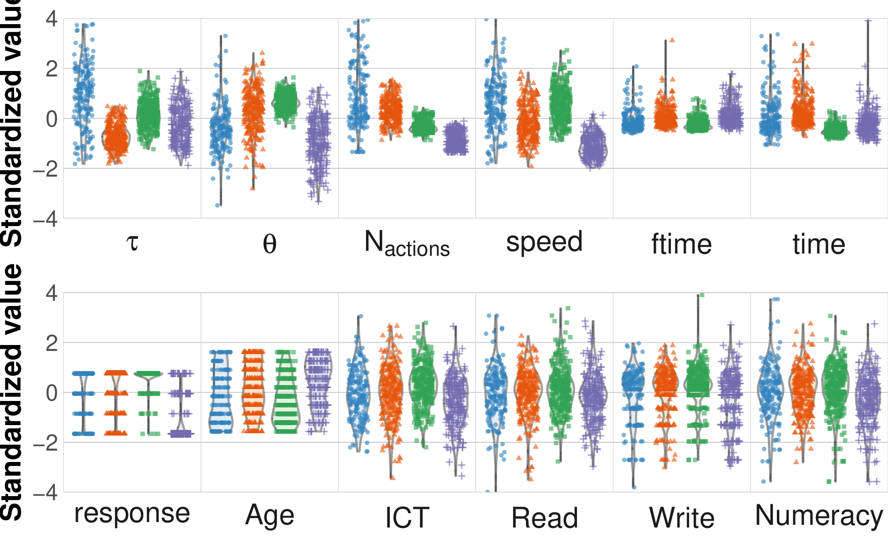
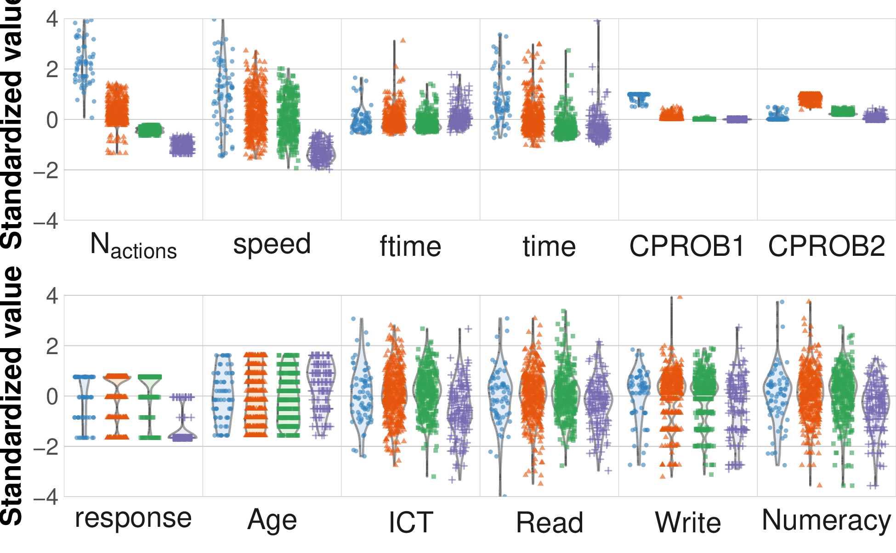

+++
title = "party_invitations-1"
author = ["Jonghyun Yun"]
lastmod = 2021-12-23T16:14:54-06:00
draft = false
weight = 10
chapter = true
+++

Table of Contents

- [collocation](#collocation)
- [visual cluster](#visual-cluster)
- [response](#response)

<!--endtoc-->

# collocation {#collocation}

## Class  1

|bigram                                                                    | likelihood_ratio|
|:-------------------------------------------------------------------------|----------------:|
|('FOLDER_VIEWED-CanComeFolder', 'MAIL_MOVED-item101.CanComeFolder')       |         817.3284|
|('FOLDER_VIEWED-CannotComeFolder', 'MAIL_MOVED-item102.CannotComeFolder') |         723.4372|
|('NEXT_INQUIRY-REQUEST', 'END_CANCEL-endtask_txt4')                       |         510.8037|
|('FOLDER_VIEWED-CanComeFolder', 'MAIL_MOVED-item104.CanComeFolder')       |         495.2927|
|('MAIL_VIEWED-item102', 'MAIL_DRAG-item102')                              |         416.9918|
|('FOLDER_VIEWED-TrashFolder', 'MAIL_MOVED-item103.target=TrashFolder')    |         374.2922|
|('FOLDER_VIEWED-TrashFolder', 'MAIL_MOVED-item105.target=TrashFolder')    |         320.9747|
|('FOLDER_VIEWED-InboxFolder', 'MAIL_MOVED-item103.InboxFolder')           |         315.7787|
|('FOLDER_VIEWED-CannotComeFolder', 'MAIL_VIEWED-item301')                 |         292.7040|
|('FOLDER_VIEWED-CannotComeFolder', 'MAIL_MOVED-item301.CannotComeFolder') |         278.9309|

## Class  2

|bigram                                                                    | likelihood_ratio|
|:-------------------------------------------------------------------------|----------------:|
|('FOLDER_VIEWED-CannotComeFolder', 'MAIL_MOVED-item102.CannotComeFolder') |         894.4766|
|('FOLDER_VIEWED-CanComeFolder', 'MAIL_MOVED-item101.CanComeFolder')       |         865.1981|
|('FOLDER_VIEWED-CanComeFolder', 'MAIL_MOVED-item104.CanComeFolder')       |         654.7479|
|('MAIL_VIEWED-item102', 'MAIL_DRAG-item102')                              |         646.6347|
|('FOLDER_VIEWED-CannotComeFolder', 'MAIL_VIEWED-item301')                 |         485.7336|
|('NEXT_INQUIRY-REQUEST', 'END_CANCEL-endtask_txt4')                       |         449.1188|
|('MAIL_VIEWED-item201', 'MAIL_VIEWED-item202')                            |         310.1378|
|('FOLDER_VIEWED-CanComeFolder', 'MAIL_VIEWED-item201')                    |         259.9339|
|('MAIL_DRAG-item104', 'FOLDER_VIEWED-CanComeFolder')                      |         234.2510|
|('FOLDER_VIEWED-CanComeFolder', 'FOLDER_VIEWED-CanComeFolder')            |         224.1286|

## Class  3

|bigram                                                                    | likelihood_ratio|
|:-------------------------------------------------------------------------|----------------:|
|('FOLDER_VIEWED-CannotComeFolder', 'MAIL_MOVED-item102.CannotComeFolder') |        1920.6574|
|('FOLDER_VIEWED-CanComeFolder', 'MAIL_MOVED-item101.CanComeFolder')       |        1414.3165|
|('FOLDER_VIEWED-CanComeFolder', 'MAIL_MOVED-item104.CanComeFolder')       |        1367.2376|
|('MAIL_VIEWED-item102', 'MAIL_DRAG-item102')                              |        1151.9347|
|('MAIL_MOVED-item104.CanComeFolder', 'MAIL_VIEWED-item105')               |         528.8972|
|('MAIL_VIEWED-item104', 'MAIL_DRAG-item104')                              |         473.7513|
|('MAIL_DRAG-item104', 'FOLDER_VIEWED-CanComeFolder')                      |         462.6390|
|('MAIL_VIEWED-item105', 'NEXT_INQUIRY-REQUEST')                           |         374.3775|
|('MAIL_MOVED-item101.CanComeFolder', 'MAIL_VIEWED-item102')               |         349.0786|
|('MAIL_MOVED-item102.CannotComeFolder', 'MAIL_VIEWED-item103')            |         319.1954|

## Class  4

|bigram                                                                    | likelihood_ratio|
|:-------------------------------------------------------------------------|----------------:|
|('NEXT_INQUIRY-REQUEST', 'END_CANCEL-endtask_txt4')                       |        217.80195|
|('FOLDER_VIEWED-CanComeFolder', 'MAIL_MOVED-item101.CanComeFolder')       |        215.63280|
|('FOLDER_VIEWED-CanComeFolder', 'MAIL_MOVED-item104.CanComeFolder')       |        211.32627|
|('MAIL_MOVED-item101.CanComeFolder', 'MAIL_DRAG-item104')                 |        148.42662|
|('FOLDER_VIEWED-CannotComeFolder', 'MAIL_MOVED-item102.CannotComeFolder') |        141.61502|
|('MAIL_VIEWED-item102', 'MAIL_DRAG-item102')                              |         96.50556|
|('MAIL_DRAG-item104', 'FOLDER_VIEWED-CanComeFolder')                      |         89.07329|
|('FOLDER_VIEWED-CanComeFolder', 'FOLDER_VIEWED-CannotComeFolder')         |         63.34961|
|('FOLDER_VIEWED-CanComeFolder', 'MAIL_VIEWED-item202')                    |         60.13844|
|('MAIL_VIEWED-item103', 'MAIL_VIEWED-item104')                            |         58.77450|

# visual cluster {#visual-cluster}

# response {#response}

Response: the larger, the better

### w/ tau and theta

|          tau|        theta|      naction|          spd|     AGEG5LFS|             n|
|------------:|------------:|------------:|------------:|------------:|-------------:|
|  1.01 (1.39)| -0.40 (0.91)|  1.06 (1.57)|  0.66 (1.06)| -0.19 (1.07)| 181.00 (0.00)|
| -0.69 (0.50)|  0.30 (0.89)|  0.32 (0.49)| -0.18 (0.71)|  0.15 (0.98)| 270.00 (0.00)|
|  0.18 (0.57)|  0.66 (0.34)| -0.30 (0.24)|  0.55 (0.70)| -0.33 (0.89)| 304.00 (0.00)|
| -0.25 (0.75)| -0.96 (0.94)| -0.86 (0.33)| -1.11 (0.44)|  0.44 (0.91)| 215.00 (0.00)|

### w/o tau and theta

|      naction|          spd|      CPROB1|      CPROB2|     AGEG5LFS|             n|
|------------:|------------:|-----------:|-----------:|------------:|-------------:|
|  2.61 (1.42)|  1.00 (1.26)| 0.91 (0.15)| 0.09 (0.15)|  0.02 (1.00)|  69.00 (0.00)|
|  0.27 (0.48)|  0.25 (0.84)| 0.06 (0.08)| 0.88 (0.13)| -0.10 (1.04)| 429.00 (0.00)|
| -0.43 (0.11)|  0.06 (0.78)| 0.01 (0.01)| 0.26 (0.07)| -0.08 (0.94)| 321.00 (0.00)|
| -1.05 (0.21)| -1.29 (0.35)| 0.00 (0.00)| 0.07 (0.09)|  0.46 (0.89)| 151.00 (0.00)|
