+++
title = "Applications"
author = ["Jonghyun Yun"]
lastmod = 2021-12-23T16:14:53-06:00
draft = false
weight = 50
chapter = true
+++

<div class="ox-hugo-toc toc">
<div></div>

<div class="heading">Table of Contents</div>

- [party\_invitations-1](#party-invitations-1)
    - [collocation](#collocation)
    - [visual cluster](#visual-cluster)
    - [response](#response)
- [cd\_tally](#cd-tally)
    - [collocations](#collocations)
    - [visualise cluster](#visualise-cluster)
    - [response](#response)
- [tickets](#tickets)
    - [collocation](#collocation)
    - [visualize clusters](#visualize-clusters)
    - [response](#response)
- [book\_order](#book-order)
    - [collocations](#collocations)
    - [visual clusters](#visual-clusters)
    - [reponse](#reponse)
- [meeting\_room](#meeting-room)
    - [collocations](#collocations)
    - [visualise cluster](#visualise-cluster)
    - [response](#response)
- [lamp\_return](#lamp-return)
    - [collocations](#collocations)
    - [visualise cluster](#visualise-cluster)
    - [response](#response)

</div>
<!--endtoc-->

We implement the prposed method to our motivating example.

-   `ftime`: time until the first action taken
-   `time`: total time of a person's process

We introduce two rudimentary statistcs.

-   `naction` or `#action`: the action sequence length \\(M\_{k}\\). The total number of actions taken by respondent \\(k\\).
-   `fastness`: `#action` divided by the total time elaped since \\(t\_{k,1}\\).

Multivariate Gaussian mixture for clustering

-   Varying variances and varying covariances (Model 6)

    AIC and BIC ..

I need one more on cluster analysis:

-   [ ] I want to compare sub-sequences between clusters: longest common subsequence <&ulitzsch_combining_2021>
    -   common subsequences in LCS? NLP would be useful here: common phrase?
        -   ans: n-grams like tri-grams
        -   ans: most interesting collocations
-   [ ] map respondent to word embedding, mark speed / &tau; / &theta;
-   [ ] action frequencies cluster: top 5 actions?
-   [ ] how sentences are compared in NLP? Text Summarization

Do

1.  collcations: freq and time -> show what are these actions, explain semantic ass and time efficiency
2.  map respondents marked by &tau;, &theta;: find neighboring actions?? not necessarily what they did
3.  text summary: how it works? too ambiguous.. it seems to work by removing some sentences


# party\_invitations-1 {#party-invitations-1}


## collocation {#collocation}


## Class  1


|bigram                                                                    | likelihood_ratio|
|:-------------------------------------------------------------------------|----------------:|
|('FOLDER_VIEWED-CanComeFolder', 'MAIL_MOVED-item101.CanComeFolder')       |         817.3284|
|('FOLDER_VIEWED-CannotComeFolder', 'MAIL_MOVED-item102.CannotComeFolder') |         723.4372|
|('NEXT_INQUIRY-REQUEST', 'END_CANCEL-endtask_txt4')                       |         510.8037|
|('FOLDER_VIEWED-CanComeFolder', 'MAIL_MOVED-item104.CanComeFolder')       |         495.2927|
|('MAIL_VIEWED-item102', 'MAIL_DRAG-item102')                              |         416.9918|
|('FOLDER_VIEWED-TrashFolder', 'MAIL_MOVED-item103.target=TrashFolder')    |         374.2922|
|('FOLDER_VIEWED-TrashFolder', 'MAIL_MOVED-item105.target=TrashFolder')    |         320.9747|
|('FOLDER_VIEWED-InboxFolder', 'MAIL_MOVED-item103.InboxFolder')           |         315.7787|
|('FOLDER_VIEWED-CannotComeFolder', 'MAIL_VIEWED-item301')                 |         292.7040|
|('FOLDER_VIEWED-CannotComeFolder', 'MAIL_MOVED-item301.CannotComeFolder') |         278.9309|


## Class  2


|bigram                                                                    | likelihood_ratio|
|:-------------------------------------------------------------------------|----------------:|
|('FOLDER_VIEWED-CannotComeFolder', 'MAIL_MOVED-item102.CannotComeFolder') |         894.4766|
|('FOLDER_VIEWED-CanComeFolder', 'MAIL_MOVED-item101.CanComeFolder')       |         865.1981|
|('FOLDER_VIEWED-CanComeFolder', 'MAIL_MOVED-item104.CanComeFolder')       |         654.7479|
|('MAIL_VIEWED-item102', 'MAIL_DRAG-item102')                              |         646.6347|
|('FOLDER_VIEWED-CannotComeFolder', 'MAIL_VIEWED-item301')                 |         485.7336|
|('NEXT_INQUIRY-REQUEST', 'END_CANCEL-endtask_txt4')                       |         449.1188|
|('MAIL_VIEWED-item201', 'MAIL_VIEWED-item202')                            |         310.1378|
|('FOLDER_VIEWED-CanComeFolder', 'MAIL_VIEWED-item201')                    |         259.9339|
|('MAIL_DRAG-item104', 'FOLDER_VIEWED-CanComeFolder')                      |         234.2510|
|('FOLDER_VIEWED-CanComeFolder', 'FOLDER_VIEWED-CanComeFolder')            |         224.1286|


## Class  3


|bigram                                                                    | likelihood_ratio|
|:-------------------------------------------------------------------------|----------------:|
|('FOLDER_VIEWED-CannotComeFolder', 'MAIL_MOVED-item102.CannotComeFolder') |        1920.6574|
|('FOLDER_VIEWED-CanComeFolder', 'MAIL_MOVED-item101.CanComeFolder')       |        1414.3165|
|('FOLDER_VIEWED-CanComeFolder', 'MAIL_MOVED-item104.CanComeFolder')       |        1367.2376|
|('MAIL_VIEWED-item102', 'MAIL_DRAG-item102')                              |        1151.9347|
|('MAIL_MOVED-item104.CanComeFolder', 'MAIL_VIEWED-item105')               |         528.8972|
|('MAIL_VIEWED-item104', 'MAIL_DRAG-item104')                              |         473.7513|
|('MAIL_DRAG-item104', 'FOLDER_VIEWED-CanComeFolder')                      |         462.6390|
|('MAIL_VIEWED-item105', 'NEXT_INQUIRY-REQUEST')                           |         374.3775|
|('MAIL_MOVED-item101.CanComeFolder', 'MAIL_VIEWED-item102')               |         349.0786|
|('MAIL_MOVED-item102.CannotComeFolder', 'MAIL_VIEWED-item103')            |         319.1954|


## Class  4


|bigram                                                                    | likelihood_ratio|
|:-------------------------------------------------------------------------|----------------:|
|('NEXT_INQUIRY-REQUEST', 'END_CANCEL-endtask_txt4')                       |        217.80195|
|('FOLDER_VIEWED-CanComeFolder', 'MAIL_MOVED-item101.CanComeFolder')       |        215.63280|
|('FOLDER_VIEWED-CanComeFolder', 'MAIL_MOVED-item104.CanComeFolder')       |        211.32627|
|('MAIL_MOVED-item101.CanComeFolder', 'MAIL_DRAG-item104')                 |        148.42662|
|('FOLDER_VIEWED-CannotComeFolder', 'MAIL_MOVED-item102.CannotComeFolder') |        141.61502|
|('MAIL_VIEWED-item102', 'MAIL_DRAG-item102')                              |         96.50556|
|('MAIL_DRAG-item104', 'FOLDER_VIEWED-CanComeFolder')                      |         89.07329|
|('FOLDER_VIEWED-CanComeFolder', 'FOLDER_VIEWED-CannotComeFolder')         |         63.34961|
|('FOLDER_VIEWED-CanComeFolder', 'MAIL_VIEWED-item202')                    |         60.13844|
|('MAIL_VIEWED-item103', 'MAIL_VIEWED-item104')                            |         58.77450|


## visual cluster {#visual-cluster}

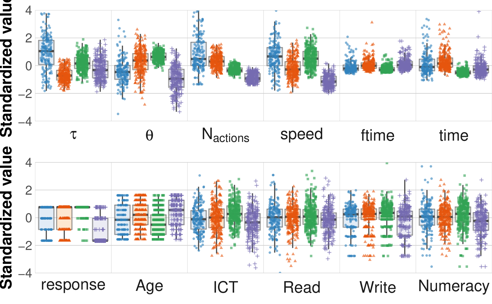


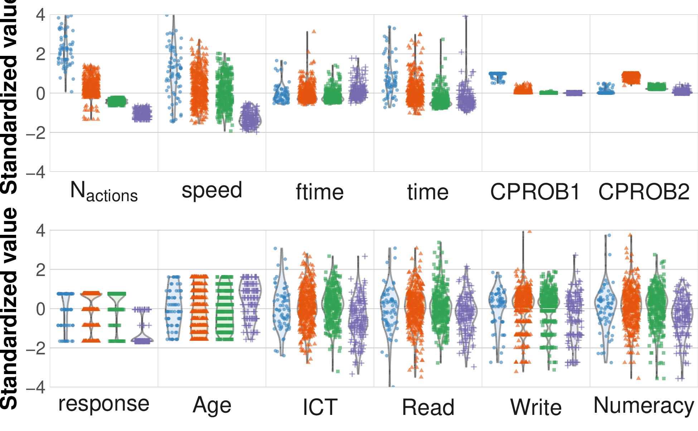


## response {#response}

Response: the larger, the better


### w/ tau and theta


|          tau|        theta|      naction|          spd|     AGEG5LFS|             n|
|------------:|------------:|------------:|------------:|------------:|-------------:|
|  1.01 (1.39)| -0.40 (0.91)|  1.06 (1.57)|  0.66 (1.06)| -0.19 (1.07)| 181.00 (0.00)|
| -0.69 (0.50)|  0.30 (0.89)|  0.32 (0.49)| -0.18 (0.71)|  0.15 (0.98)| 270.00 (0.00)|
|  0.18 (0.57)|  0.66 (0.34)| -0.30 (0.24)|  0.55 (0.70)| -0.33 (0.89)| 304.00 (0.00)|
| -0.25 (0.75)| -0.96 (0.94)| -0.86 (0.33)| -1.11 (0.44)|  0.44 (0.91)| 215.00 (0.00)|

### w/o tau and theta


|      naction|          spd|      CPROB1|      CPROB2|     AGEG5LFS|             n|
|------------:|------------:|-----------:|-----------:|------------:|-------------:|
|  2.61 (1.42)|  1.00 (1.26)| 0.91 (0.15)| 0.09 (0.15)|  0.02 (1.00)|  69.00 (0.00)|
|  0.27 (0.48)|  0.25 (0.84)| 0.06 (0.08)| 0.88 (0.13)| -0.10 (1.04)| 429.00 (0.00)|
| -0.43 (0.11)|  0.06 (0.78)| 0.01 (0.01)| 0.26 (0.07)| -0.08 (0.94)| 321.00 (0.00)|
| -1.05 (0.21)| -1.29 (0.35)| 0.00 (0.00)| 0.07 (0.09)|  0.46 (0.89)| 151.00 (0.00)|


# cd\_tally {#cd-tally}


## collocations {#collocations}

## Class  1


|bigram                                                                     | likelihood_ratio|
|:--------------------------------------------------------------------------|----------------:|
|('SUBMIT_complete-u03_default_txt14', 'NEXT_INQUIRY-REQUEST')              |       1459.57552|
|('TOOLBAR_spreadApp-spreadApp', 'TOOLBAR_webApp-webApp')                   |       1189.05250|
|('TOOLBAR_webApp-webApp', 'COMBOBOX-menulist.index=9')                     |        455.87983|
|('COMBOBOX-menulist.index=9', 'SUBMIT_complete-u03_default_txt14')         |        404.68816|
|('TOOLBAR_webApp-webApp', 'TOOLBAR_spreadApp-spreadApp')                   |        178.25025|
|('NEXT_INQUIRY-REQUEST', 'SUBMIT_complete-u03_default_txt14')              |         84.10660|
|('SUBMIT_complete-u03_default_txt14', 'SUBMIT_complete-u03_default_txt14') |         77.40740|
|('SUBMIT_complete-u03_default_txt14', 'TOOLBAR_spreadApp-spreadApp')       |         74.16434|
|('TOOLBAR_webApp-webApp', 'NEXT_INQUIRY-REQUEST')                          |         67.95933|
|('TOOLBAR_webApp-webApp', 'COMBOBOX-menulist.index=8')                     |         63.94217|
## Class  2


|bigram                                                             | likelihood_ratio|
|:------------------------------------------------------------------|----------------:|
|('SUBMIT_complete-u03_default_txt14', 'NEXT_INQUIRY-REQUEST')      |        2355.3848|
|('TOOLBAR_spreadApp-spreadApp', 'TOOLBAR_webApp-webApp')           |        1392.4234|
|('COMBOBOX-menulist.index=9', 'SUBMIT_complete-u03_default_txt14') |         865.4099|
|('TOOLBAR_webApp-webApp', 'COMBOBOX-menulist.index=9')             |         832.1501|
|('TOOLBAR_webApp-webApp', 'TOOLBAR_spreadApp-spreadApp')           |         606.5532|
|('NEXT_INQUIRY-REQUEST', 'END_CANCEL-endtask_txt4')                |         502.3374|
|('TOOLBAR_ss-sort-ss-sort', 'COMBOBOX-sortablecol1.index=3')       |         485.4294|
|('MENUITEM_sort-key=sort', 'COMBOBOX-sortablecol1.index=3')        |         453.2708|
|('MENU-ss-data-menu', 'MENUITEM_sort-key=sort')                    |         435.1334|
|('COMBOBOX-sortablecol1.index=3', 'RADIO_BTN-priority1asc')        |         322.2008|
## Class  3


|bigram                                                              | likelihood_ratio|
|:-------------------------------------------------------------------|----------------:|
|('SUBMIT_complete-u03_default_txt14', 'NEXT_INQUIRY-REQUEST')       |       340.964425|
|('COMBOBOX-menulist.index=4', 'SUBMIT_complete-u03_default_txt14')  |       217.307581|
|('COMBOBOX-menulist.index=11', 'SUBMIT_complete-u03_default_txt14') |        26.081798|
|('KEYPRESS', 'BREAKOFF-REQUEST')                                    |        14.724331|
|('COMBOBOX-menulist.index=26', 'SUBMIT_complete-u03_default_txt14') |         7.358132|
|('COMBOBOX-menulist.index=3', 'SUBMIT_complete-u03_default_txt14')  |         7.358132|
|('COMBOBOX-menulist.index=7', 'SUBMIT_complete-u03_default_txt14')  |         7.358132|
|('COMBOBOX-menulist.index=9', 'SUBMIT_complete-u03_default_txt14')  |         7.358132|
|('GET_HELP-REQUEST', 'COMBOBOX-menulist.index=4')                   |         4.880417|
|('COMBOBOX-menulist.index=10', 'SUBMIT_complete-u03_default_txt14') |         3.669923|
## Class  4


|bigram                                                                                | likelihood_ratio|
|:-------------------------------------------------------------------------------------|----------------:|
|('SUBMIT_complete-u03_default_txt14', 'NEXT_INQUIRY-REQUEST')                         |         339.8976|
|('TOOLBAR_spreadApp-spreadApp', 'TOOLBAR_webApp-webApp')                              |         225.6964|
|('COMBOBOX-menulist.index=9', 'SUBMIT_complete-u03_default_txt14')                    |         206.3333|
|('TEXTBOX_ONFOCUS-searchtfield.value=', 'KEYPRESS')                                   |         195.4571|
|('TOOLBAR_webApp-webApp', 'COMBOBOX-menulist.index=9')                                |         192.6315|
|('TOOLBAR_webApp-webApp', 'TOOLBAR_spreadApp-spreadApp')                              |         179.7811|
|('CD_FIND_ok-spread-search-btn', 'TOOLBAR_spread-search-next-spread-search-next-btn') |         177.6448|
|('NEXT_INQUIRY-REQUEST', 'END_CANCEL-endtask_txt4')                                   |         129.0081|
|('TOOLBAR_ss-sort-ss-sort', 'COMBOBOX-sortablecol1.index=3')                          |         115.3623|
|('MENU-ss-data-menu', 'MENUITEM_sort-key=sort')                                       |         104.0280|


## visualise cluster {#visualise-cluster}

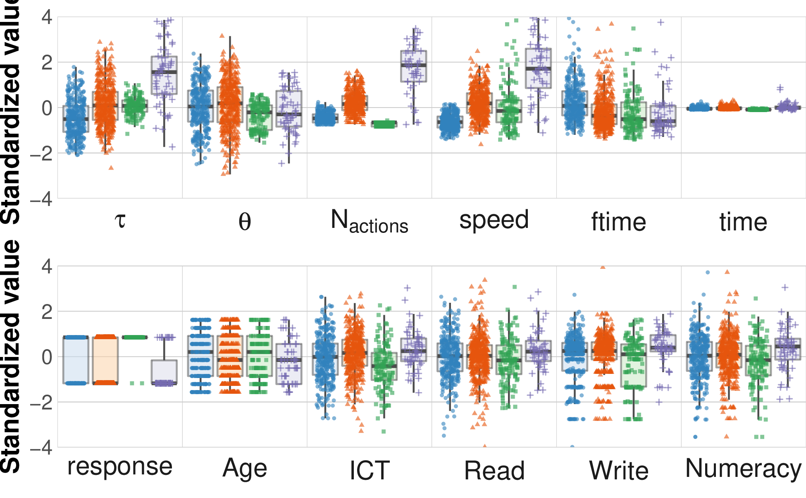
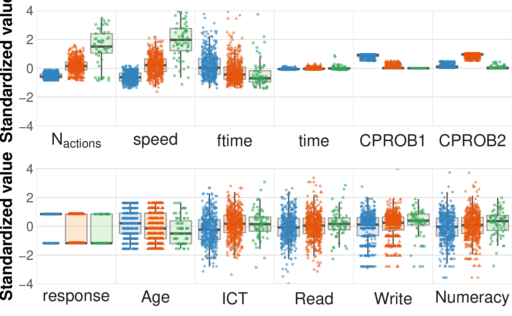

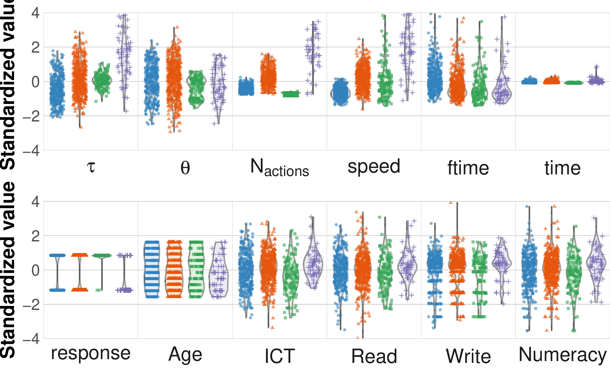
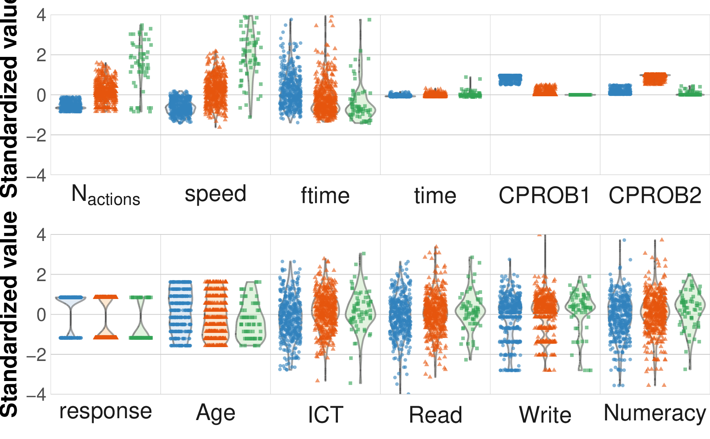


## response {#response}


### w/ tau and theta


|          tau|        theta|      naction|          spd|     AGEG5LFS|             n|
|------------:|------------:|------------:|------------:|------------:|-------------:|
|  1.01 (1.39)| -0.40 (0.91)|  1.06 (1.57)|  0.66 (1.06)| -0.19 (1.07)| 181.00 (0.00)|
| -0.69 (0.50)|  0.30 (0.89)|  0.32 (0.49)| -0.18 (0.71)|  0.15 (0.98)| 270.00 (0.00)|
|  0.18 (0.57)|  0.66 (0.34)| -0.30 (0.24)|  0.55 (0.70)| -0.33 (0.89)| 304.00 (0.00)|
| -0.25 (0.75)| -0.96 (0.94)| -0.86 (0.33)| -1.11 (0.44)|  0.44 (0.91)| 215.00 (0.00)|

### w/o tau and theta


|      naction|          spd|      CPROB1|      CPROB2|     AGEG5LFS|             n|
|------------:|------------:|-----------:|-----------:|------------:|-------------:|
|  2.61 (1.42)|  1.00 (1.26)| 0.91 (0.15)| 0.09 (0.15)|  0.02 (1.00)|  69.00 (0.00)|
|  0.27 (0.48)|  0.25 (0.84)| 0.06 (0.08)| 0.88 (0.13)| -0.10 (1.04)| 429.00 (0.00)|
| -0.43 (0.11)|  0.06 (0.78)| 0.01 (0.01)| 0.26 (0.07)| -0.08 (0.94)| 321.00 (0.00)|
| -1.05 (0.21)| -1.29 (0.35)| 0.00 (0.00)| 0.07 (0.09)|  0.46 (0.89)| 151.00 (0.00)|


# tickets {#tickets}

```R
--------------------------------------------------------------
tau and theta + naction, spd
--------------------------------------------------------------
Compare tidyLPA solutions:

 Model Classes AIC      AWE      BIC      CLC      KIC
 6     1       9741.434 9945.767 9809.601 9715.434 9758.434
 6     2       6976.934 7402.489 7118.135 6920.782 7008.934
 6     3       5955.984 6602.815 6170.221 5869.626 6002.984
 6     4       5589.996 6457.851 5877.267 5473.684 5651.996

Best model according to AIC is Model 6 with 4 classes.
Best model according to AWE is Model 6 with 4 classes.
Best model according to BIC is Model 6 with 4 classes.
Best model according to CLC is Model 6 with 4 classes.
Best model according to KIC is Model 6 with 4 classes.

An analytic hierarchy process, based on the fit indices AIC, AWE, BIC, CLC, and KIC (Akogul & Erisoglu, 2017), suggests the best solution is Model 6 with 4 classes.

--------------------------------------------------------------
naction, spd
--------------------------------------------------------------
Compare tidyLPA solutions:

 Model Classes AIC      AWE      BIC      CLC      KIC
 6     1       5391.087 5462.777 5415.432 5383.087 5399.087
 6     2       3693.159 3853.480 3746.718 3672.956 3707.159
 6     3       3370.270 3619.131 3453.043 3337.955 3390.270
 6     4       3506.481 3844.076 3618.469 3461.861 3532.481

Best model according to AIC is Model 6 with 3 classes.
Best model according to AWE is Model 6 with 3 classes.
Best model according to BIC is Model 6 with 3 classes.
Best model according to CLC is Model 6 with 3 classes.
Best model according to KIC is Model 6 with 3 classes.

An analytic hierarchy process, based on the fit indices AIC, AWE, BIC, CLC, and KIC (Akogul & Erisoglu, 2017), suggests the best solution is Model 6 with 3 classes.
```


## collocation {#collocation}

## Class  1


|bigram                                                               | likelihood_ratio|
|:--------------------------------------------------------------------|----------------:|
|('TAB-tabbutton2', 'TAB-tabbutton1')                                 |        5348.6765|
|('BUTTON_submit-pg2_txt33', 'BUTTON_submit_ok-u21p2pu5_txt2')        |        3823.0690|
|('BUTTON_submit_ok-u21p2pu5_txt2', 'NEXT_INQUIRY-REQUEST')           |        2159.6960|
|('COMBOBOX-default_menu1.index=7', 'COMBOBOX-default_menu2.index=2') |        1966.0726|
|('COMBOBOX-default_menu2.index=2', 'BUTTON_search-default_txt23')    |        1898.1312|
|('CHECKBOX-check2', 'CHECKBOX-check3')                               |        1584.7181|
|('CHECKBOX-check9', 'CHECKBOX-check11')                              |        1578.2255|
|('CHECKBOX-check11', 'BUTTON_available-pg1_txt47')                   |        1189.0331|
|('BUTTON_available-pg1_txt47', 'BUTTON_available-pg7_txt47')         |        1101.9322|
|('COMBOBOX-pg2_menu6.index=8', 'BUTTON_submit-pg2_txt33')            |         922.0956|
## Class  2


|bigram                                                                                                             | likelihood_ratio|
|:------------------------------------------------------------------------------------------------------------------|----------------:|
|('BUTTON_search-default_txt23', 'BUTTON_close-popup1_txt4')                                                        |        55.698957|
|('COMBOBOX-default_menu1.index=7', 'COMBOBOX-default_menu2.index=2')                                               |        37.495676|
|('COMBOBOX-default_menu2.index=2', 'NEXT_INQUIRY-REQUEST')                                                         |        17.586276|
|('TAB-tabbutton2', 'TAB-tabbutton1')                                                                               |        13.757955|
|('CHECKBOX-check4', 'BUTTON_available-pg1_txt47')                                                                  |        13.533514|
|('BUTTON_close-popup1_txt4', 'NEXT_INQUIRY-REQUEST')                                                               |        11.074180|
|('COMBOBOX-default_menu1.index=3', 'COMBOBOX-default_menu2.index=1')                                               |        10.430812|
|('COMBOBOX-default_menu2.index=2', 'BUTTON_search-default_txt23')                                                  |         9.834263|
|('BOX_PRESS-action=as://switchStateButton(u021_default_form1a,unit21page6,u021_default_popup2)', 'TAB-tabbutton1') |         9.714429|
|('TAB-tabbutton1', 'NEXT_INQUIRY-REQUEST')                                                                         |         9.489936|
## Class  3


|bigram                                                               | likelihood_ratio|
|:--------------------------------------------------------------------|----------------:|
|('TAB-tabbutton2', 'TAB-tabbutton1')                                 |        4082.5863|
|('BUTTON_submit-pg2_txt33', 'BUTTON_submit_ok-u21p2pu5_txt2')        |        2397.7490|
|('BUTTON_available-pg1_txt47', 'BUTTON_available-pg7_txt47')         |        1283.7639|
|('BUTTON_submit_ok-u21p2pu5_txt2', 'NEXT_INQUIRY-REQUEST')           |         991.4217|
|('COMBOBOX-default_menu2.index=2', 'BUTTON_search-default_txt23')    |         884.3631|
|('COMBOBOX-default_menu1.index=7', 'COMBOBOX-default_menu2.index=2') |         780.2374|
|('BUTTON_submit_ok-u21p2pu5_txt2', 'BUTTON_close-popup2_txt4')       |         774.0134|
|('CHECKBOX-check2', 'CHECKBOX-check3')                               |         511.6382|
|('CHECKBOX-check9', 'CHECKBOX-check11')                              |         481.3976|
|('CHECKBOX-check11', 'BUTTON_available-pg1_txt47')                   |         378.1517|
## Class  4


|bigram                                                               | likelihood_ratio|
|:--------------------------------------------------------------------|----------------:|
|('TAB-tabbutton2', 'TAB-tabbutton1')                                 |        3693.8423|
|('BUTTON_submit-pg2_txt33', 'BUTTON_submit_ok-u21p2pu5_txt2')        |        1761.9371|
|('BUTTON_submit_ok-u21p2pu5_txt2', 'NEXT_INQUIRY-REQUEST')           |        1335.2799|
|('COMBOBOX-default_menu1.index=7', 'COMBOBOX-default_menu2.index=2') |        1273.6836|
|('COMBOBOX-default_menu2.index=2', 'BUTTON_search-default_txt23')    |        1220.8369|
|('CHECKBOX-check9', 'CHECKBOX-check11')                              |        1099.9491|
|('CHECKBOX-check11', 'BUTTON_available-pg1_txt47')                   |        1069.7063|
|('CHECKBOX-check2', 'CHECKBOX-check3')                               |         885.6972|
|('BUTTON_available-pg1_txt47', 'COMBOBOX-pg2_menu1.index=8')         |         718.7921|
|('COMBOBOX-pg2_menu6.index=8', 'BUTTON_submit-pg2_txt33')            |         703.2595|

## Some covariates

|Name        |Label                                                                               |Value scheme                                          |
|:-----------|:-----------------------------------------------------------------------------------|:-----------------------------------------------------|
|AGEG5LFS    |Age groups in 5-year intervals based on LFS groupings (derived)                     |Derived - Age groups in equal 5 year intervals (1-10) |
|NFEHRS      |Number of hours of participation in non-formal education (derived)                  |NA                                                    |
|EARNHRDCL   |Hourly earnings excluding bonuses for wage and salary earners, in deciles (derived) |Derived - Decile                                      |
|LEARNATWORK |Index of learning at work (derived)                                                 |NA                                                    |
|ICTHOME     |Index of use of ICT skills at home (derived)                                        |NA                                                    |
|ICTWORK     |Index of use of ICT skills at work (derived)                                        |NA                                                    |
|INFLUENCE   |Index of use of influencing skills at work (derived)                                |NA                                                    |
|NUMHOME     |Index of use of numeracy skills at home (basic and advanced - derived)              |NA                                                    |
|NUMWORK     |Index of use of numeracy skills at work (basic and advanced - derived)              |NA                                                    |
|READHOME    |Index of use of reading skills at home (prose and document texts - derived)         |NA                                                    |
|READWORK    |Index of use of reading skills at work (prose and document texts - derived)         |NA                                                    |
|TASKDISC    |Index of use of task discretion at work (derived)                                   |NA                                                    |
|WRITHOME    |Index of use of writing skills at home (derived)                                    |NA                                                    |
|WRITWORK    |Index of use of writing skills at work (derived)                                    |NA                                                    |


## visualize clusters {#visualize-clusters}

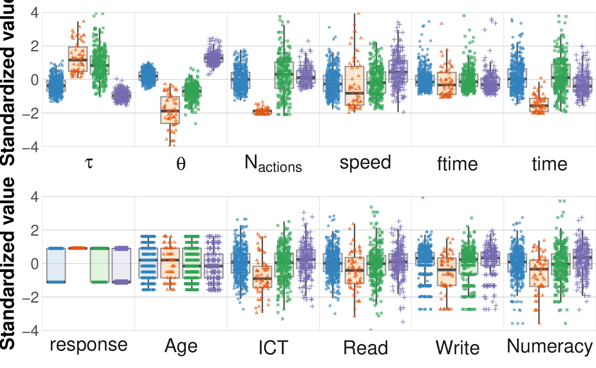
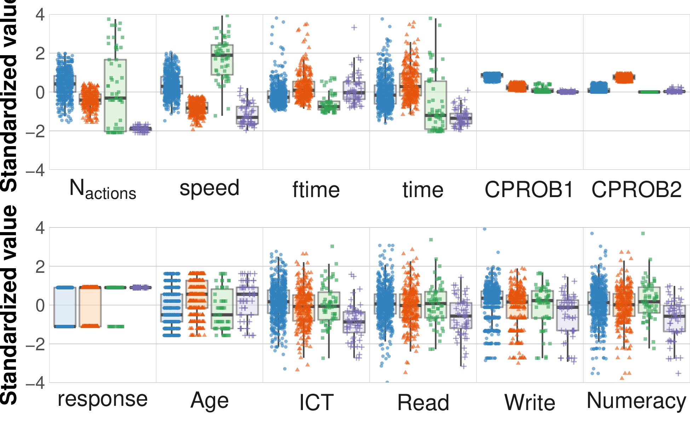

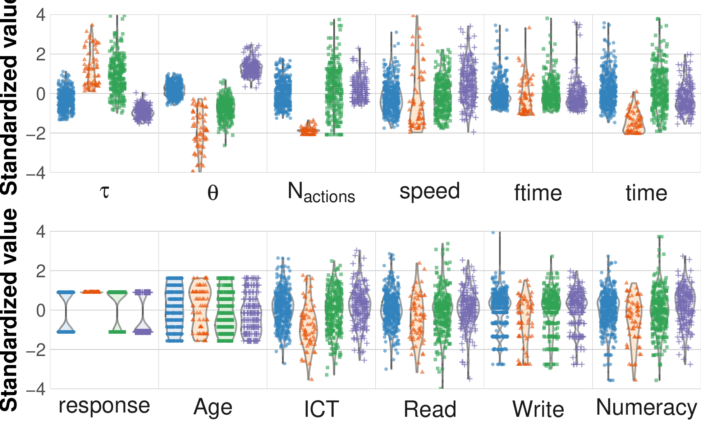
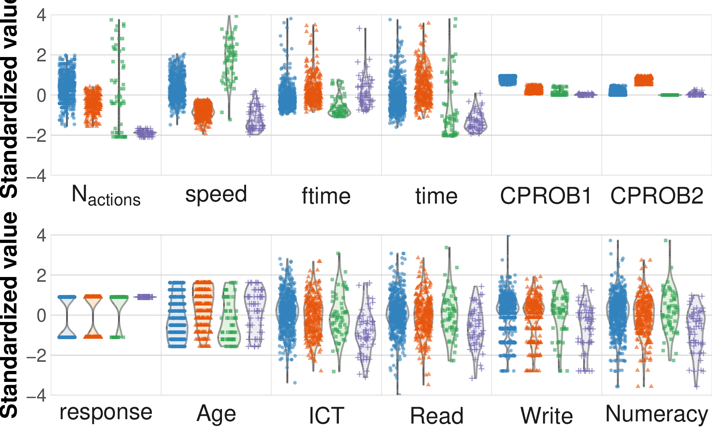


## response {#response}

Response: the smaller, the better


### w/ tau and theta


|          tau|        theta|      naction|          spd|     AGEG5LFS|             n|
|------------:|------------:|------------:|------------:|------------:|-------------:|
|  1.01 (1.39)| -0.40 (0.91)|  1.06 (1.57)|  0.66 (1.06)| -0.19 (1.07)| 181.00 (0.00)|
| -0.69 (0.50)|  0.30 (0.89)|  0.32 (0.49)| -0.18 (0.71)|  0.15 (0.98)| 270.00 (0.00)|
|  0.18 (0.57)|  0.66 (0.34)| -0.30 (0.24)|  0.55 (0.70)| -0.33 (0.89)| 304.00 (0.00)|
| -0.25 (0.75)| -0.96 (0.94)| -0.86 (0.33)| -1.11 (0.44)|  0.44 (0.91)| 215.00 (0.00)|

### w/o tau and theta


|      naction|          spd|      CPROB1|      CPROB2|     AGEG5LFS|             n|
|------------:|------------:|-----------:|-----------:|------------:|-------------:|
|  2.61 (1.42)|  1.00 (1.26)| 0.91 (0.15)| 0.09 (0.15)|  0.02 (1.00)|  69.00 (0.00)|
|  0.27 (0.48)|  0.25 (0.84)| 0.06 (0.08)| 0.88 (0.13)| -0.10 (1.04)| 429.00 (0.00)|
| -0.43 (0.11)|  0.06 (0.78)| 0.01 (0.01)| 0.26 (0.07)| -0.08 (0.94)| 321.00 (0.00)|
| -1.05 (0.21)| -1.29 (0.35)| 0.00 (0.00)| 0.07 (0.09)|  0.46 (0.89)| 151.00 (0.00)|


# book\_order {#book-order}


## collocations {#collocations}

## Class  3


|bigram                                                                                                      | likelihood_ratio|
|:-----------------------------------------------------------------------------------------------------------|----------------:|
|('TEXTLINK-pg1_txt7.href=u07_pg1_popup1.target=popup', 'BUTTON_close-popup1_txt2')                          |        208.86637|
|('CHECK_pg7-pg7_txt4', 'BUTTON_close-popup4_txt3')                                                          |        195.79144|
|('TEXTLINK-default_txt18.href=unit7page7.target=self', 'CHECK_pg7-pg7_txt4')                                |        164.30067|
|('TEXTLINK-default_txt9.href=unit7page3.target=self', 'TEXTLINK-pg3_txt5.href=unit7page8.target=self')      |        157.00750|
|('TEXTLINK-default_txt3.href=unit7page1.target=self', 'TEXTLINK-pg1_txt7.href=u07_pg1_popup1.target=popup') |        151.54740|
|('TEXTLINK-pg6_txt12.href=u07_pg6_popup3.target=popup', 'BUTTON_close-popup3_txt2')                         |        142.00070|
|('TOOLBAR_back-toolbar_back_btn', 'TEXTLINK-default_txt12.href=unit7page4.target=self')                     |        126.70172|
|('BUYNOW_pg4-pg4_txt11', 'BUYBOOK_pg4_ok-pg4_pu6_okbtn')                                                    |        118.39287|
|('TOOLBAR_back-toolbar_back_btn', 'TEXTLINK-default_txt9.href=unit7page3.target=self')                      |        114.73986|
|('BUYBOOK_pg4_ok-pg4_pu6_okbtn', 'NEXT_INQUIRY-REQUEST')                                                    |         87.20094|
## Class  2


|bigram                                                                         | likelihood_ratio|
|:------------------------------------------------------------------------------|----------------:|
|('BUYNOW_pg7-pg7_txt19', 'BUYBOOK_pg7_ok-pg7_pu6_okbtn')                       |        207.41883|
|('TEXTLINK-default_txt18.href=unit7page7.target=self', 'BUYNOW_pg7-pg7_txt19') |        188.35084|
|('BUYNOW_pg1-pg1_txt8', 'BUYBOOK_pg1_ok-pg1_pu6_okbtn')                        |        186.42648|
|('BUYNOW_pg3-pg3_txt4', 'BUYBOOK_pg3_ok-pg3_pu6_okbtn')                        |        175.03323|
|('TEXTLINK-default_txt3.href=unit7page1.target=self', 'BUYNOW_pg1-pg1_txt8')   |        167.84040|
|('TEXTLINK-default_txt9.href=unit7page3.target=self', 'BUYNOW_pg3-pg3_txt4')   |        131.17740|
|('BUYBOOK_pg7_ok-pg7_pu6_okbtn', 'NEXT_INQUIRY-REQUEST')                       |         98.52990|
|('BUYNOW_pg4-pg4_txt11', 'BUYBOOK_pg4_ok-pg4_pu6_okbtn')                       |         94.84852|
|('TEXTLINK-default_txt12.href=unit7page4.target=self', 'BUYNOW_pg4-pg4_txt11') |         94.84852|
|('BUYBOOK_pg1_ok-pg1_pu6_okbtn', 'NEXT_INQUIRY-REQUEST')                       |         90.13419|
## Class  1


|bigram                                                                                                      | likelihood_ratio|
|:-----------------------------------------------------------------------------------------------------------|----------------:|
|('BUYNOW_pg4-pg4_txt11', 'BUYBOOK_pg4_ok-pg4_pu6_okbtn')                                                    |         2993.405|
|('TEXTLINK-pg1_txt7.href=u07_pg1_popup1.target=popup', 'BUTTON_close-popup1_txt2')                          |         2772.062|
|('CHECK_pg7-pg7_txt4', 'BUTTON_close-popup4_txt3')                                                          |         2701.893|
|('TEXTLINK-default_txt9.href=unit7page3.target=self', 'TEXTLINK-pg3_txt5.href=unit7page8.target=self')      |         2658.989|
|('BUYBOOK_pg4_ok-pg4_pu6_okbtn', 'NEXT_INQUIRY-REQUEST')                                                    |         2609.485|
|('TEXTLINK-default_txt18.href=unit7page7.target=self', 'CHECK_pg7-pg7_txt4')                                |         2227.420|
|('TEXTLINK-default_txt3.href=unit7page1.target=self', 'TEXTLINK-pg1_txt7.href=u07_pg1_popup1.target=popup') |         2219.096|
|('TOOLBAR_back-toolbar_back_btn', 'TEXTLINK-default_txt12.href=unit7page4.target=self')                     |         2146.316|
|('TOOLBAR_back-toolbar_back_btn', 'TOOLBAR_back-toolbar_back_btn')                                          |         1956.254|
|('TEXTLINK-pg3_txt5.href=unit7page8.target=self', 'TOOLBAR_back-toolbar_back_btn')                          |         1230.032|


## visual clusters {#visual-clusters}

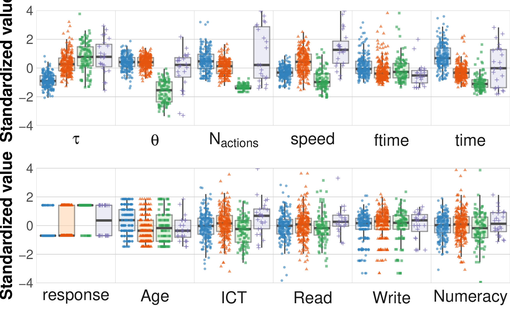
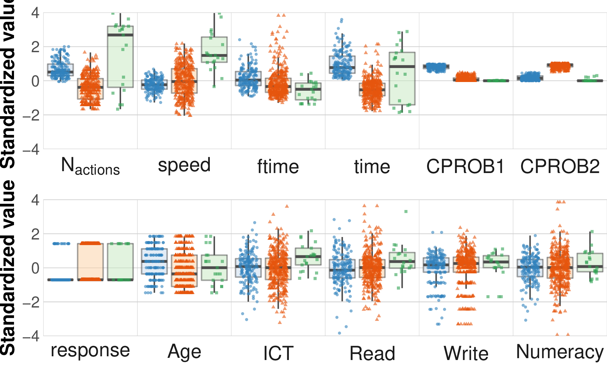


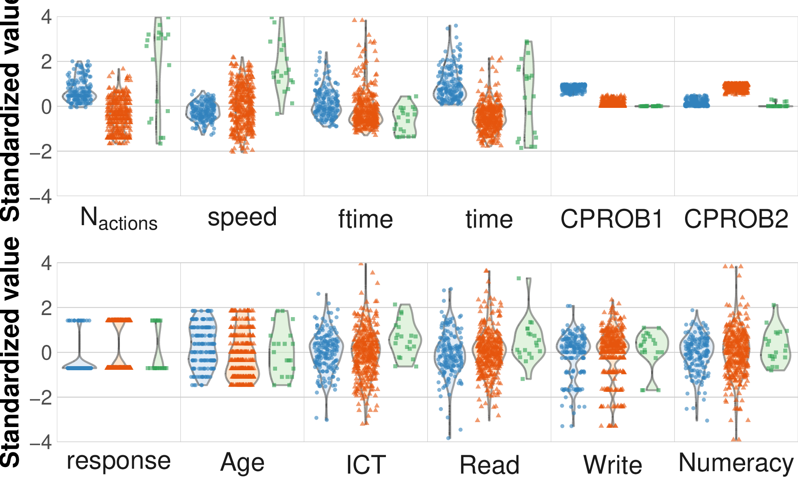


## reponse {#reponse}

Response: the larger, the better


### w/ tau and theta


|          tau|        theta|      naction|          spd|     AGEG5LFS|             n|
|------------:|------------:|------------:|------------:|------------:|-------------:|
|  1.01 (1.39)| -0.40 (0.91)|  1.06 (1.57)|  0.66 (1.06)| -0.19 (1.07)| 181.00 (0.00)|
| -0.69 (0.50)|  0.30 (0.89)|  0.32 (0.49)| -0.18 (0.71)|  0.15 (0.98)| 270.00 (0.00)|
|  0.18 (0.57)|  0.66 (0.34)| -0.30 (0.24)|  0.55 (0.70)| -0.33 (0.89)| 304.00 (0.00)|
| -0.25 (0.75)| -0.96 (0.94)| -0.86 (0.33)| -1.11 (0.44)|  0.44 (0.91)| 215.00 (0.00)|

### w/o tau and theta


|      naction|          spd|      CPROB1|      CPROB2|     AGEG5LFS|             n|
|------------:|------------:|-----------:|-----------:|------------:|-------------:|
|  2.61 (1.42)|  1.00 (1.26)| 0.91 (0.15)| 0.09 (0.15)|  0.02 (1.00)|  69.00 (0.00)|
|  0.27 (0.48)|  0.25 (0.84)| 0.06 (0.08)| 0.88 (0.13)| -0.10 (1.04)| 429.00 (0.00)|
| -0.43 (0.11)|  0.06 (0.78)| 0.01 (0.01)| 0.26 (0.07)| -0.08 (0.94)| 321.00 (0.00)|
| -1.05 (0.21)| -1.29 (0.35)| 0.00 (0.00)| 0.07 (0.09)|  0.46 (0.89)| 151.00 (0.00)|


# meeting\_room {#meeting-room}


## collocations {#collocations}

## Class  1


|bigram                                                                          | likelihood_ratio|
|:-------------------------------------------------------------------------------|----------------:|
|('FOLDER_VIEWED-InboxFolder', 'FOLDER_VIEWED-myMails')                          |         51.88126|
|('FOLDER_VIEWED-MtgRoomFolder', 'FOLDER_VIEWED-ReservationsFolder')             |         35.22581|
|('TOOLBAR_webApp-webApp', 'TEXTLINK-default_txt3.href=unit02page2.target=self') |         28.36017|
|('TOOLBAR_mailApp-mailApp', 'NEXT_INQUIRY-REQUEST')                             |         23.17940|
|('MAIL_VIEWED-item102', 'MAIL_VIEWED-item103')                                  |         20.35835|
|('FOLDER_VIEWED-myMails', 'FOLDER_VIEWED-MtgRoomFolder')                        |         14.78127|
|('FOLDER_UNFOLDED-MtgRoomFolder', 'FOLDER_FOLDED-MtgRoomFolder')                |         14.42721|
|('MENU-message-menu', 'MENUITEM_move-folder-key=move-folder')                   |         14.42721|
|('MENU-view-menu', 'MENUITEM_sort-mc-key=sort-mc')                              |         14.42721|
|('MENUITEM_sort-mc-key=sort-mc', 'MAIL_SORT_ok-sortValidation')                 |         14.42721|
## Class  2


|bigram                                                                                    | likelihood_ratio|
|:-----------------------------------------------------------------------------------------|----------------:|
|('BUTTON_RESERVE_submit-SUBMIT_RESERVATION_SUCCESS', 'BUTTON_close-popup1_txt2')          |        2428.7755|
|('COMBOBOX-zemenulist4.index=3', 'COMBOBOX-zemenulist5.index=4')                          |        1366.9993|
|('BUTTON_RESERVE_submit-SUBMIT_RESERVATION_FAILURE_conflict', 'BUTTON_close-popup7_txt2') |        1320.6393|
|('BUTTON_UNFILL_submit-pg5_txt21', 'BUTTON_close-popup3_txt2')                            |        1247.8091|
|('MAIL_VIEWED-item102', 'MAIL_VIEWED-item103')                                            |        1180.8554|
|('COMBOBOX-zemenulist4.index=4', 'COMBOBOX-zemenulist5.index=5')                          |        1119.3536|
|('COMBOBOX-zmenulist6.index=7', 'BUTTON_RESERVE_submit-SUBMIT_RESERVATION_SUCCESS')       |         799.9066|
|('MAIL_VIEWED-item103', 'MAIL_VIEWED-item104')                                            |         723.1158|
|('COMBOBOX-menulist.index=6', 'BUTTON_UNFILL_submit-pg5_txt21')                           |         681.4486|
|('TEXTLINK-pg1_txt4.href=unit02page3.target=self', 'COMBOBOX-zmenulist1.index=2')         |         678.0070|
## Class  3


|bigram                                                                                               | likelihood_ratio|
|:----------------------------------------------------------------------------------------------------|----------------:|
|('BUTTON_RESERVE_submit-SUBMIT_RESERVATION_SUCCESS', 'BUTTON_close-popup1_txt2')                     |        3165.7677|
|('BUTTON_RESERVE_submit-SUBMIT_RESERVATION_FAILURE_conflict', 'BUTTON_close-popup7_txt2')            |        2876.2798|
|('COMBOBOX-zemenulist4.index=3', 'COMBOBOX-zemenulist5.index=4')                                     |        1909.3797|
|('BUTTON_UNFILL_submit-pg5_txt21', 'BUTTON_close-popup3_txt2')                                       |        1549.0920|
|('MAIL_VIEWED-item102', 'MAIL_VIEWED-item103')                                                       |        1436.9996|
|('COMBOBOX-zemenulist4.index=4', 'COMBOBOX-zemenulist5.index=5')                                     |        1284.4368|
|('TOOLBAR_mailApp-mailApp', 'TOOLBAR_webApp-webApp')                                                 |        1246.3057|
|('TEXTLINK-pg1_txt4.href=unit02page3.target=self', 'COMBOBOX-zmenulist1.index=2')                    |         874.2876|
|('COMBOBOX-zmenulist6.index=7', 'BUTTON_RESERVE_submit-SUBMIT_RESERVATION_SUCCESS')                  |         817.4273|
|('TEXTLINK-pg3_txt3.href=unit02page2.target=self', 'TEXTLINK-pg2_txt2.href=unit02page1.target=self') |         695.1467|
## Class  4


|bigram                                                                                                                                                                                                               | likelihood_ratio|
|:--------------------------------------------------------------------------------------------------------------------------------------------------------------------------------------------------------------------|----------------:|
|('BUTTON_RESERVE_submit-SUBMIT_RESERVATION_SUCCESS', 'BUTTON_close-popup1_txt2')                                                                                                                                     |         563.2656|
|('BUTTON_RESERVE_submit-SUBMIT_RESERVATION_FAILURE_conflict', 'BUTTON_close-popup7_txt2')                                                                                                                            |         419.8368|
|('COMBOBOX-zemenulist4.index=3', 'COMBOBOX-zemenulist5.index=4')                                                                                                                                                     |         332.7030|
|('TEXTBOX_ONFOCUS-textbox1.value=', 'TEXTBOX_KILLFOCUS-textbox1.value=')                                                                                                                                             |         330.6313|
|('TEXTBOX_ONFOCUS-textbox1.value=......................................................................', 'TEXTBOX_KILLFOCUS-textbox1.value=......................................................................') |         243.6613|
|('MAIL_VIEWED-item102', 'MAIL_VIEWED-item103')                                                                                                                                                                       |         221.5643|
|('BUTTON_UNFILL_submit-pg5_txt21', 'BUTTON_close-popup3_txt2')                                                                                                                                                       |         219.4852|
|('COMBOBOX-zemenulist4.index=4', 'COMBOBOX-zemenulist5.index=5')                                                                                                                                                     |         200.1086|
|('TEXTLINK-pg3_txt3.href=unit02page2.target=self', 'TEXTLINK-pg2_txt2.href=unit02page1.target=self')                                                                                                                 |         195.8817|
|('FOLDER_VIEWED-ReservationsFolder', 'MAIL_MOVED-item101.target=ReservationsFolder')                                                                                                                                 |         194.3509|


## visualise cluster {#visualise-cluster}

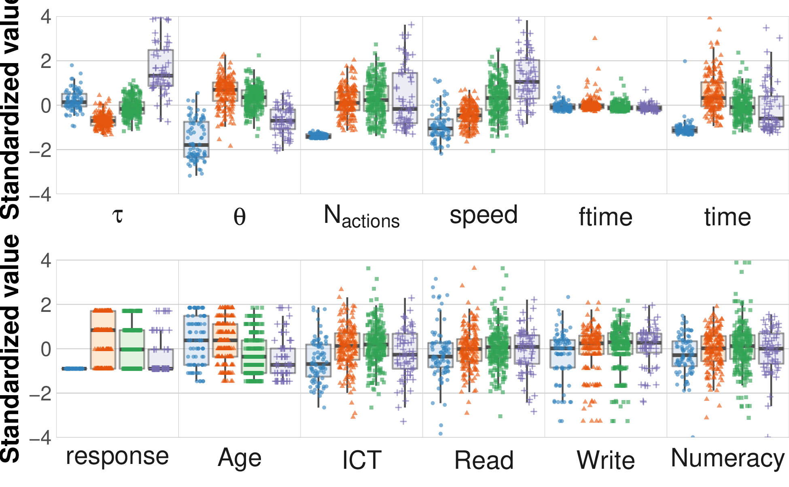
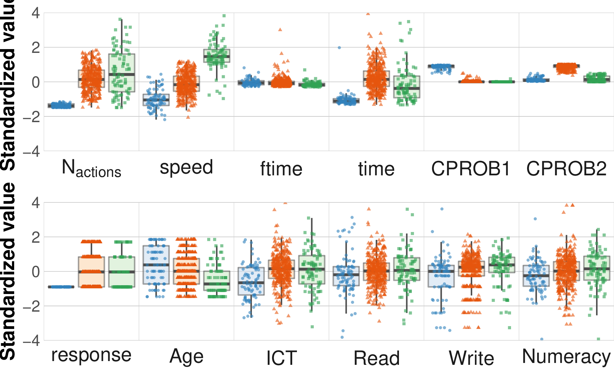

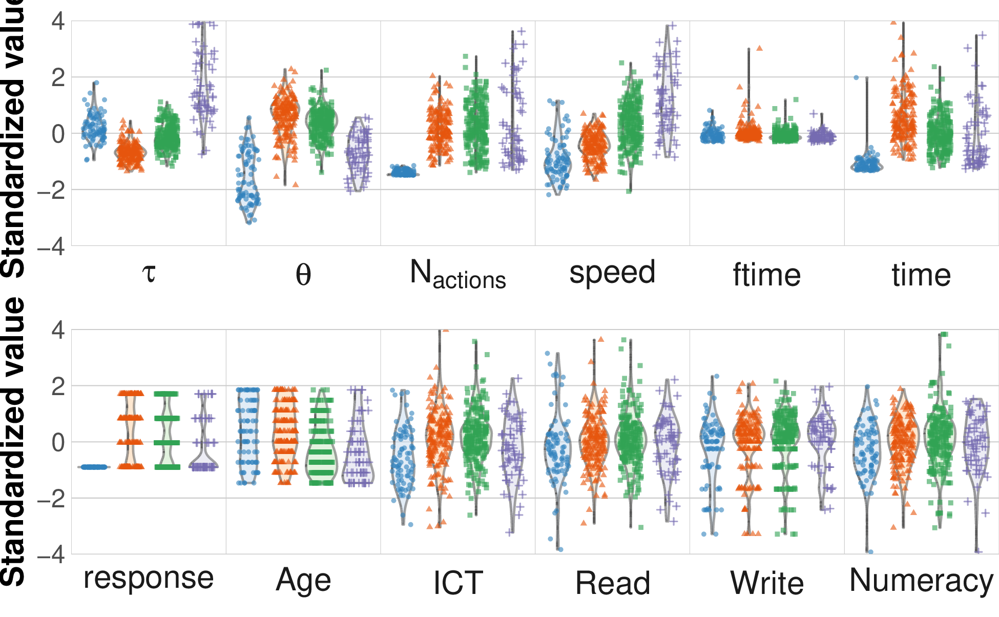
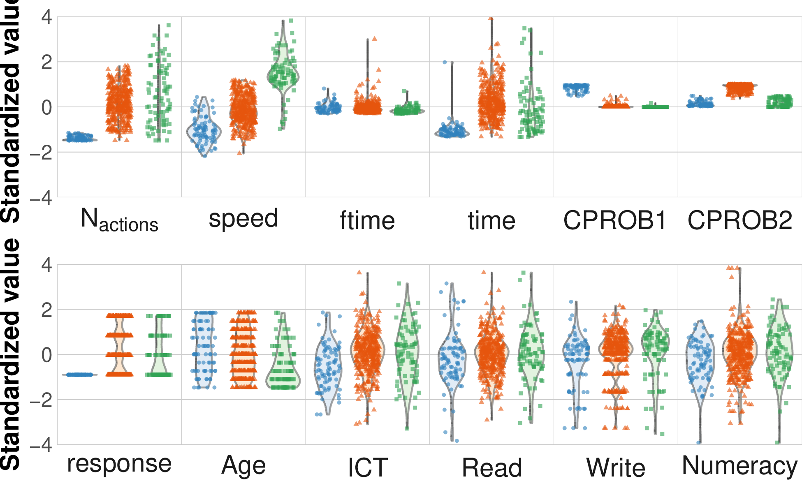


## response {#response}

Loading required package: ggplot2

### w/ tau and theta


|          tau|        theta|      naction|          spd|     AGEG5LFS|             n|
|------------:|------------:|------------:|------------:|------------:|-------------:|
|  0.88 (1.77)| -1.05 (1.11)|  1.85 (1.79)|  1.02 (1.83)| -0.23 (1.00)|  57.00 (0.00)|
| -0.38 (0.57)| -0.33 (0.91)|  0.04 (0.71)| -0.61 (0.49)|  0.42 (1.01)| 175.00 (0.00)|
|  0.67 (0.94)| -0.08 (0.98)| -0.18 (0.53)|  0.59 (0.79)| -0.45 (0.88)| 144.00 (0.00)|
| -0.43 (0.43)|  0.69 (0.47)| -0.47 (0.27)| -0.19 (0.58)|  0.02 (0.92)| 186.00 (0.00)|

### w/o tau and theta


|      naction|          spd|      CPROB1|      CPROB2|     AGEG5LFS|             n|
|------------:|------------:|-----------:|-----------:|------------:|-------------:|
|  3.06 (1.66)|  1.58 (2.25)| 0.94 (0.14)| 0.00 (0.00)| -0.13 (1.09)|  28.00 (0.00)|
| -0.53 (0.32)| -0.28 (0.60)| 0.01 (0.01)| 0.83 (0.13)|  0.04 (0.98)| 340.00 (0.00)|
|  0.48 (0.52)|  0.26 (0.99)| 0.06 (0.08)| 0.12 (0.15)| -0.06 (1.02)| 194.00 (0.00)|


# lamp\_return {#lamp-return}


## collocations {#collocations}

## Class  1


|bigram                                                                                                               | likelihood_ratio|
|:--------------------------------------------------------------------------------------------------------------------|----------------:|
|('TEXTBOX_ONFOCUS-u023_pg2_txt19.value=', 'TEXTBOX_KILLFOCUS-u023_pg2_txt19.value=')                                 |         589.8216|
|('BUTTON_obtain-u023_pg12_txt6', 'BUTTON_OBTAIN_close-u023_popup2_txt4')                                             |         538.4479|
|('BUTTON_RETURN_submit-u023_pg2_txt22', 'NEXT_INQUIRY-REQUEST')                                                      |         388.4260|
|('RADIO_BTN-u023_pg2_txt8', 'COMBOBOX-u023_pg2_menu1.index=1')                                                       |         320.5374|
|('TEXTBOX_KILLFOCUS-u023_pg2_txt19.value=7834', 'BUTTON_RETURN_submit-u023_pg2_txt22')                               |         306.3855|
|('TEXTLINK-u023_pg1_txt10.href=unit23page2.target=self', 'RADIO_BTN-u023_pg2_txt8')                                  |         300.3013|
|('TEXTLINK-u023_pg2_txt21.href=unit23page12.target=self', 'BUTTON_obtain-u023_pg12_txt6')                            |         237.8251|
|('TEXTLINK-u023_pg1_txt9.href=unit23page12.target=self', 'BUTTON_obtain-u023_pg12_txt6')                             |         227.3003|
|('KEYPRESS', 'TEXTBOX_KILLFOCUS-u023_pg2_txt19.value=7834')                                                          |         222.5735|
|('TEXTLINK-u023_default_txt10.href=unit23page1.target=self', 'TEXTLINK-u023_pg1_txt10.href=unit23page2.target=self') |         213.6009|
## Class  2


|bigram                                                                                    | likelihood_ratio|
|:-----------------------------------------------------------------------------------------|----------------:|
|('BUTTON_obtain-u023_pg12_txt6', 'BUTTON_OBTAIN_close-u023_popup2_txt4')                  |        1718.9581|
|('BUTTON_RETURN_submit-u023_pg2_txt22', 'NEXT_INQUIRY-REQUEST')                           |         851.9591|
|('RADIO_BTN-u023_pg2_txt8', 'COMBOBOX-u023_pg2_menu1.index=1')                            |         814.8844|
|('KEYPRESS', 'TEXTBOX_KILLFOCUS-u023_pg2_txt19.value=7834')                               |         806.4828|
|('TEXTBOX_ONFOCUS-u023_pg2_txt19.value=', 'KEYPRESS')                                     |         790.7215|
|('TEXTLINK-u023_pg1_txt10.href=unit23page2.target=self', 'RADIO_BTN-u023_pg2_txt8')       |         698.9622|
|('TEXTBOX_ONFOCUS-u023_pg2_txt19.value=', 'TEXTBOX_KILLFOCUS-u023_pg2_txt19.value=')      |         655.5400|
|('TEXTLINK-u023_pg2_txt21.href=unit23page12.target=self', 'BUTTON_obtain-u023_pg12_txt6') |         600.6666|
|('TEXTBOX_KILLFOCUS-u023_pg2_txt19.value=7834', 'BUTTON_RETURN_submit-u023_pg2_txt22')    |         586.4540|
|('TOOLBAR_mailApp-mailApp', 'MAIL_VIEWED-item305')                                        |         529.4708|
## Class  3


|bigram                                                                                   | likelihood_ratio|
|:----------------------------------------------------------------------------------------|----------------:|
|('BUTTON_obtain-u023_pg12_txt6', 'BUTTON_OBTAIN_close-u023_popup2_txt4')                 |        1078.8160|
|('BUTTON_RETURN_submit-u023_pg2_txt22', 'NEXT_INQUIRY-REQUEST')                          |         704.2991|
|('TEXTBOX_ONFOCUS-u023_pg2_txt19.value=', 'TEXTBOX_KILLFOCUS-u023_pg2_txt19.value=')     |         658.5855|
|('RADIO_BTN-u023_pg2_txt8', 'COMBOBOX-u023_pg2_menu1.index=1')                           |         649.2960|
|('KEYPRESS', 'TEXTBOX_KILLFOCUS-u023_pg2_txt19.value=7834')                              |         639.5205|
|('TEXTBOX_ONFOCUS-u023_pg2_txt19.value=', 'KEYPRESS')                                    |         604.0866|
|('TEXTLINK-u023_pg1_txt10.href=unit23page2.target=self', 'RADIO_BTN-u023_pg2_txt8')      |         574.7355|
|('TEXTBOX_KILLFOCUS-u023_pg2_txt19.value=7834', 'BUTTON_RETURN_submit-u023_pg2_txt22')   |         554.8621|
|('MAIL_VIEWED-item305', 'TOOLBAR_webApp-webApp')                                         |         443.4153|
|('TEXTLINK-u023_pg1_txt9.href=unit23page12.target=self', 'BUTTON_obtain-u023_pg12_txt6') |         414.3679|
## Class  4


|bigram                                                                                   | likelihood_ratio|
|:----------------------------------------------------------------------------------------|----------------:|
|('BUTTON_obtain-u023_pg12_txt6', 'BUTTON_OBTAIN_close-u023_popup2_txt4')                 |        1507.1803|
|('BUTTON_RETURN_submit-u023_pg2_txt22', 'NEXT_INQUIRY-REQUEST')                          |        1268.0231|
|('RADIO_BTN-u023_pg2_txt8', 'COMBOBOX-u023_pg2_menu1.index=1')                           |        1084.1788|
|('KEYPRESS', 'TEXTBOX_KILLFOCUS-u023_pg2_txt19.value=7834')                              |        1058.9451|
|('TEXTBOX_KILLFOCUS-u023_pg2_txt19.value=7834', 'BUTTON_RETURN_submit-u023_pg2_txt22')   |         991.3056|
|('TEXTBOX_ONFOCUS-u023_pg2_txt19.value=', 'KEYPRESS')                                    |         905.3262|
|('TEXTLINK-u023_pg1_txt10.href=unit23page2.target=self', 'RADIO_BTN-u023_pg2_txt8')      |         866.1994|
|('TOOLBAR_mailApp-mailApp', 'MAIL_VIEWED-item305')                                       |         817.2017|
|('MAIL_VIEWED-item305', 'TOOLBAR_webApp-webApp')                                         |         687.0170|
|('TEXTLINK-u023_pg1_txt9.href=unit23page12.target=self', 'BUTTON_obtain-u023_pg12_txt6') |         662.2376|


## visualise cluster {#visualise-cluster}

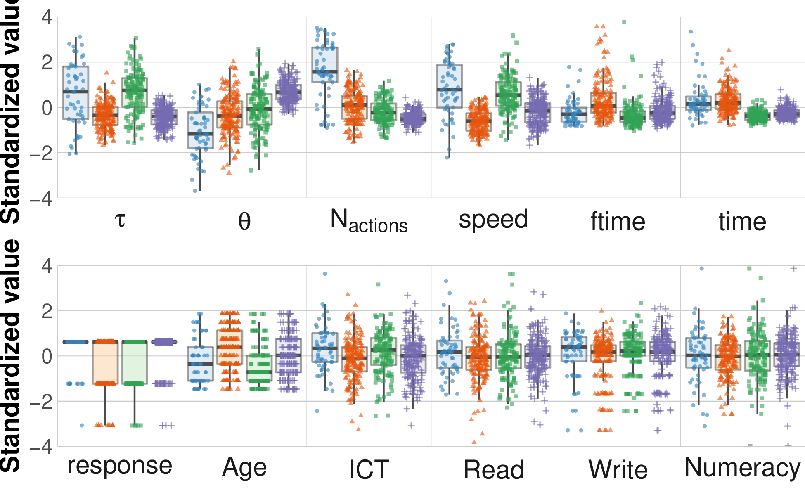
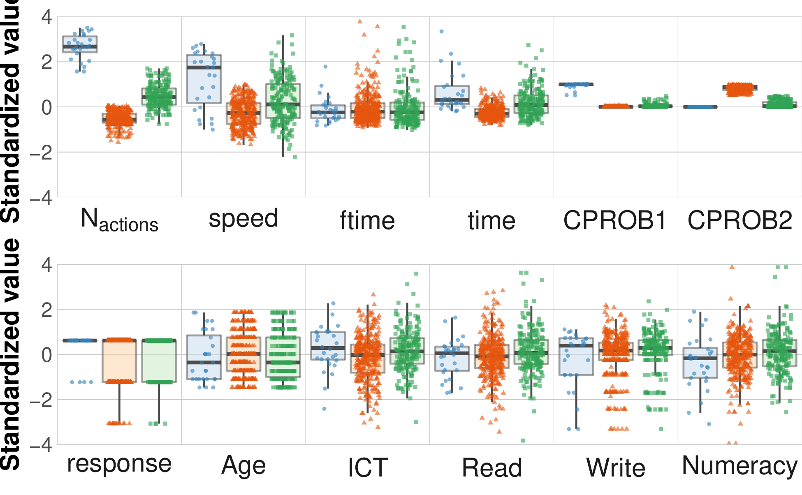

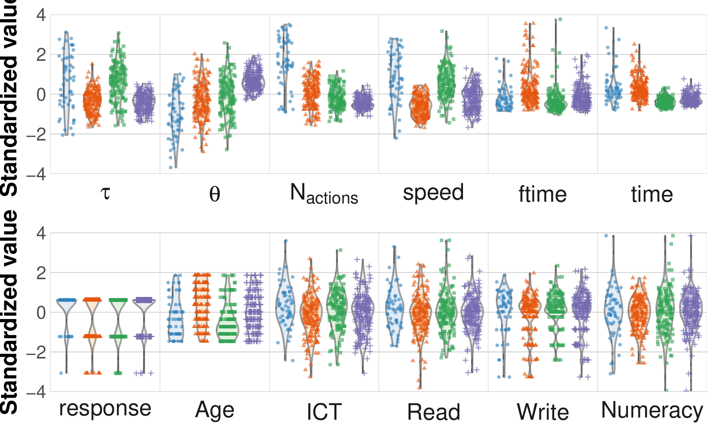
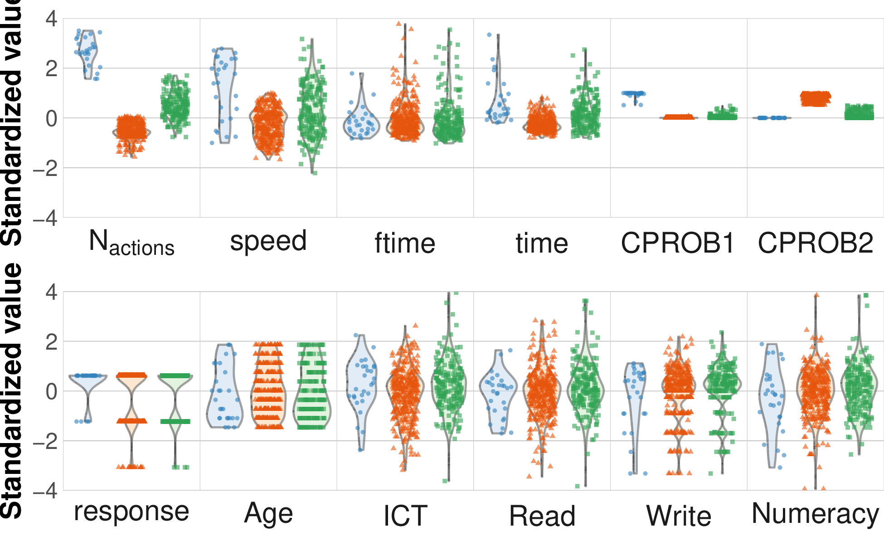


## response {#response}


### w/ tau and theta


|          tau|        theta|      naction|          spd|     AGEG5LFS|             n|
|------------:|------------:|------------:|------------:|------------:|-------------:|
|  0.88 (1.77)| -1.05 (1.11)|  1.85 (1.79)|  1.02 (1.83)| -0.23 (1.00)|  57.00 (0.00)|
| -0.38 (0.57)| -0.33 (0.91)|  0.04 (0.71)| -0.61 (0.49)|  0.42 (1.01)| 175.00 (0.00)|
|  0.67 (0.94)| -0.08 (0.98)| -0.18 (0.53)|  0.59 (0.79)| -0.45 (0.88)| 144.00 (0.00)|
| -0.43 (0.43)|  0.69 (0.47)| -0.47 (0.27)| -0.19 (0.58)|  0.02 (0.92)| 186.00 (0.00)|

### w/o tau and theta


|      naction|          spd|      CPROB1|      CPROB2|     AGEG5LFS|             n|
|------------:|------------:|-----------:|-----------:|------------:|-------------:|
|  3.06 (1.66)|  1.58 (2.25)| 0.94 (0.14)| 0.00 (0.00)| -0.13 (1.09)|  28.00 (0.00)|
| -0.53 (0.32)| -0.28 (0.60)| 0.01 (0.01)| 0.83 (0.13)|  0.04 (0.98)| 340.00 (0.00)|
|  0.48 (0.52)|  0.26 (0.99)| 0.06 (0.08)| 0.12 (0.15)| -0.06 (1.02)| 194.00 (0.00)|
