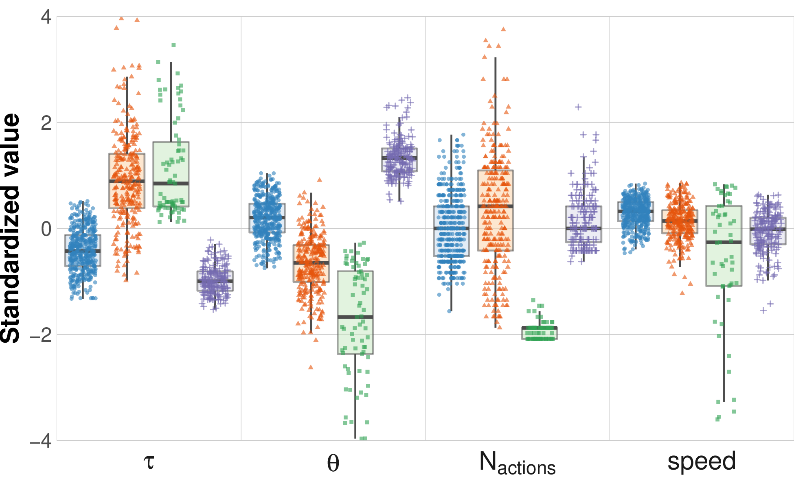
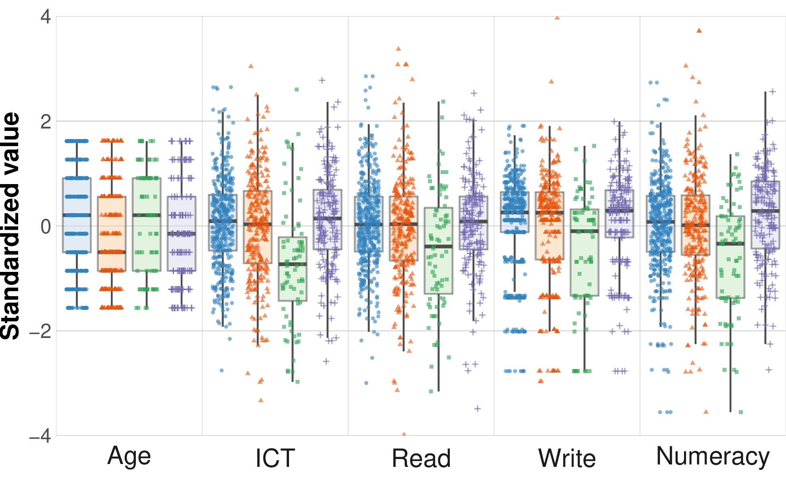

+++
title = "Tickets"
author = ["Jonghyun Yun"]
lastmod = 2021-12-21T14:54:19-06:00
draft = false
weight = 3
chapter = true
+++

<div class="ox-hugo-toc toc">
<div></div>

<div class="heading">Table of Contents</div>

- [collocation](#collocation)
- [visualize clusters](#visualize-clusters)
- [more plots](#more-plots)

</div>
<!--endtoc-->

We implement the prposed method to our motivating example.

-   `ftime`: time until the first action taken
-   `time`: total time of a person's process

We introduce two rudimentary statistcs.

-   `naction` or `#action`: the action sequence length \\(M\_{k}\\). The total number of actions taken by respondent \\(k\\).
-   `fastness`: `#action` divided by the total time elaped since \\(t\_{k,1}\\).

Multivariate Gaussian mixture for clustering

-   Varying variances and varying covariances (Model 6)

    AIC and BIC ..

I need one more on cluster analysis:

-   [ ] I want to compare sub-sequences between clusters: longest common subsequence <&ulitzsch_combining_2021>
    -   common subsequences in LCS? NLP would be useful here: common phrase?
        -   ans: n-grams like tri-grams
        -   ans: most interesting collocations
-   [ ] map respondent to word embedding, mark speed / &tau; / &theta;
-   [ ] action frequencies cluster: top 5 actions?
-   [ ] how sentences are compared in NLP? Text Summarization

Do

1.  collcations: freq and time -> show what are these actions, explain semantic ass and time efficiency
2.  map respondents marked by &tau;, &theta;: find neighboring actions?? not necessarily what they did
3.  text summary: how it works? too ambiguous.. it seems to work by removing some sentences

<!--listend-->

```emacs-lisp
(insert-file (concat out_dir "/lpa_mods.txt"))
```

```R
--------------------------------------------------------------
tau and theta + naction, spd
--------------------------------------------------------------
Compare tidyLPA solutions:

 Model Classes AIC      AWE      BIC      CLC      KIC
 6     1       9741.434 9945.767 9809.601 9715.434 9758.434
 6     2       6976.934 7402.489 7118.135 6920.782 7008.934
 6     3       5955.984 6602.815 6170.221 5869.626 6002.984
 6     4       5589.996 6457.851 5877.267 5473.684 5651.996

Best model according to AIC is Model 6 with 4 classes.
Best model according to AWE is Model 6 with 4 classes.
Best model according to BIC is Model 6 with 4 classes.
Best model according to CLC is Model 6 with 4 classes.
Best model according to KIC is Model 6 with 4 classes.

An analytic hierarchy process, based on the fit indices AIC, AWE, BIC, CLC, and KIC (Akogul & Erisoglu, 2017), suggests the best solution is Model 6 with 4 classes.

--------------------------------------------------------------
naction, spd
--------------------------------------------------------------
Compare tidyLPA solutions:

 Model Classes AIC      AWE      BIC      CLC      KIC
 6     1       5391.087 5462.777 5415.432 5383.087 5399.087
 6     2       3693.159 3853.480 3746.718 3672.956 3707.159
 6     3       3370.270 3619.131 3453.043 3337.955 3390.270
 6     4       3506.481 3844.076 3618.469 3461.861 3532.481

Best model according to AIC is Model 6 with 3 classes.
Best model according to AWE is Model 6 with 3 classes.
Best model according to BIC is Model 6 with 3 classes.
Best model according to CLC is Model 6 with 3 classes.
Best model according to KIC is Model 6 with 3 classes.

An analytic hierarchy process, based on the fit indices AIC, AWE, BIC, CLC, and KIC (Akogul & Erisoglu, 2017), suggests the best solution is Model 6 with 3 classes.
```

```sh
out_dir="tickets/"
cd $out_dir
cd figure
convert -density 300 tau_action.pdf tau_action.png
convert -density 300 theta_tau_res.pdf theta_tau_res.png
convert -density 300 time_action_more.pdf time_action_more-%d.png
convert -density 300 time_action.pdf time_action-%d.png
```

```sh
out_dir="tickets/"
cd $out_dir
cd figure
convert -density 300 lpa_box4.pdf lpa_box4.png
convert -density 300 lpa_box_back.pdf lpa_box_back.png
```


# collocation {#collocation}

## Class 4

|bigram                                                               | likelihood_ratio|
|:--------------------------------------------------------------------|----------------:|
|('TAB-tabbutton2', 'TAB-tabbutton1')                                 |        3250.4640|
|('BUTTON_submit-pg2_txt33', 'BUTTON_submit_ok-u21p2pu5_txt2')        |        1593.4218|
|('BUTTON_submit_ok-u21p2pu5_txt2', 'NEXT_INQUIRY-REQUEST')           |        1203.7973|
|('COMBOBOX-default_menu1.index=7', 'COMBOBOX-default_menu2.index=2') |        1170.1266|
|('COMBOBOX-default_menu2.index=2', 'BUTTON_search-default_txt23')    |        1132.6405|
|('CHECKBOX-check11', 'BUTTON_available-pg1_txt47')                   |        1044.0817|
|('CHECKBOX-check9', 'CHECKBOX-check11')                              |        1012.5782|
|('CHECKBOX-check2', 'CHECKBOX-check3')                               |         823.4326|
|('BUTTON_available-pg1_txt47', 'COMBOBOX-pg2_menu1.index=8')         |         666.0548|
|('COMBOBOX-pg2_menu6.index=8', 'BUTTON_submit-pg2_txt33')            |         644.3896|

## Class 3

|bigram                                                                                                             | likelihood_ratio|
|:------------------------------------------------------------------------------------------------------------------|----------------:|
|('BUTTON_search-default_txt23', 'BUTTON_close-popup1_txt4')                                                        |        60.525996|
|('COMBOBOX-default_menu1.index=7', 'COMBOBOX-default_menu2.index=2')                                               |        30.504433|
|('COMBOBOX-default_menu2.index=2', 'NEXT_INQUIRY-REQUEST')                                                         |        18.700064|
|('TAB-tabbutton2', 'TAB-tabbutton1')                                                                               |        14.000061|
|('CHECKBOX-check4', 'BUTTON_available-pg1_txt47')                                                                  |        13.654947|
|('COMBOBOX-default_menu1.index=3', 'COMBOBOX-default_menu2.index=1')                                               |        10.670246|
|('BUTTON_close-popup1_txt4', 'NEXT_INQUIRY-REQUEST')                                                               |        10.305298|
|('BOX_PRESS-action=as://switchStateButton(u021_default_form1a,unit21page6,u021_default_popup2)', 'TAB-tabbutton1') |         9.835862|
|('COMBOBOX-default_menu1.index=3', 'COMBOBOX-default_menu1.index=4')                                               |         9.156266|
|('COMBOBOX-default_menu1.index=3', 'COMBOBOX-default_menu2.index=4')                                               |         9.156266|

## Class 2

|bigram                                                               | likelihood_ratio|
|:--------------------------------------------------------------------|----------------:|
|('TAB-tabbutton2', 'TAB-tabbutton1')                                 |        4358.0690|
|('BUTTON_submit-pg2_txt33', 'BUTTON_submit_ok-u21p2pu5_txt2')        |        2503.5212|
|('BUTTON_available-pg1_txt47', 'BUTTON_available-pg7_txt47')         |        1248.4710|
|('COMBOBOX-default_menu2.index=2', 'BUTTON_search-default_txt23')    |        1062.6828|
|('BUTTON_submit_ok-u21p2pu5_txt2', 'NEXT_INQUIRY-REQUEST')           |        1061.0533|
|('COMBOBOX-default_menu1.index=7', 'COMBOBOX-default_menu2.index=2') |         896.4663|
|('BUTTON_submit_ok-u21p2pu5_txt2', 'BUTTON_close-popup2_txt4')       |         822.5202|
|('CHECKBOX-check2', 'CHECKBOX-check3')                               |         577.8453|
|('CHECKBOX-check9', 'CHECKBOX-check11')                              |         561.1858|
|('CHECKBOX-check11', 'BUTTON_available-pg1_txt47')                   |         409.1931|

## Class 1

|bigram                                                               | likelihood_ratio|
|:--------------------------------------------------------------------|----------------:|
|('TAB-tabbutton2', 'TAB-tabbutton1')                                 |        5518.3265|
|('BUTTON_submit-pg2_txt33', 'BUTTON_submit_ok-u21p2pu5_txt2')        |        3888.7627|
|('BUTTON_submit_ok-u21p2pu5_txt2', 'NEXT_INQUIRY-REQUEST')           |        2233.5503|
|('COMBOBOX-default_menu1.index=7', 'COMBOBOX-default_menu2.index=2') |        1954.7621|
|('COMBOBOX-default_menu2.index=2', 'BUTTON_search-default_txt23')    |        1806.9551|
|('CHECKBOX-check9', 'CHECKBOX-check11')                              |        1586.1384|
|('CHECKBOX-check2', 'CHECKBOX-check3')                               |        1576.2932|
|('CHECKBOX-check11', 'BUTTON_available-pg1_txt47')                   |        1194.1592|
|('BUTTON_available-pg1_txt47', 'BUTTON_available-pg7_txt47')         |        1155.0621|
|('COMBOBOX-pg2_menu6.index=8', 'BUTTON_submit-pg2_txt33')            |         995.2568|

## Some covariates

|Name        |Label                                                                               |Value scheme                                          |
|:-----------|:-----------------------------------------------------------------------------------|:-----------------------------------------------------|
|AGEG5LFS    |Age groups in 5-year intervals based on LFS groupings (derived)                     |Derived - Age groups in equal 5 year intervals (1-10) |
|NFEHRS      |Number of hours of participation in non-formal education (derived)                  |NA                                                    |
|EARNHRDCL   |Hourly earnings excluding bonuses for wage and salary earners, in deciles (derived) |Derived - Decile                                      |
|LEARNATWORK |Index of learning at work (derived)                                                 |NA                                                    |
|ICTHOME     |Index of use of ICT skills at home (derived)                                        |NA                                                    |
|ICTWORK     |Index of use of ICT skills at work (derived)                                        |NA                                                    |
|INFLUENCE   |Index of use of influencing skills at work (derived)                                |NA                                                    |
|NUMHOME     |Index of use of numeracy skills at home (basic and advanced - derived)              |NA                                                    |
|NUMWORK     |Index of use of numeracy skills at work (basic and advanced - derived)              |NA                                                    |
|READHOME    |Index of use of reading skills at home (prose and document texts - derived)         |NA                                                    |
|READWORK    |Index of use of reading skills at work (prose and document texts - derived)         |NA                                                    |
|TASKDISC    |Index of use of task discretion at work (derived)                                   |NA                                                    |
|WRITHOME    |Index of use of writing skills at home (derived)                                    |NA                                                    |
|WRITWORK    |Index of use of writing skills at work (derived)                                    |NA                                                    |


# visualize clusters {#visualize-clusters}

|  |  |
|----------------------------|----------------------------|






Response: the smaller, the better

## mean


|        tau|      theta|    naction|        spd|      res|
|----------:|----------:|----------:|----------:|--------:|
| -0.4123013|  0.1939430|  0.0105633|  0.2949513| 3.710588|
|  0.9344900| -0.6655596|  0.3971435|  0.1263112| 5.219081|
|  1.1296467| -1.7866636| -1.9230219| -1.9932064| 7.000000|
| -0.9718218|  1.3403763|  0.1527688| -0.0648598| 3.145251|

## sd


|       tau|    theta|   naction|       spd|      res|
|---------:|--------:|---------:|---------:|--------:|
| 0.4111353| 0.384638| 0.6375695| 0.2628682| 2.989527|
| 0.9065238| 0.553052| 1.2095532| 0.3520752| 2.745995|
| 0.9047816| 1.085768| 0.1671354| 2.6734464| 0.000000|
| 0.2688267| 0.354953| 0.5181867| 0.3940398| 2.883724|

## n


| tau| theta| naction| spd| res|
|---:|-----:|-------:|---:|---:|
| 425|   425|     425| 425| 425|
| 283|   283|     283| 283| 283|
|  75|    75|      75|  75|  75|
| 179|   179|     179| 179| 179|


# more plots {#more-plots}

&tau;'s covaritates:
&theta;'s covaritates:

|        |           |
|-------------------------------------|-------------------------------------|
|        |   |
|   |   |
|   |   |
|  |  |
|  |                                     |
