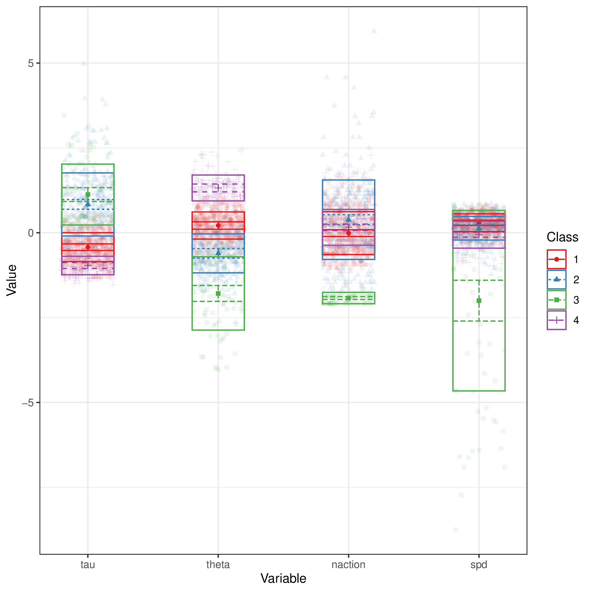
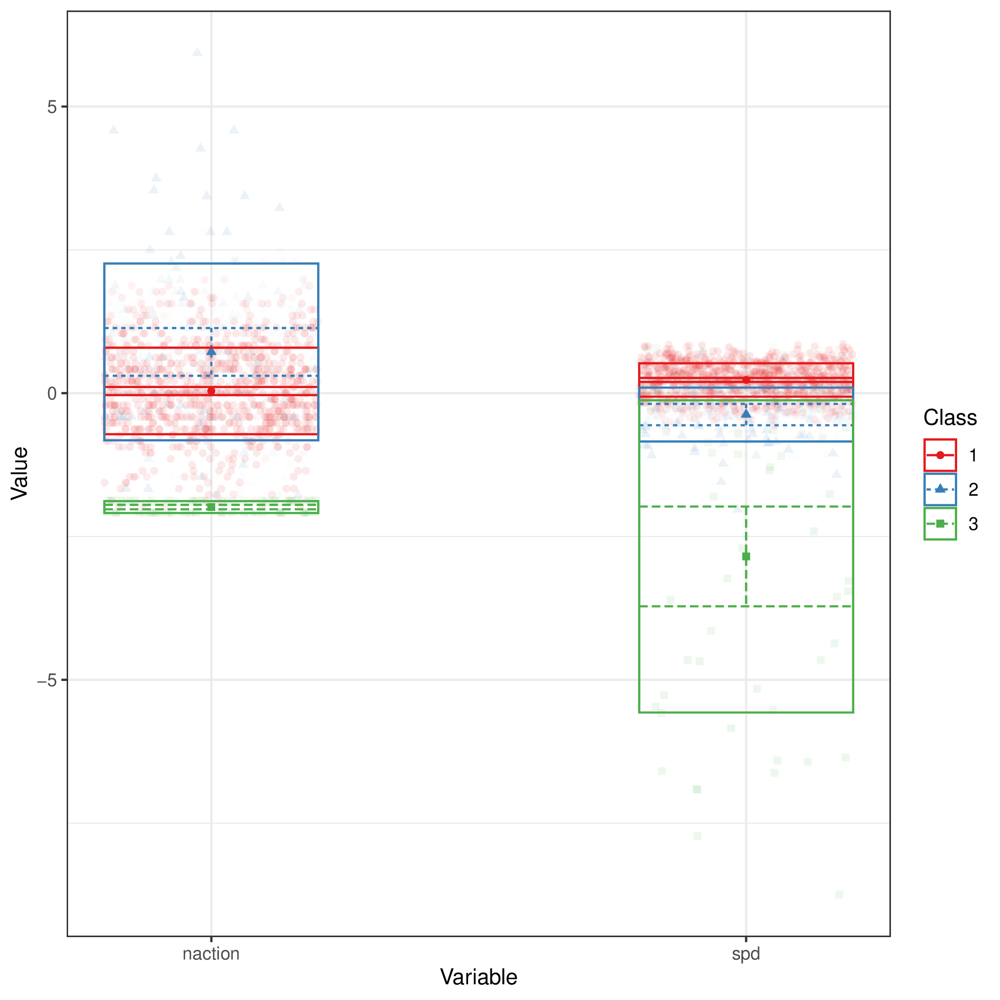
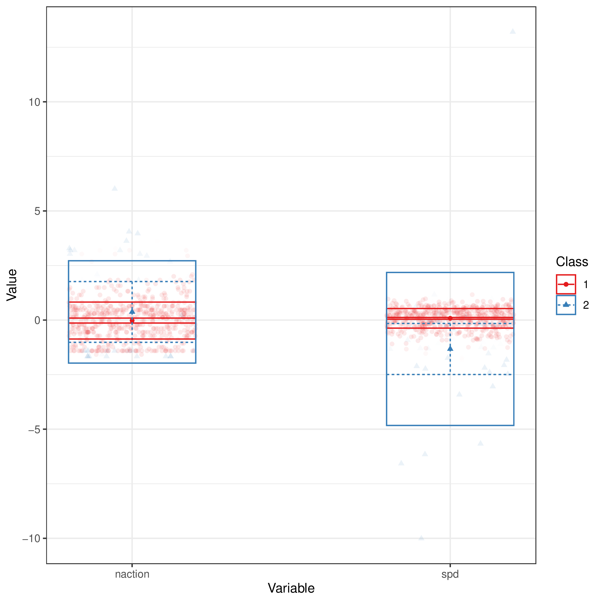

+++
title = "clustering"
author = ["Jonghyun Yun"]
lastmod = 2021-11-04T13:56:10-05:00
draft = false
weight = 1
chapter = true
+++

Table of Contents

- [party\_invitations-1](#party-invitations-1)
- [tickets](#tickets)
- [book\_order](#book-order)

<!--endtoc-->

# party\_invitations-1 {#party-invitations-1}

# tickets {#tickets}

# book\_order {#book-order}

