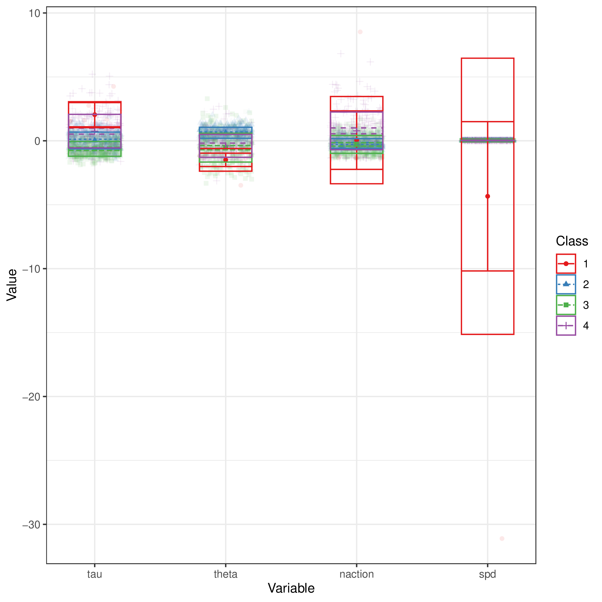
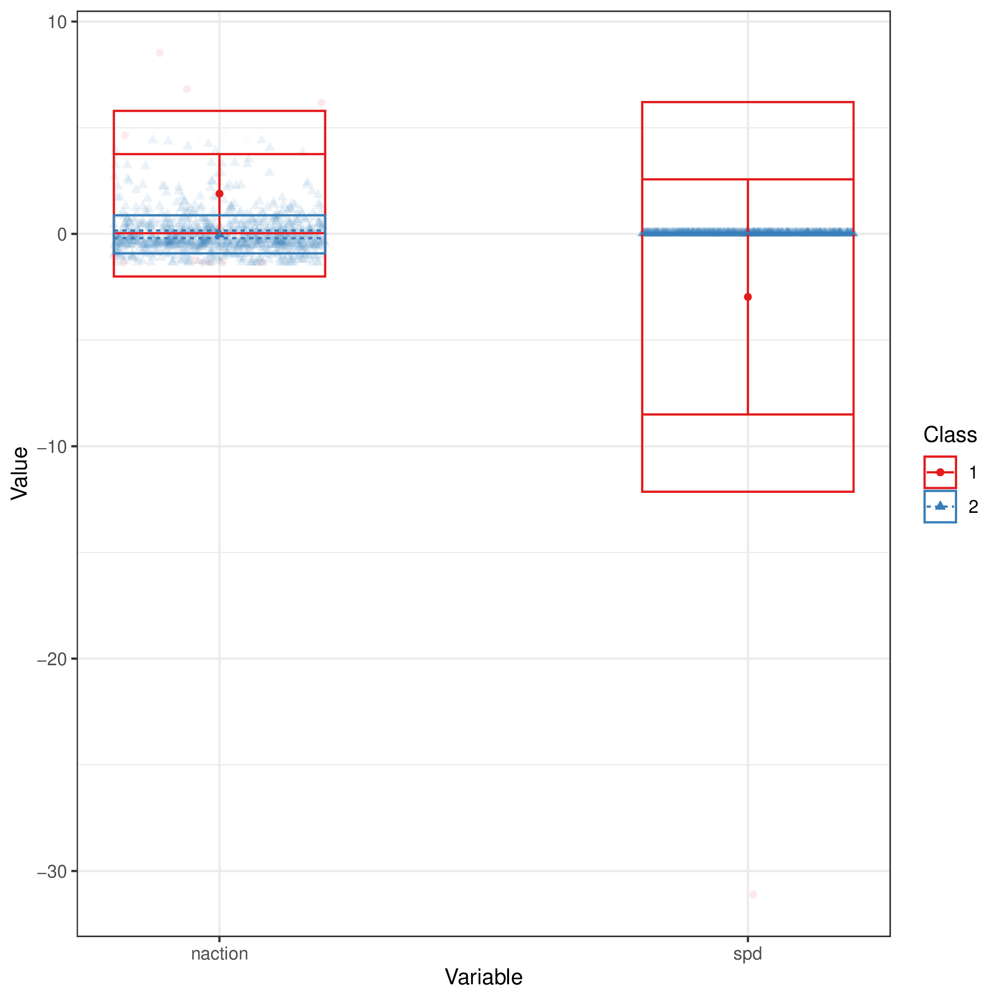
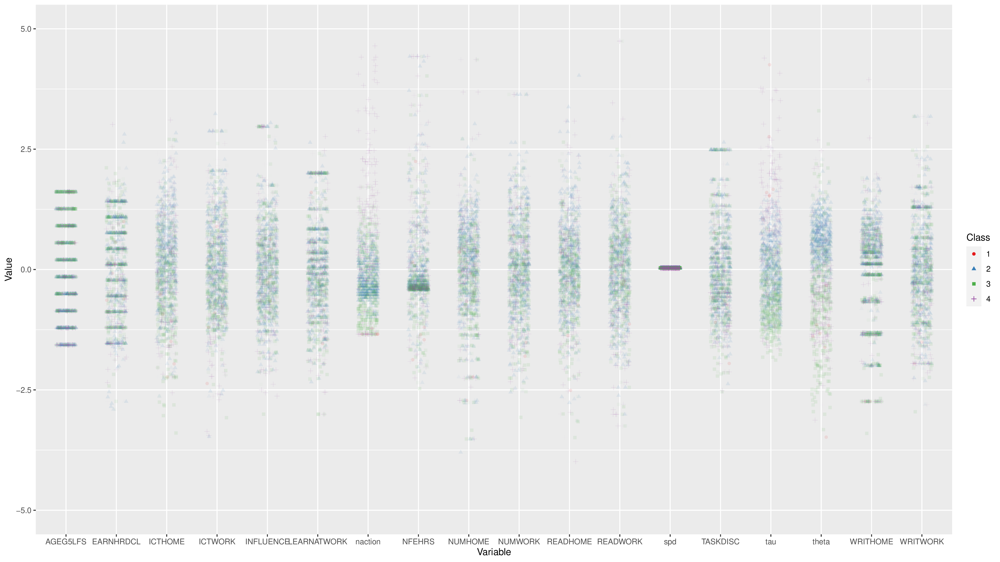
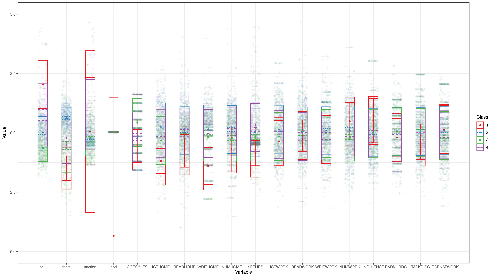
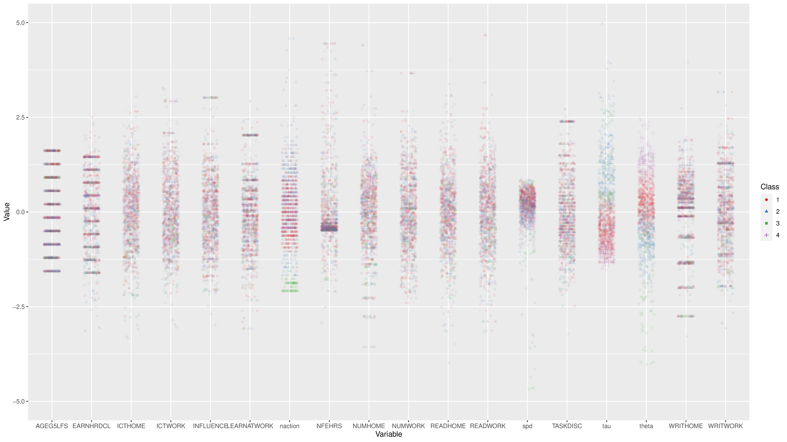
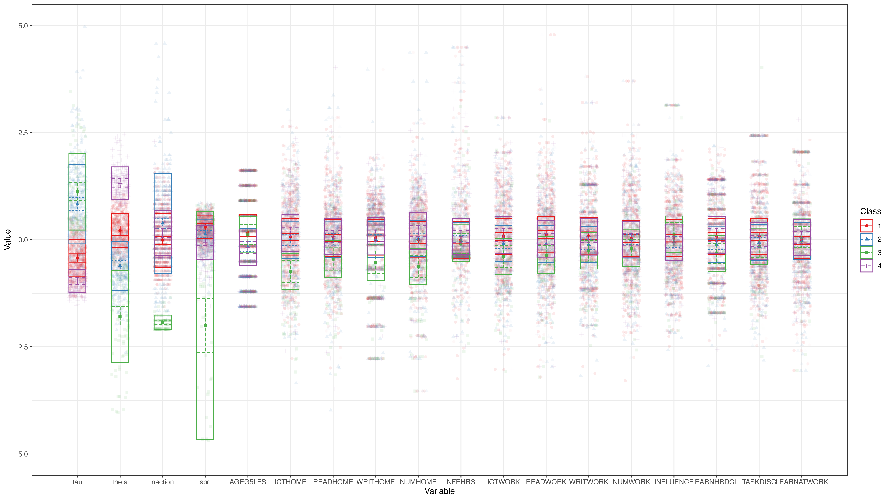
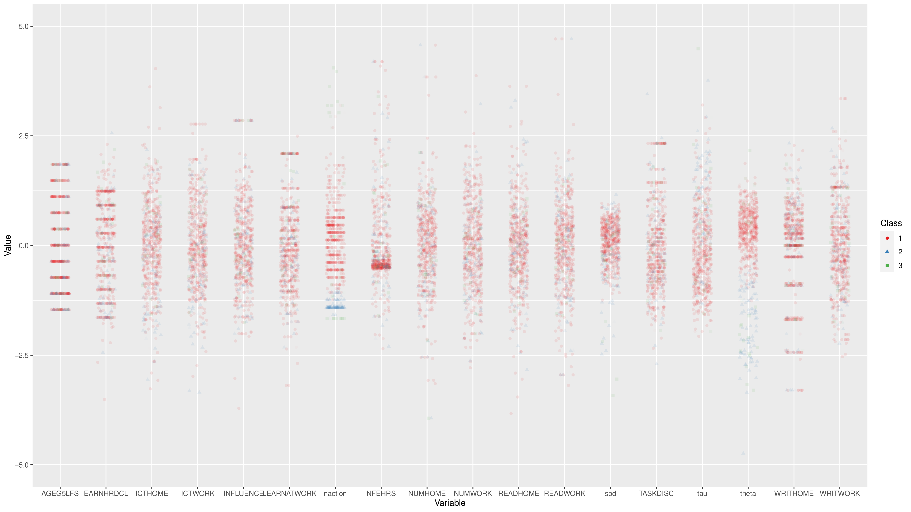
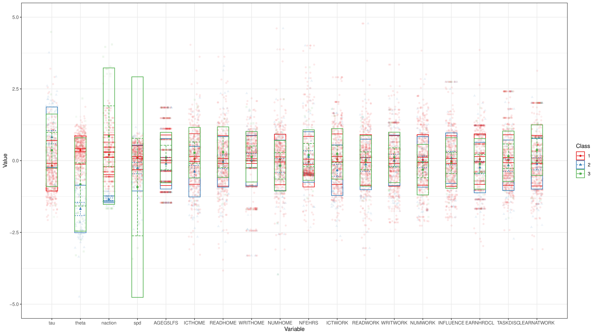

+++
title = "clustering"
author = ["Jonghyun Yun"]
lastmod = 2021-11-22T16:20:21-06:00
draft = false
weight = 1
chapter = true
+++

Table of Contents

- [party\_invitations-1](#party-invitations-1)
- [tickets](#tickets)
- [book\_order](#book-order)

<!--endtoc-->

`ftime = timestamp[1] / 1000, naction = n(), time = timestamp[n()] / 1000, spd = naction / (ftime - time)`
&tau;: person's baseline hazard for action transition
&theta;: person's xxx to jump to a similar action for the next one

|Name        |Label                                                                               |Value scheme                                          |
|:-----------|:-----------------------------------------------------------------------------------|:-----------------------------------------------------|
|AGEG5LFS    |Age groups in 5-year intervals based on LFS groupings (derived)                     |Derived - Age groups in equal 5 year intervals (1-10) |
|NFEHRS      |Number of hours of participation in non-formal education (derived)                  |NA                                                    |
|EARNHRDCL   |Hourly earnings excluding bonuses for wage and salary earners, in deciles (derived) |Derived - Decile                                      |
|LEARNATWORK |Index of learning at work (derived)                                                 |NA                                                    |
|ICTHOME     |Index of use of ICT skills at home (derived)                                        |NA                                                    |
|ICTWORK     |Index of use of ICT skills at work (derived)                                        |NA                                                    |
|INFLUENCE   |Index of use of influencing skills at work (derived)                                |NA                                                    |
|NUMHOME     |Index of use of numeracy skills at home (basic and advanced - derived)              |NA                                                    |
|NUMWORK     |Index of use of numeracy skills at work (basic and advanced - derived)              |NA                                                    |
|READHOME    |Index of use of reading skills at home (prose and document texts - derived)         |NA                                                    |
|READWORK    |Index of use of reading skills at work (prose and document texts - derived)         |NA                                                    |
|TASKDISC    |Index of use of task discretion at work (derived)                                   |NA                                                    |
|WRITHOME    |Index of use of writing skills at home (derived)                                    |NA                                                    |
|WRITWORK    |Index of use of writing skills at work (derived)                                    |NA                                                    |

# party\_invitations-1 {#party-invitations-1}

## mean

|        tau|      theta|    naction|        spd|       res|
|----------:|----------:|----------:|----------:|---------:|
|  2.0563546| -1.4942981|  0.0841316| -4.4287605| 0.4285714|
|  0.0216743|  0.6296890| -0.2115868|  0.0312633| 2.7697517|
| -0.6472588| -0.5780634| -0.2753689|  0.0345127| 1.1844660|
|  0.8341553| -0.4259267|  0.8447064|  0.0307452| 1.8957346|

## sd

|       tau|     theta|   naction|        spd|      res|
|---------:|---------:|---------:|----------:|--------:|
| 1.0991249| 0.9644910| 3.7204805| 11.7664714| 1.133893|
| 0.6498181| 0.4327975| 0.3830087|  0.0016937| 0.563832|
| 0.5699341| 1.1143492| 0.6979747|  0.0011854| 1.322244|
| 1.3255476| 0.8873260| 1.5074309|  0.0024590| 1.237713|

## n

| tau| theta| naction| spd| res|
|---:|-----:|-------:|---:|---:|
|   7|     7|       7|   7|   7|
| 443|   443|     443| 443| 443|
| 309|   309|     309| 309| 309|
| 211|   211|     211| 211| 211|

# tickets {#tickets}

## mean

|        tau|      theta|    naction|        spd|      res|
|----------:|----------:|----------:|----------:|--------:|
| -0.4123013|  0.1939430|  0.0105633|  0.2949513| 3.710588|
|  0.9344900| -0.6655596|  0.3971435|  0.1263112| 5.219081|
|  1.1296467| -1.7866636| -1.9230219| -1.9932064| 7.000000|
| -0.9718218|  1.3403763|  0.1527688| -0.0648598| 3.145251|

## sd

|       tau|    theta|   naction|       spd|      res|
|---------:|--------:|---------:|---------:|--------:|
| 0.4111353| 0.384638| 0.6375695| 0.2628682| 2.989527|
| 0.9065238| 0.553052| 1.2095532| 0.3520752| 2.745995|
| 0.9047816| 1.085768| 0.1671354| 2.6734464| 0.000000|
| 0.2688267| 0.354953| 0.5181867| 0.3940398| 2.883724|

## n

| tau| theta| naction| spd| res|
|---:|-----:|-------:|---:|---:|
| 425|   425|     425| 425| 425|
| 283|   283|     283| 283| 283|
|  75|    75|      75|  75|  75|
| 179|   179|     179| 179| 179|

# book\_order {#book-order}

## mean

|        tau|      theta|    naction|        spd|      res|
|----------:|----------:|----------:|----------:|--------:|
| -0.1796185|  0.3713422|  0.2076782|  0.1051426| 2.266667|
|  0.8268249| -1.6669104| -1.3426361| -0.2532945| 6.318182|
|  0.3102977| -0.7852254|  0.9498770| -0.9624705| 4.230769|

## sd

|       tau|     theta|   naction|       spd|      res|
|---------:|---------:|---------:|---------:|--------:|
| 0.8760688| 0.4854905| 0.6785404| 0.4186236| 2.451307|
| 1.0592788| 0.8313262| 0.1204197| 0.7950367| 1.915127|
| 1.3204838| 1.7256246| 2.4779712| 3.9729973| 3.050347|

## n

| tau| theta| naction| spd| res|
|---:|-----:|-------:|---:|---:|
| 450|   450|     450| 450| 450|
|  88|    88|      88|  88|  88|
|  26|    26|      26|  26|  26|
