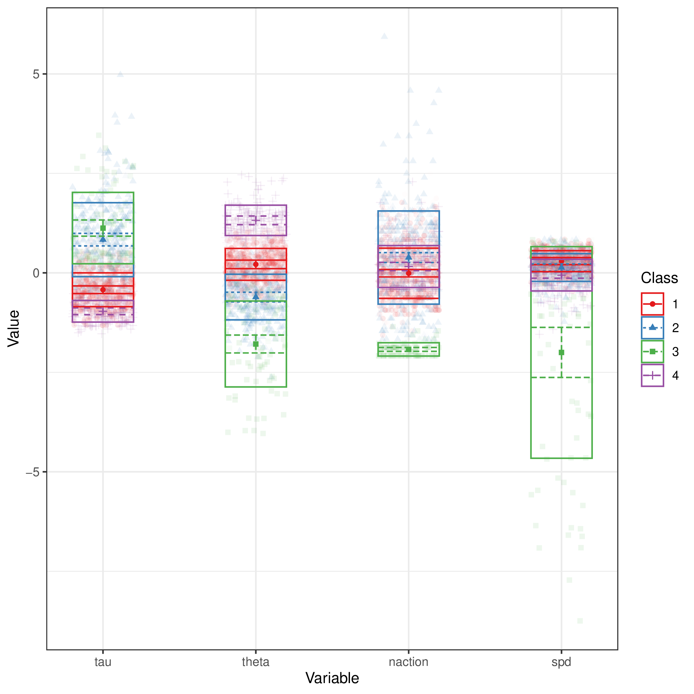

+++
title = "clustering"
author = ["Jonghyun Yun"]
lastmod = 2021-11-23T11:29:29-06:00
draft = false
weight = 1
chapter = true
+++

Table of Contents

- [party\_invitations-1](#party-invitations-1)
- [tickets](#tickets)
- [book\_order](#book-order)

<!--endtoc-->

`ftime = timestamp[1] / 1000, naction = n(), time = timestamp[n()] / 1000, spd = naction / (ftime - time)`
&tau;: person's baseline hazard for action transition
&theta;: person's xxx to jump to a similar action for the next one

|Name        |Label                                                                               |Value scheme                                          |
|:-----------|:-----------------------------------------------------------------------------------|:-----------------------------------------------------|
|AGEG5LFS    |Age groups in 5-year intervals based on LFS groupings (derived)                     |Derived - Age groups in equal 5 year intervals (1-10) |
|NFEHRS      |Number of hours of participation in non-formal education (derived)                  |NA                                                    |
|EARNHRDCL   |Hourly earnings excluding bonuses for wage and salary earners, in deciles (derived) |Derived - Decile                                      |
|LEARNATWORK |Index of learning at work (derived)                                                 |NA                                                    |
|ICTHOME     |Index of use of ICT skills at home (derived)                                        |NA                                                    |
|ICTWORK     |Index of use of ICT skills at work (derived)                                        |NA                                                    |
|INFLUENCE   |Index of use of influencing skills at work (derived)                                |NA                                                    |
|NUMHOME     |Index of use of numeracy skills at home (basic and advanced - derived)              |NA                                                    |
|NUMWORK     |Index of use of numeracy skills at work (basic and advanced - derived)              |NA                                                    |
|READHOME    |Index of use of reading skills at home (prose and document texts - derived)         |NA                                                    |
|READWORK    |Index of use of reading skills at work (prose and document texts - derived)         |NA                                                    |
|TASKDISC    |Index of use of task discretion at work (derived)                                   |NA                                                    |
|WRITHOME    |Index of use of writing skills at home (derived)                                    |NA                                                    |
|WRITWORK    |Index of use of writing skills at work (derived)                                    |NA                                                    |

# party\_invitations-1 {#party-invitations-1}



Response: the larger, the better

### mean
Error in mm %>% select(4:8) %>% knitr::kable() :
  could not find function "%>%"

### sd
Error in sd %>% select(4:8) %>% knitr::kable() :
  could not find function "%>%"

### n
Error in n %>% select(4:8) %>% knitr::kable() :
  could not find function "%>%"

# tickets {#tickets}



Response: the smaller, the better

### mean
Error in mm %>% select(4:8) %>% knitr::kable() :
  could not find function "%>%"

### sd
Error in sd %>% select(4:8) %>% knitr::kable() :
  could not find function "%>%"

### n
Error in n %>% select(4:8) %>% knitr::kable() :
  could not find function "%>%"

# book\_order {#book-order}



Response: the larger, the better

### mean
Error in mm %>% select(4:8) %>% knitr::kable() :
  could not find function "%>%"

### sd
Error in sd %>% select(4:8) %>% knitr::kable() :
  could not find function "%>%"

### n
Error in n %>% select(4:8) %>% knitr::kable() :
  could not find function "%>%"
