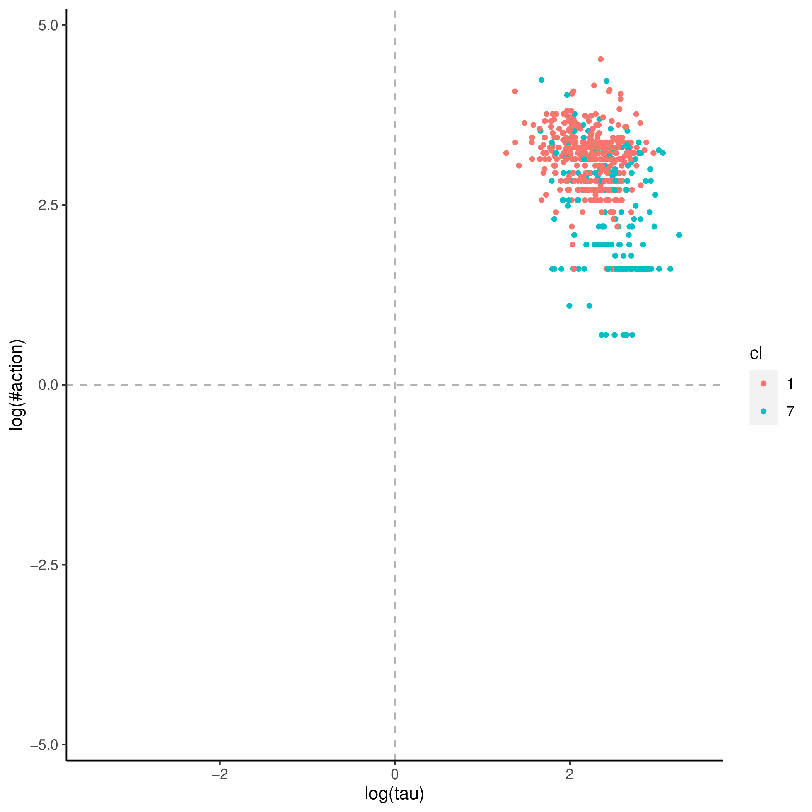
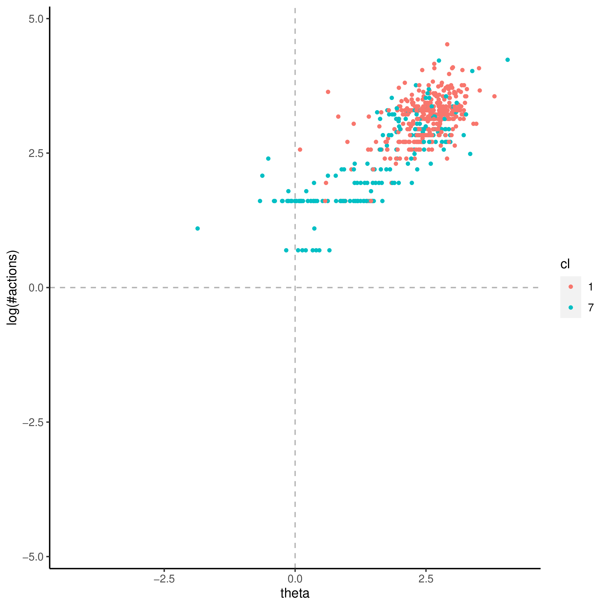
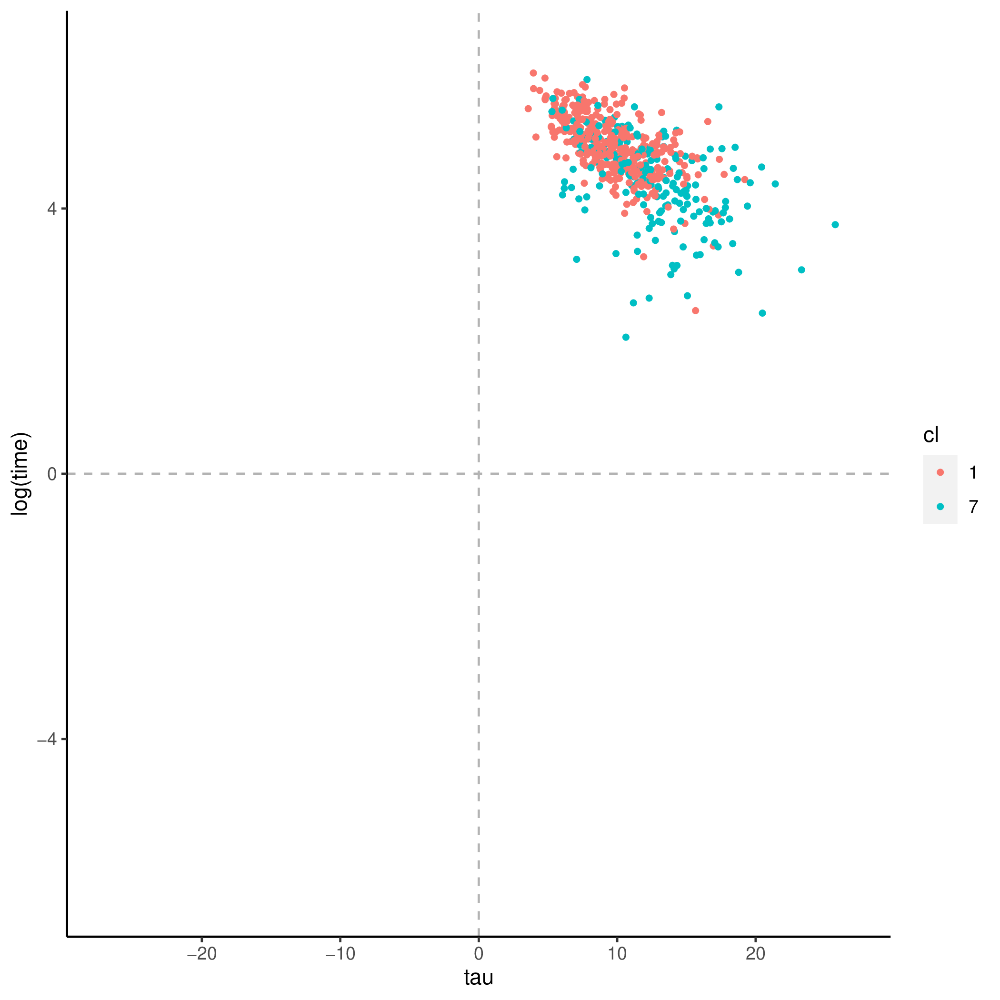

+++
title = "book_order"
author = ["Jonghyun Yun"]
lastmod = 2021-09-21T15:27:02-05:00
draft = false
weight = 1
chapter = true
+++

&tau;'s covaritates:

|Name           |Label                                                                                                       |      imp|      pval|
|:--------------|:-----------------------------------------------------------------------------------------------------------|--------:|---------:|
|B_Q11          |Education - Formal qualification - Grant from employer                                                      | 2.039946| 0.0099010|
|FAET12         |Participated in formal AET in 12 months preceding survey (see AETPOP - derived)                             | 1.316256| 0.0099010|
|FAET12NJR      |Participated in formal AET for non job-related reasons in 12 months preceding survey (see AETPOP - derived) | 1.818654| 0.0198020|
|ISCO1C         |Occupational classification of respondent's job at 1-digit level (ISCO 2008), current job (derived)         | 1.609067| 0.0891089|
|ISCO2C         |Occupational classification of respondent's job at 2-digit level (ISCO 2008), current job (derived)         | 1.975223| 0.1386139|
|EARNHRBONUSDCL |Hourly earnings including bonuses for wage and salary earners, in deciles (derived)                         | 1.053179| 0.2079208|
|AGEG5LFS       |Age groups in 5-year intervals based on LFS groupings (derived)                                             | 2.005220| 0.2970297|
|C_Q09_C        |Current status/work history - Years of paid work during lifetime (top-coded at 47)                          | 2.223969| 0.3168317|

&theta;'s covaritates:

|Name           |Label                                                                                               |       imp|      pval|
|:--------------|:---------------------------------------------------------------------------------------------------|---------:|---------:|
|J_Q08          |Background - Number of books at home                                                                | 0.0271501| 0.0099010|
|ICTHOME        |Index of use of ICT skills at home (derived)                                                        | 0.0709937| 0.0099010|
|C_Q09_C        |Current status/work history - Years of paid work during lifetime (top-coded at 47)                  | 0.0289934| 0.0891089|
|READHOME       |Index of use of reading skills at home (prose and document texts - derived)                         | 0.0475137| 0.1386139|
|ISCO2C         |Occupational classification of respondent's job at 2-digit level (ISCO 2008), current job (derived) | 0.0389882| 0.2376238|
|NUMHOME        |Index of use of numeracy skills at home (basic and advanced - derived)                              | 0.0327606| 0.2475248|
|ICTHOME_WLE_CA |Index of use of ICT skills at home, categorised WLE (derived)                                       | 0.0096426| 0.3663366|
|NFEHRS         |Number of hours of participation in non-formal education (derived)                                  | 0.0207122| 0.4653465|
|TASKDISC       |Index of use of task discretion at work (derived)                                                   | 0.0150106| 0.5742574|
|READWORK       |Index of use of reading skills at work (prose and document texts - derived)                         | 0.0304869| 0.5841584|
|INFLUENCE      |Index of use of influencing skills at work (derived)                                                | 0.0229463| 0.5940594|
|NFEHRSJR       |Number of hours of participation in non-formal education for job-related reasons (derived)          | 0.0019651| 0.9207921|

