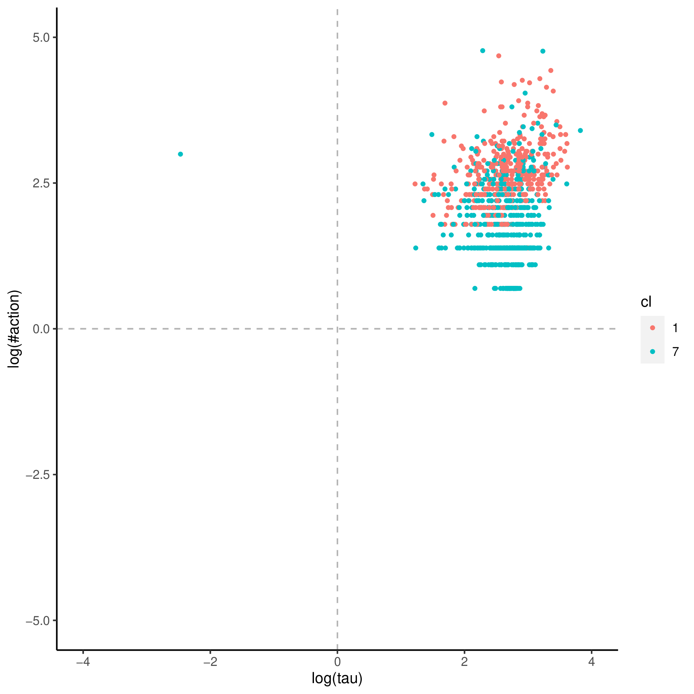
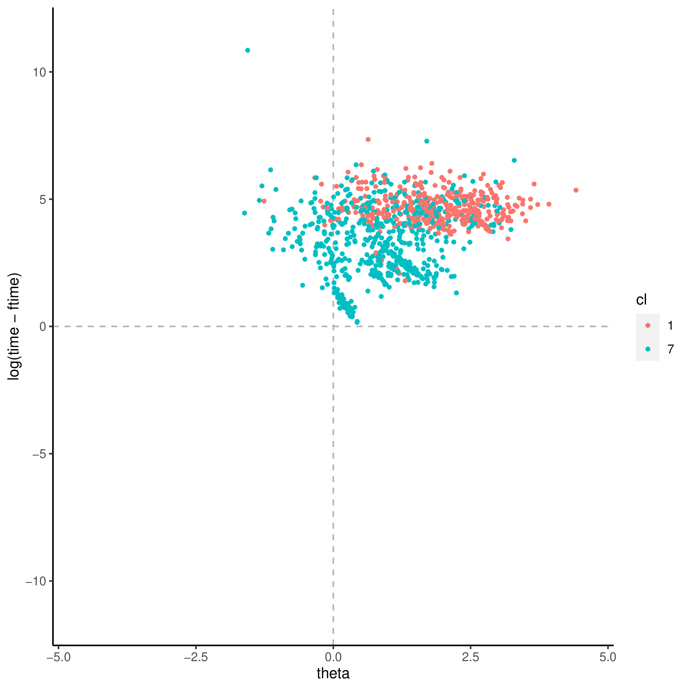

+++
title = "cd_tally"
author = ["Jonghyun Yun"]
lastmod = 2021-09-21T15:26:46-05:00
draft = false
weight = 1
chapter = true
+++

&tau;'s covaritates:

|Name       |Label                                                                                      |       imp|      pval|
|:----------|:------------------------------------------------------------------------------------------|---------:|---------:|
|AGEG5LFS   |Age groups in 5-year intervals based on LFS groupings (derived)                            | 13.225172| 0.0198020|
|LEAVER1624 |Youth aged 16 to 24 who have left education without completing ISCED 3 or higher (derived) |  3.181545| 0.0198020|
|INFLUENCE  |Index of use of influencing skills at work (derived)                                       |  6.290272| 0.0198020|
|ICTWORK    |Index of use of ICT skills at work (derived)                                               |  4.230648| 0.0891089|
|WRITWORK   |Index of use of writing skills at work (derived)                                           |  4.635795| 0.2079208|
|C_Q09_C    |Current status/work history - Years of paid work during lifetime (top-coded at 47)         |  4.174670| 0.5445545|

&theta;'s covaritates:

|Name           |Label                                                                                                   |       imp|      pval|
|:--------------|:-------------------------------------------------------------------------------------------------------|---------:|---------:|
|FAET12JR       |Participated in formal AET for job-related reasons in 12 months preceding survey (see AETPOP - derived) | 0.0226119| 0.0099010|
|ICTHOME        |Index of use of ICT skills at home (derived)                                                            | 0.0675867| 0.0099010|
|ICTHOME_WLE_CA |Index of use of ICT skills at home, categorised WLE (derived)                                           | 0.0258062| 0.0099010|
|C_Q09_C        |Current status/work history - Years of paid work during lifetime (top-coded at 47)                      | 0.0417345| 0.0297030|
|J_Q08          |Background - Number of books at home                                                                    | 0.0161170| 0.0297030|
|WRITHOME       |Index of use of writing skills at home (derived)                                                        | 0.0342809| 0.0594059|
|YRSGET         |Imputed years of formal education needed to get the job (self-reported - derived)                       | 0.0302366| 0.0693069|
|AGEG5LFS       |Age groups in 5-year intervals based on LFS groupings (derived)                                         | 0.0327879| 0.0990099|
|ISCO2C         |Occupational classification of respondent's job at 2-digit level (ISCO 2008), current job (derived)     | 0.0384570| 0.1188119|
|ISIC2C         |Industry classification of respondent's job at 2-digit level (ISIC rev 4), current job (derived)        | 0.0289311| 0.2178218|
|EDCAT8         |Highest level of formal education obtained (8 categories - derived)                                     | 0.0141250| 0.2277228|
|READHOME       |Index of use of reading skills at home (prose and document texts - derived)                             | 0.0232100| 0.2970297|
|EARNHRDCL      |Hourly earnings excluding bonuses for wage and salary earners, in deciles (derived)                     | 0.0159185| 0.4455446|
|ICTWORK        |Index of use of ICT skills at work (derived)                                                            | 0.0150712| 0.4554455|
|TASKDISC       |Index of use of task discretion at work (derived)                                                       | 0.0127158| 0.7623762|
|NUMHOME        |Index of use of numeracy skills at home (basic and advanced - derived)                                  | 0.0057798| 0.7920792|
|READWORK       |Index of use of reading skills at work (prose and document texts - derived)                             | 0.0015423| 0.9900990|

