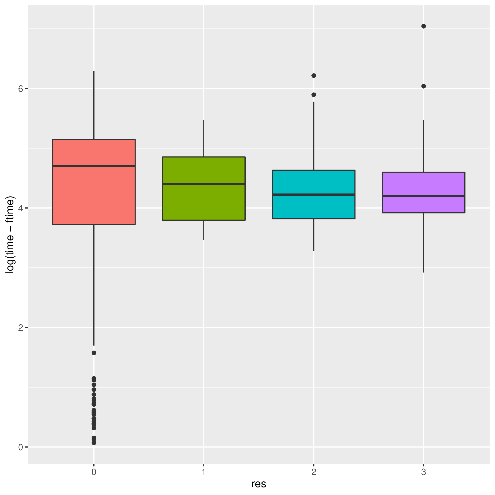
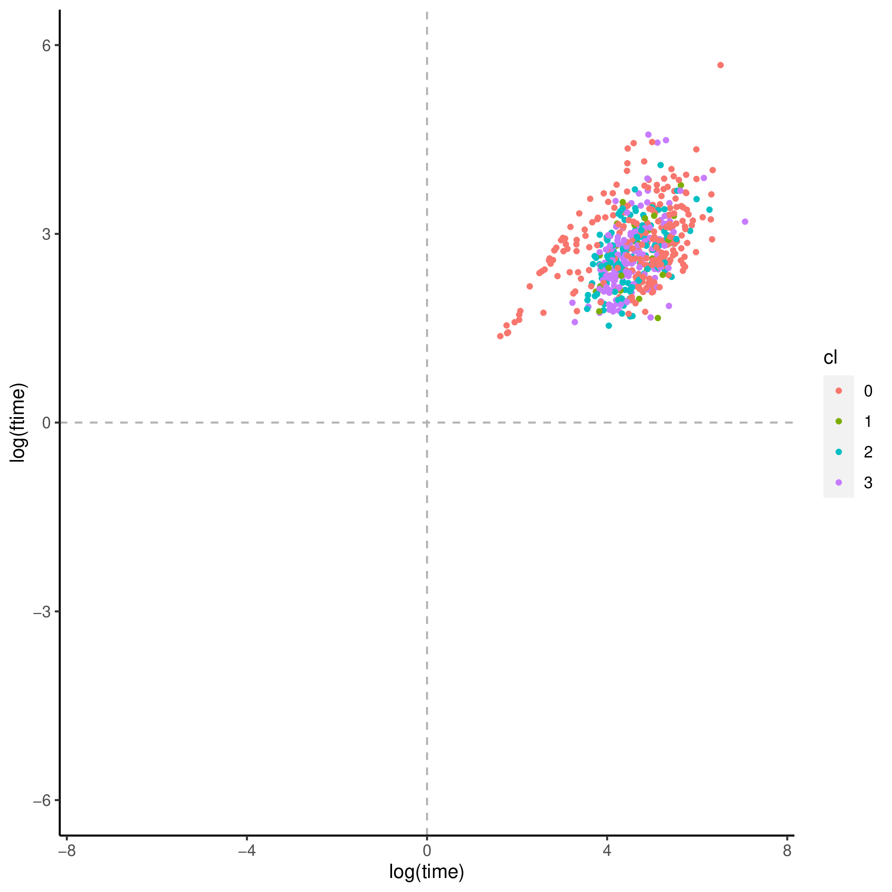
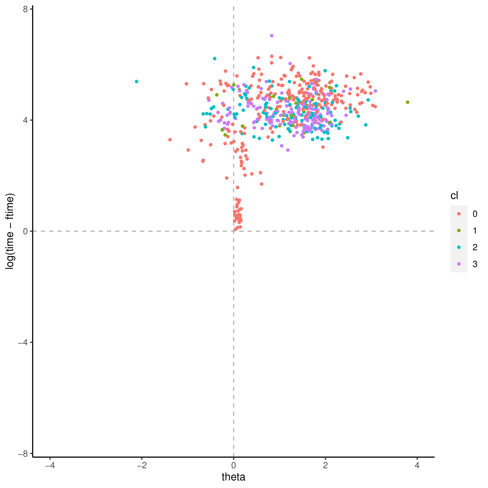
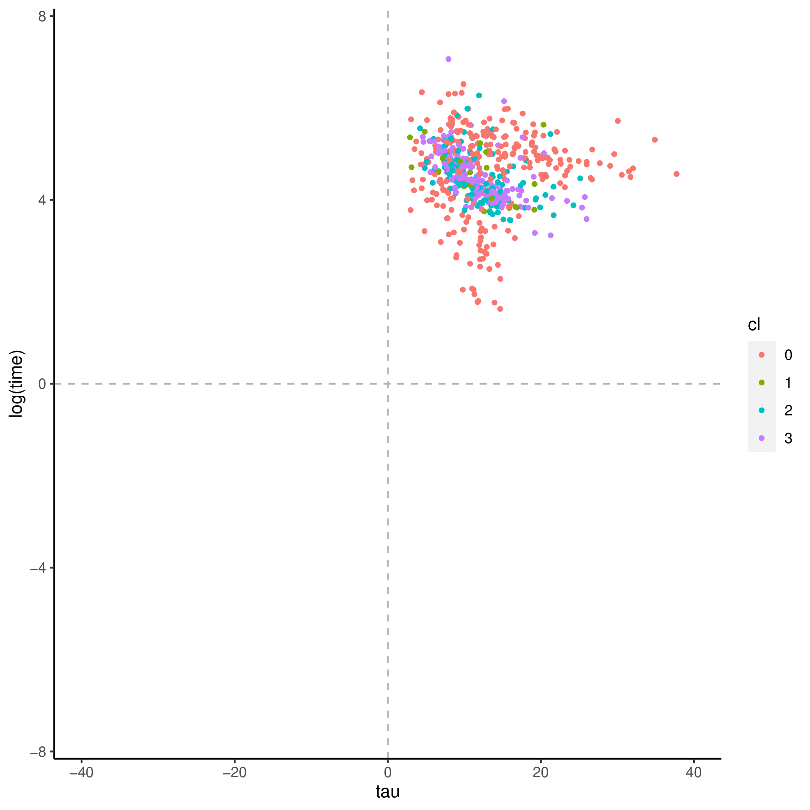
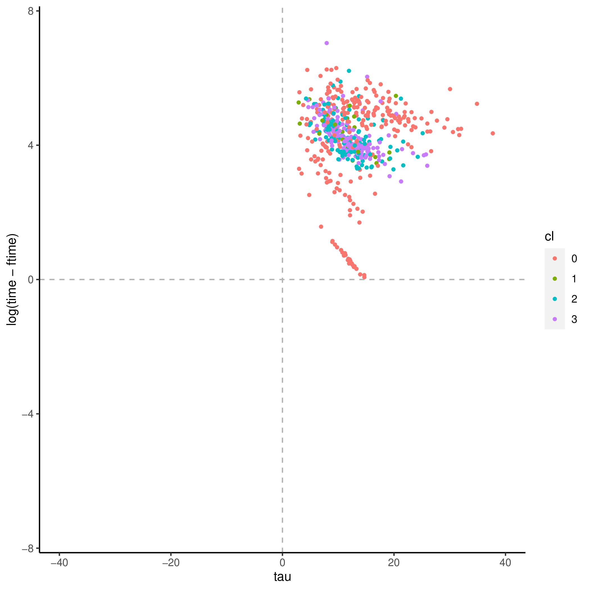
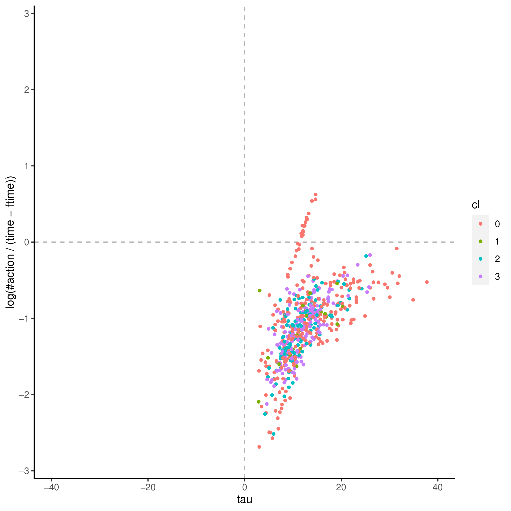

+++
title = "locate_email"
author = ["Jonghyun Yun"]
lastmod = 2021-09-21T15:27:09-05:00
draft = false
weight = 1
chapter = true
+++

&tau;'s covaritates:

|Name           |Label                                                                                               |      imp|      pval|
|:--------------|:---------------------------------------------------------------------------------------------------|--------:|---------:|
|AGEG5LFS       |Age groups in 5-year intervals based on LFS groupings (derived)                                     | 9.885435| 0.0495050|
|C_Q09_C        |Current status/work history - Years of paid work during lifetime (top-coded at 47)                  | 7.626948| 0.1683168|
|EARNHRBONUSDCL |Hourly earnings including bonuses for wage and salary earners, in deciles (derived)                 | 4.612719| 0.1683168|
|EARNHRDCL      |Hourly earnings excluding bonuses for wage and salary earners, in deciles (derived)                 | 2.667057| 0.4356436|
|ISCO2C         |Occupational classification of respondent's job at 2-digit level (ISCO 2008), current job (derived) | 3.068539| 0.6039604|
|WRITWORK       |Index of use of writing skills at work (derived)                                                    | 2.090278| 0.6039604|

&theta;'s covaritates:

|Name             |Label                                                                                               |        imp|      pval|
|:----------------|:---------------------------------------------------------------------------------------------------|----------:|---------:|
|AGEG5LFS         |Age groups in 5-year intervals based on LFS groupings (derived)                                     |  0.0244116| 0.0198020|
|ICTWORK          |Index of use of ICT skills at work (derived)                                                        |  0.0472448| 0.0198020|
|ICTWORK_WLE_CA   |Index of use of ICT skills at work, categorised WLE (derived)                                       |  0.0214467| 0.0495050|
|NUMHOME          |Index of use of numeracy skills at home (basic and advanced - derived)                              |  0.0339415| 0.0693069|
|EDCAT6           |Highest level of formal education obtained (6 categories - derived)                                 |  0.0216979| 0.0891089|
|D_Q04_T          |Status at this job or business - six levels (Trend-IALS/ALL)                                        |  0.0158932| 0.1386139|
|NFEHRS           |Number of hours of participation in non-formal education (derived)                                  |  0.0242799| 0.1386139|
|NFEHRSJR         |Number of hours of participation in non-formal education for job-related reasons (derived)          |  0.0150190| 0.2574257|
|NUMWORK          |Index of use of numeracy skills at work (basic and advanced - derived)                              |  0.0212383| 0.2772277|
|TASKDISC         |Index of use of task discretion at work (derived)                                                   |  0.0186273| 0.3168317|
|ISCO2C           |Occupational classification of respondent's job at 2-digit level (ISCO 2008), current job (derived) |  0.0178071| 0.3564356|
|INFLUENCE        |Index of use of influencing skills at work (derived)                                                |  0.0212973| 0.3960396|
|EARNHRDCL        |Hourly earnings excluding bonuses for wage and salary earners, in deciles (derived)                 |  0.0083536| 0.5841584|
|INFLUENCE_WLE_CA |Index of use of influencing skills at work, categorised WLE (derived)                               |  0.0063890| 0.5940594|
|READWORK         |Index of use of reading skills at work (prose and document texts - derived)                         |  0.0169418| 0.6336634|
|ICTHOME          |Index of use of ICT skills at home (derived)                                                        |  0.0002208| 0.7128713|
|READYTOLEARN     |Index of readiness to learn (derived)                                                               | -0.0016250| 0.7623762|

