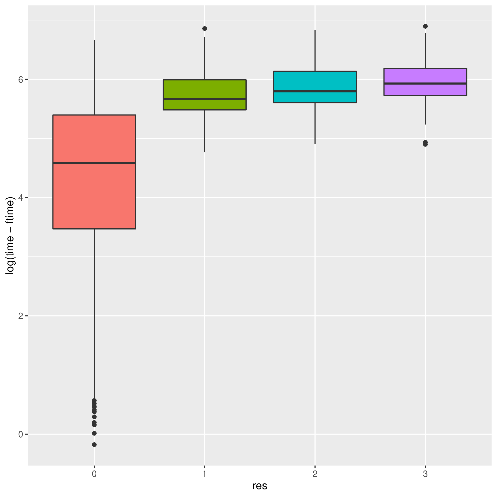
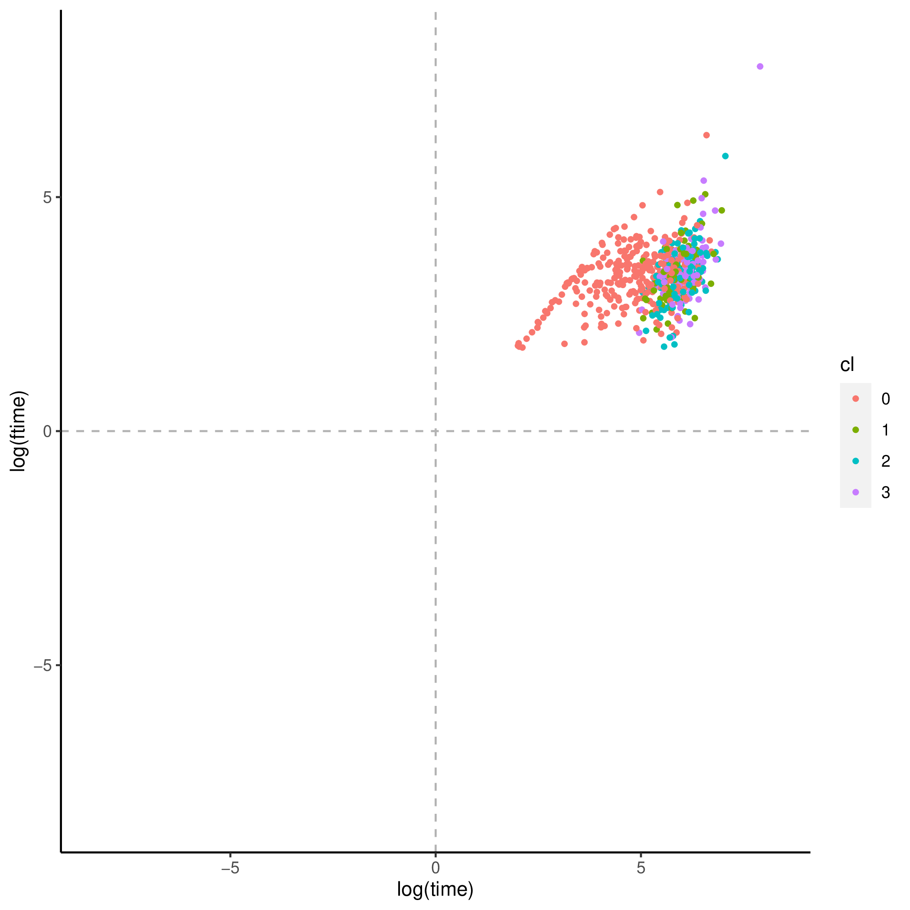
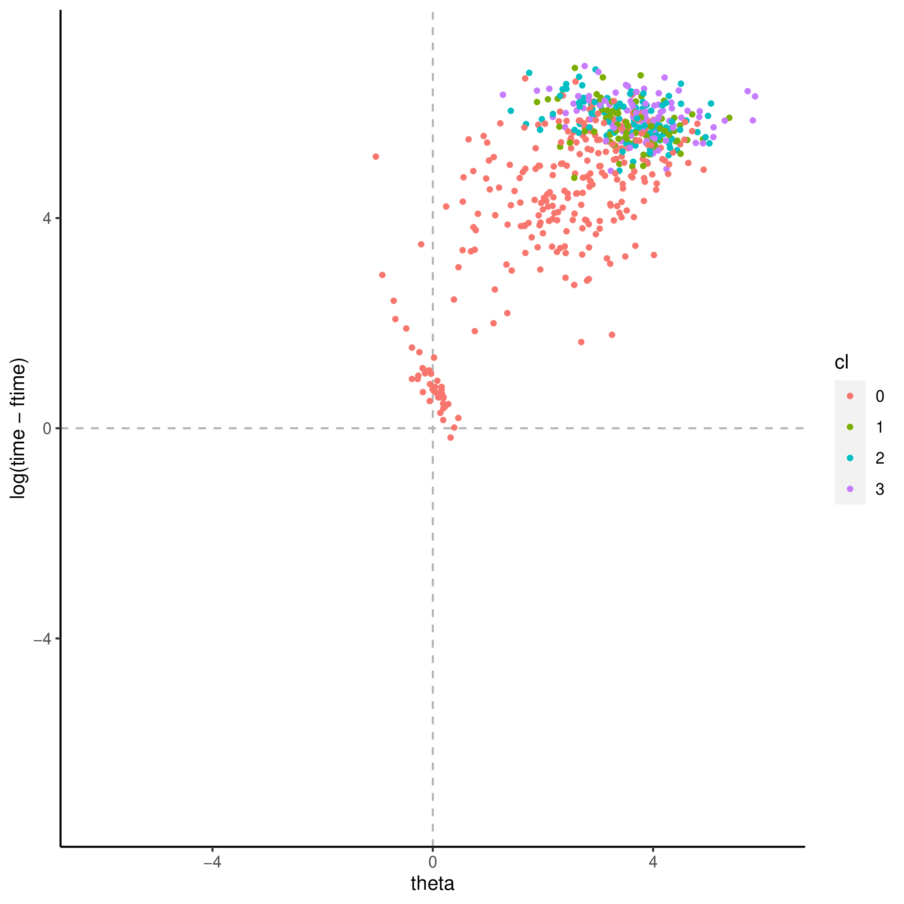
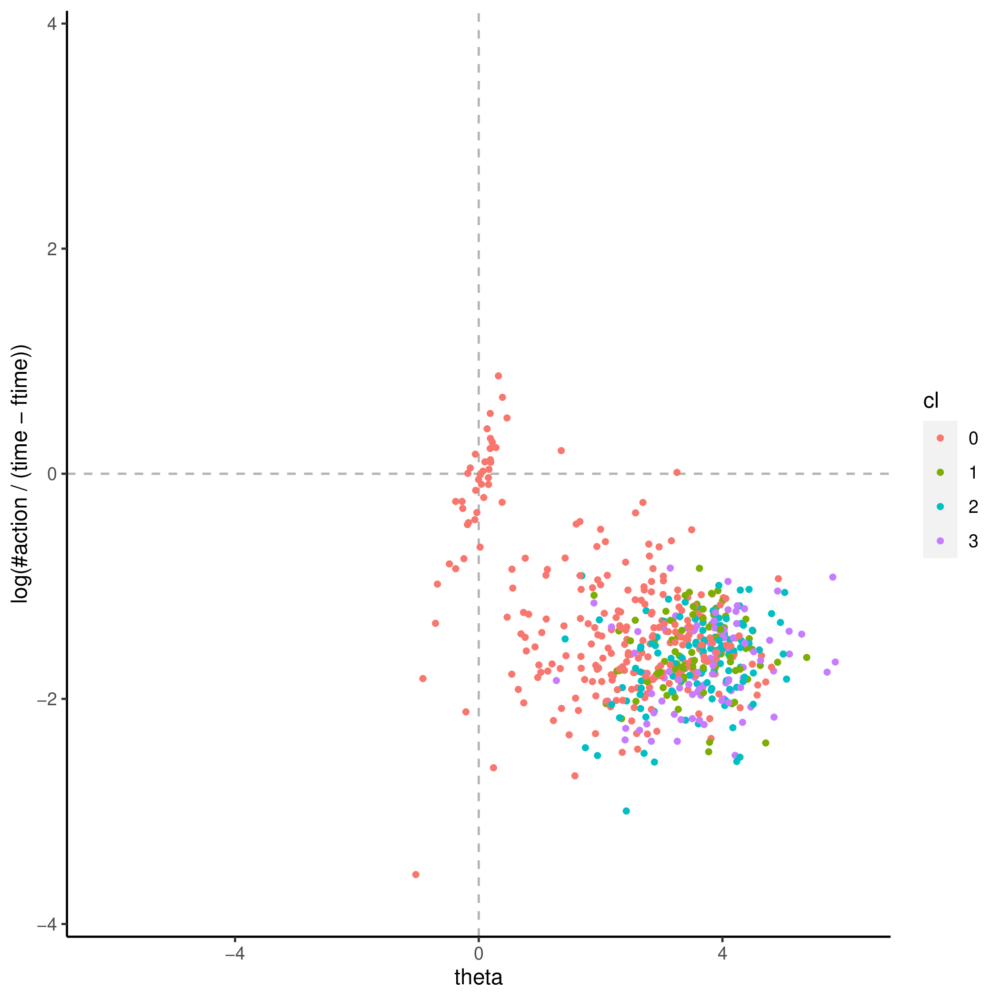
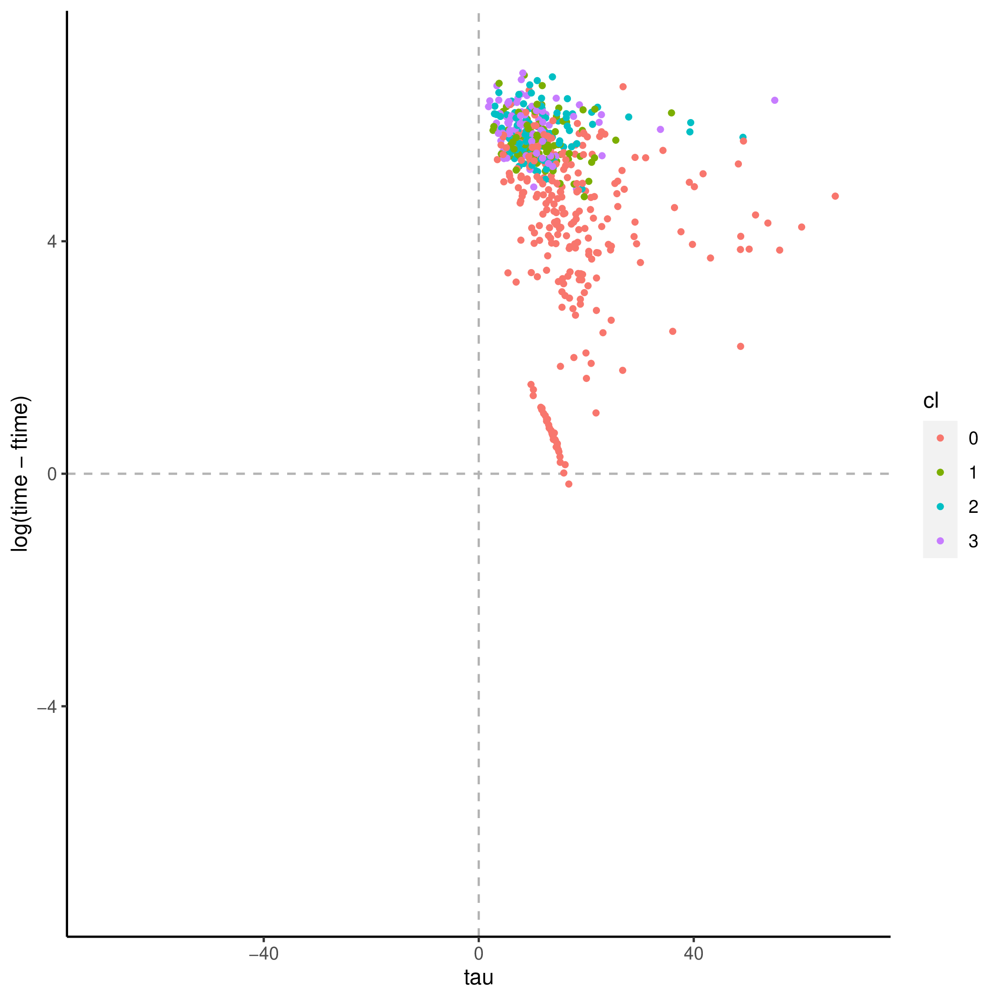

+++
title = "meeting_room"
author = ["Jonghyun Yun"]
lastmod = 2021-09-21T15:27:05-05:00
draft = false
weight = 1
chapter = true
+++

&tau;'s covaritates:

|Name           |Label                                                                                                              |       imp|      pval|
|:--------------|:------------------------------------------------------------------------------------------------------------------|---------:|---------:|
|AGEG5LFS       |Age groups in 5-year intervals based on LFS groupings (derived)                                                    | 10.574260| 0.0099010|
|NFE12          |Participated in non-formal education in 12 months preceding survey (derived)                                       |  4.066070| 0.0099010|
|NOPAIDWORKEVER |Adults who never had paid work including self-employment in past (derived)                                         |  2.430960| 0.0099010|
|NFE12JR        |Participated in non-formal education for job-related reasons in 12 months preceding survey (derived)               |  4.028282| 0.0198020|
|NFE12NJR       |Participated in non-formal education for non job-related reasons in 12 months preceding survey (derived)           |  3.117735| 0.0198020|
|ICTWORK        |Index of use of ICT skills at work (derived)                                                                       |  7.580768| 0.0594059|
|C_Q09_C        |Current status/work history - Years of paid work during lifetime (top-coded at 47)                                 |  7.175381| 0.0792079|
|FNFE12JR       |Participated in formal or non-formal education for job-related reasons in 12 months preceding the survey (derived) |  1.744144| 0.0792079|
|B_Q17          |Activities - Last year - Time spend - Unit                                                                         |  2.801032| 0.0891089|
|G_Q06          |Skill use work - ICT - Computer - Level of computer use                                                            |  4.067908| 0.1089109|
|WRITHOME       |Index of use of writing skills at home (derived)                                                                   |  4.522780| 0.1089109|
|B_Q16          |Activities - Last year - Grant from employer                                                                       |  4.424977| 0.1584158|
|NFEHRSNJR      |Number of hours of participation in non-formal education for non-job-related reasons (derived)                     |  5.588817| 0.1584158|
|PLANNING       |Index of use of planning skills at work (derived)                                                                  |  3.179292| 0.2178218|
|YRSGET         |Imputed years of formal education needed to get the job (self-reported - derived)                                  |  3.865380| 0.3267327|
|ICTHOME        |Index of use of ICT skills at home (derived)                                                                       |  3.549376| 0.3564356|
|NUMHOME        |Index of use of numeracy skills at home (basic and advanced - derived)                                             |  2.697814| 0.3663366|
|B_Q13          |Activities - Last year - Activity specified                                                                        |  1.810237| 0.4059406|
|EARNHRDCL      |Hourly earnings excluding bonuses for wage and salary earners, in deciles (derived)                                |  3.448778| 0.4158416|
|EARNHRBONUSDCL |Hourly earnings including bonuses for wage and salary earners, in deciles (derived)                                |  3.263442| 0.4554455|
|NFEHRS         |Number of hours of participation in non-formal education (derived)                                                 |  3.260719| 0.4950495|
|LEARNATWORK    |Index of learning at work (derived)                                                                                |  2.990704| 0.5049505|
|NFEHRSJR       |Number of hours of participation in non-formal education for job-related reasons (derived)                         |  2.709997| 0.5148515|
|ISCO2C         |Occupational classification of respondent's job at 2-digit level (ISCO 2008), current job (derived)                |  4.420293| 0.5544554|
|ICTHOME_WLE_CA |Index of use of ICT skills at home, categorised WLE (derived)                                                      |  1.327060| 0.7227723|
|ISCO1C         |Occupational classification of respondent's job at 1-digit level (ISCO 2008), current job (derived)                |  2.318859| 0.7326733|
|READWORK       |Index of use of reading skills at work (prose and document texts - derived)                                        |  3.215353| 0.7722772|
|D_Q10_T        |Hours per week at this job or business - number of hours (top coded at 97, Trend-IALS/ALL)                         |  2.600368| 0.9108911|
|D_Q10_C        |Current work - Hours/week (top-coded at 60)                                                                        |  1.640815| 0.9207921|

&theta;'s covaritates:

|Name           |Label                                                                              |       imp|      pval|
|:--------------|:----------------------------------------------------------------------------------|---------:|---------:|
|ICTHOME        |Index of use of ICT skills at home (derived)                                       | 0.2770673| 0.0099010|
|G_Q07          |Skill use work - ICT - Computer - Got the skills needed                            | 0.1497847| 0.0198020|
|ICTHOME_WLE_CA |Index of use of ICT skills at home, categorised WLE (derived)                      | 0.0935616| 0.0198020|
|ICTWORK        |Index of use of ICT skills at work (derived)                                       | 0.1938268| 0.0198020|
|AGEG5LFS       |Age groups in 5-year intervals based on LFS groupings (derived)                    | 0.2759343| 0.0297030|
|C_Q09_C        |Current status/work history - Years of paid work during lifetime (top-coded at 47) | 0.2060004| 0.1188119|
|READYTOLEARN   |Index of readiness to learn (derived)                                              | 0.0308734| 0.3861386|

