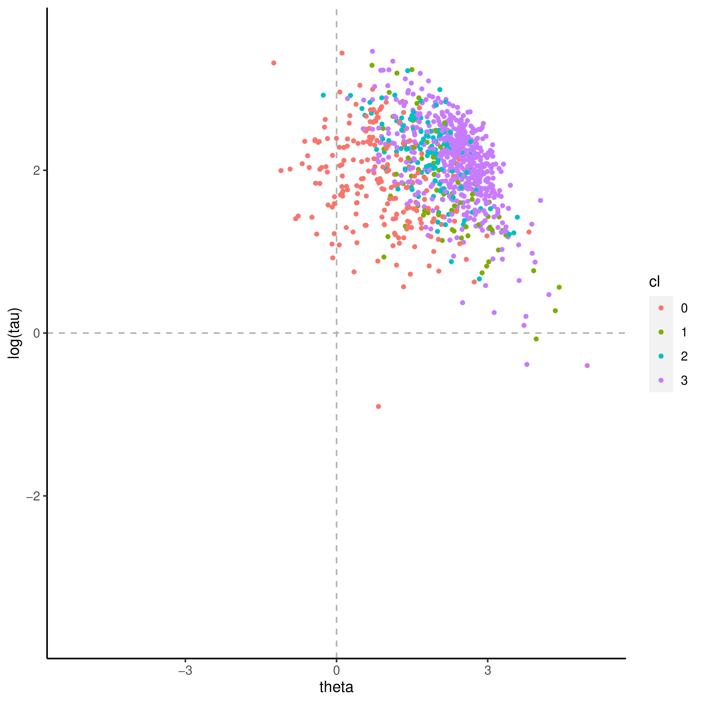
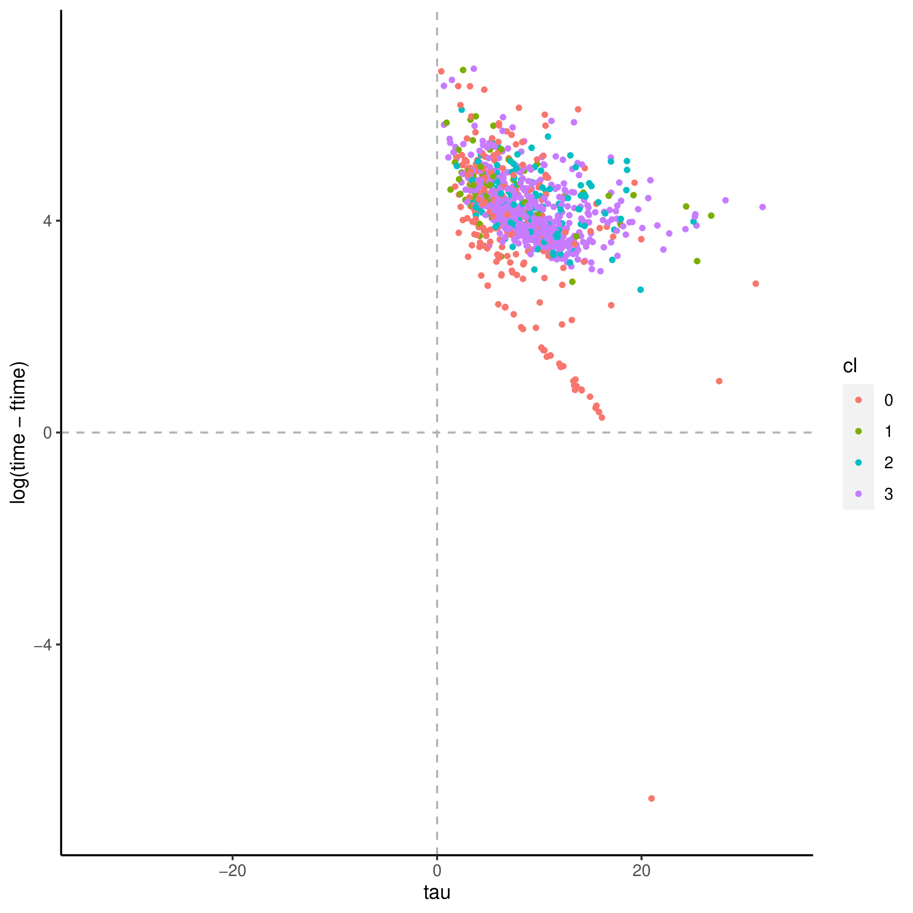
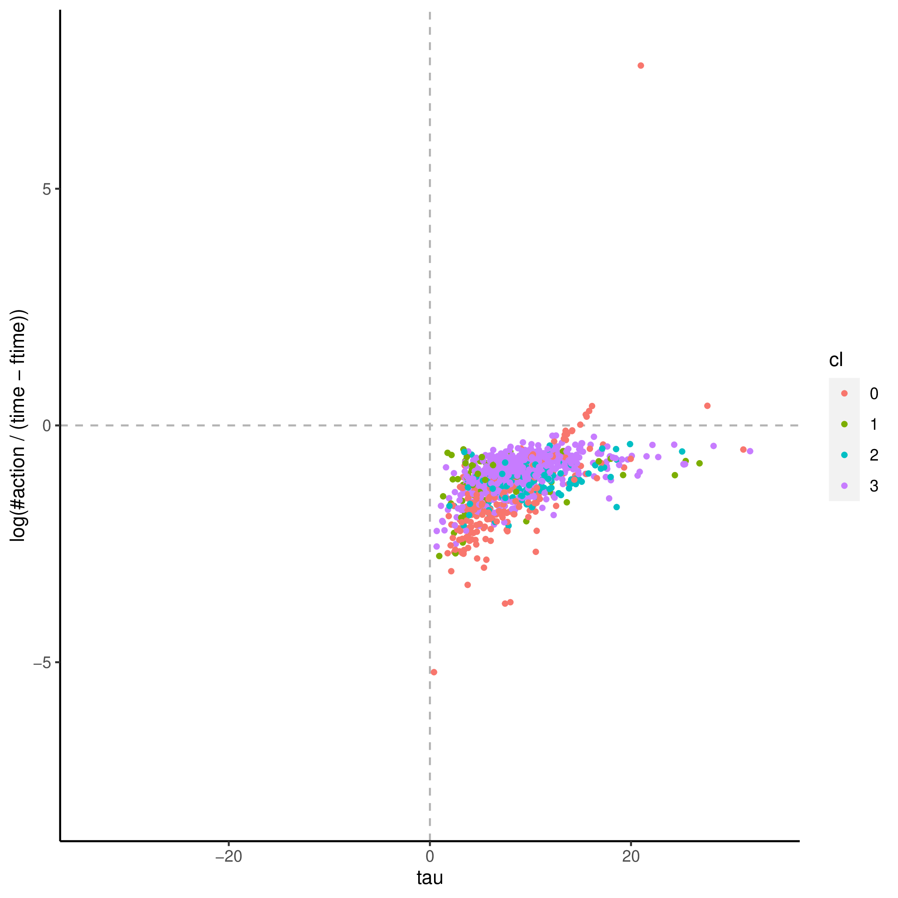

+++
title = "party_invitations-1"
author = ["Jonghyun Yun"]
lastmod = 2021-09-21T15:26:36-05:00
draft = false
weight = 1
chapter = true
+++

&tau;'s covaritates:

|Name            |Label                                                                                                                   |       imp|      pval|
|:---------------|:-----------------------------------------------------------------------------------------------------------------------|---------:|---------:|
|AETPOP          |Adult education/training population (AET) - excludes youths 16-24 in initial cycle of studies (derived)                 | 0.4760353| 0.0099010|
|FNFAET12JR      |Participated in formal or non-formal AET for job-related reasons in 12 months preceding survey (see AETPOP - derived)   | 0.5620771| 0.0099010|
|FNFAET12NJR     |Participated in formal or non-formal AET for non job-related reasons in 12 mon. preceding survey (see AETPOP - derived) | 0.6782908| 0.0099010|
|AGEG5LFS        |Age groups in 5-year intervals based on LFS groupings (derived)                                                         | 1.4775310| 0.0297030|
|READWORK        |Index of use of reading skills at work (prose and document texts - derived)                                             | 1.6950860| 0.0396040|
|ICTHOME         |Index of use of ICT skills at home (derived)                                                                            | 0.6373768| 0.0693069|
|ICTWORK         |Index of use of ICT skills at work (derived)                                                                            | 0.9159008| 0.1089109|
|WRITWORK        |Index of use of writing skills at work (derived)                                                                        | 1.2849569| 0.1287129|
|INFLUENCE       |Index of use of influencing skills at work (derived)                                                                    | 1.0713545| 0.1485149|
|LEARNATWORK     |Index of learning at work (derived)                                                                                     | 0.8104232| 0.1782178|
|ISCO2C          |Occupational classification of respondent's job at 2-digit level (ISCO 2008), current job (derived)                     | 1.0913545| 0.2277228|
|NUMHOME         |Index of use of numeracy skills at home (basic and advanced - derived)                                                  | 0.5536242| 0.2475248|
|WRITHOME_WLE_CA |Index of use of writing skills at home, categorised WLE (derived)                                                       | 0.3360830| 0.2574257|
|WRITHOME        |Index of use of writing skills at home (derived)                                                                        | 0.5458969| 0.2673267|
|EARNHRBONUSDCL  |Hourly earnings including bonuses for wage and salary earners, in deciles (derived)                                     | 0.5569200| 0.3861386|
|EARNHRDCL       |Hourly earnings excluding bonuses for wage and salary earners, in deciles (derived)                                     | 0.5770771| 0.3960396|
|ISCO1C          |Occupational classification of respondent's job at 1-digit level (ISCO 2008), current job (derived)                     | 0.4600582| 0.4653465|
|PLANNING        |Index of use of planning skills at work (derived)                                                                       | 0.2950204| 0.5346535|
|C_Q09_C         |Current status/work history - Years of paid work during lifetime (top-coded at 47)                                      | 0.5895942| 0.5445545|
|ISIC2C          |Industry classification of respondent's job at 2-digit level (ISIC rev 4), current job (derived)                        | 0.5206061| 0.6930693|
|D_Q10_T         |Hours per week at this job or business - number of hours (top coded at 97, Trend-IALS/ALL)                              | 0.4386678| 0.7128713|
|TASKDISC        |Index of use of task discretion at work (derived)                                                                       | 0.5504840| 0.7227723|
|NUMWORK         |Index of use of numeracy skills at work (basic and advanced - derived)                                                  | 0.2945469| 0.7920792|
|PLANNING_WLE_CA |Index of use of planning skills at work, categorised WLE (derived)                                                      | 0.1557439| 0.8811881|

&theta;'s covaritates:

|Name            |Label                                                                                               |       imp|      pval|
|:---------------|:---------------------------------------------------------------------------------------------------|---------:|---------:|
|J_Q08           |Background - Number of books at home                                                                | 0.0438188| 0.0099010|
|AGEG5LFS        |Age groups in 5-year intervals based on LFS groupings (derived)                                     | 0.1470972| 0.0099010|
|ICTHOME         |Index of use of ICT skills at home (derived)                                                        | 0.1615933| 0.0099010|
|ISCO2C          |Occupational classification of respondent's job at 2-digit level (ISCO 2008), current job (derived) | 0.0602383| 0.0693069|
|WRITHOME        |Index of use of writing skills at home (derived)                                                    | 0.0473309| 0.0792079|
|ICTHOME_WLE_CA  |Index of use of ICT skills at home, categorised WLE (derived)                                       | 0.0193539| 0.2574257|
|WRITHOME_WLE_CA |Index of use of writing skills at home, categorised WLE (derived)                                   | 0.0193950| 0.2871287|
|INFLUENCE       |Index of use of influencing skills at work (derived)                                                | 0.0231479| 0.4554455|
|C_Q09_C         |Current status/work history - Years of paid work during lifetime (top-coded at 47)                  | 0.0511671| 0.5346535|

