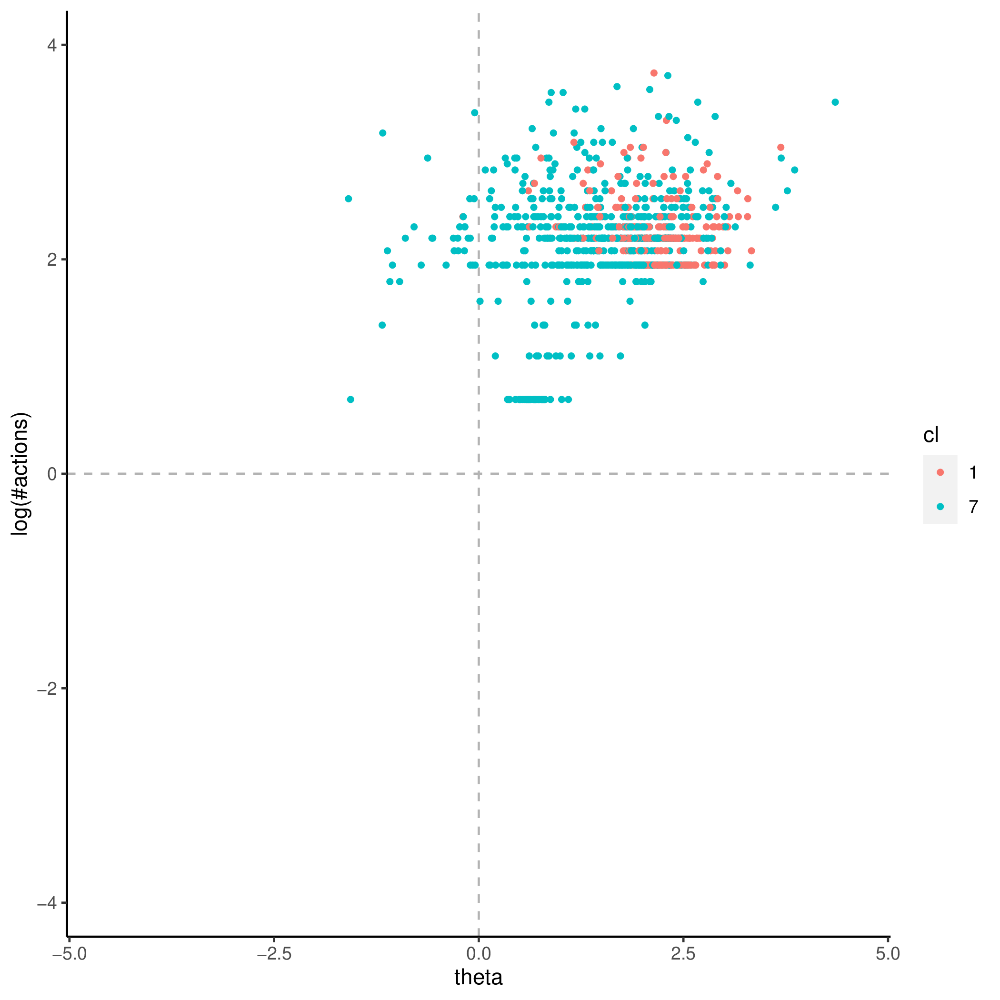
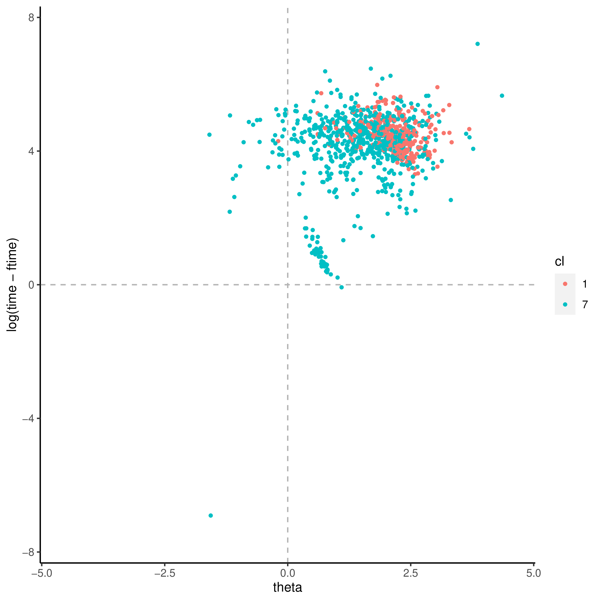
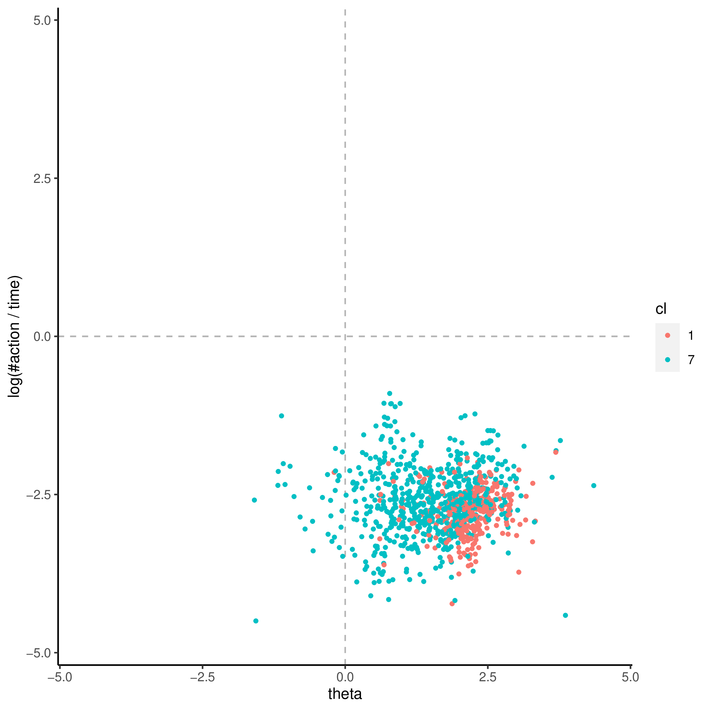
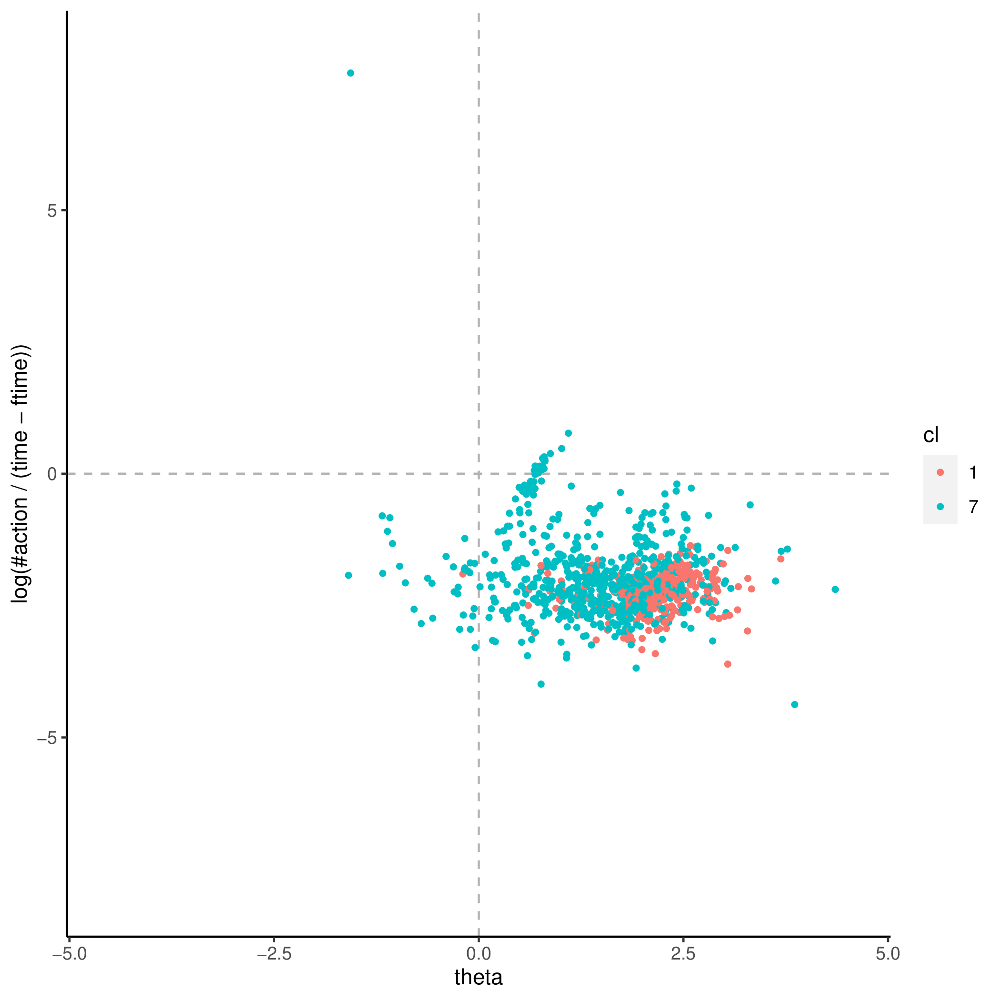
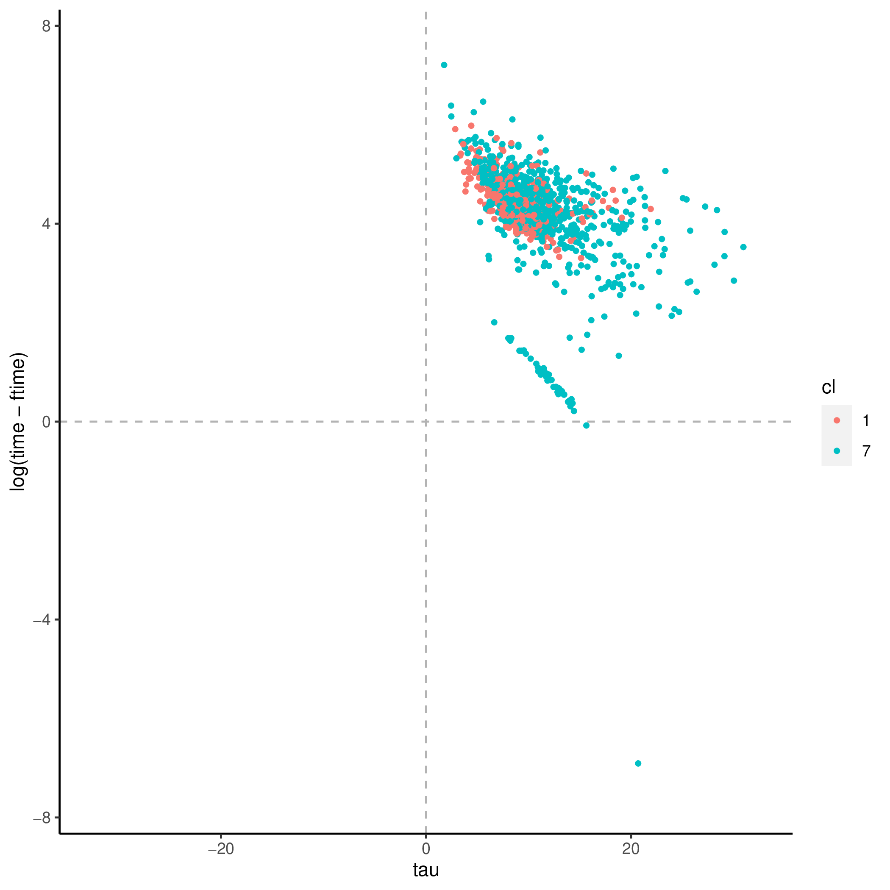
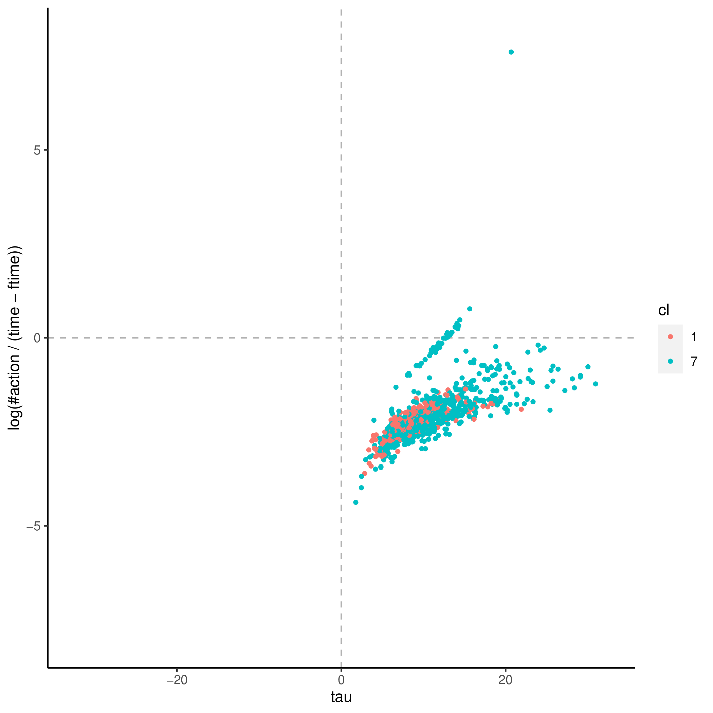

+++
title = "sprained_ankle-1"
author = ["Jonghyun Yun"]
lastmod = 2021-09-21T15:26:49-05:00
draft = false
weight = 1
chapter = true
+++

&tau;'s covaritates:

|Name               |Label                                                                                                  |       imp|      pval|
|:------------------|:------------------------------------------------------------------------------------------------------|---------:|---------:|
|AGEG5LFS           |Age groups in 5-year intervals based on LFS groupings (derived)                                        | 2.2158222| 0.0099010|
|LEAVER1624         |Youth aged 16 to 24 who have left education without completing ISCED 3 or higher (derived)             | 1.0392552| 0.0099010|
|READHOME           |Index of use of reading skills at home (prose and document texts - derived)                            | 1.5162550| 0.0099010|
|C_Q07              |Current status/work history - Subjective status                                                        | 1.3855259| 0.0198020|
|C_Q09_C            |Current status/work history - Years of paid work during lifetime (top-coded at 47)                     | 1.2549421| 0.0594059|
|ICTHOME            |Index of use of ICT skills at home (derived)                                                           | 0.7734625| 0.0891089|
|LEARNATWORK_WLE_CA |Index of learning at work, categorised WLE (derived)                                                   | 0.5628345| 0.1584158|
|EARNHRBONUSDCL     |Hourly earnings including bonuses for wage and salary earners, in deciles (derived)                    | 0.9855860| 0.1881188|
|EARNHRDCL          |Hourly earnings excluding bonuses for wage and salary earners, in deciles (derived)                    | 0.9860484| 0.2079208|
|NUMHOME_WLE_CA     |Index of use of numeracy skills at home (basic and advanced), categorised WLE (derived)                | 0.4211173| 0.2475248|
|WRITHOME           |Index of use of writing skills at home (derived)                                                       | 0.7256336| 0.3069307|
|WRITHOME_WLE_CA    |Index of use of writing skills at home, categorised WLE (derived)                                      | 0.4139999| 0.3168317|
|NUMHOME            |Index of use of numeracy skills at home (basic and advanced - derived)                                 | 0.7042356| 0.3663366|
|LEARNATWORK        |Index of learning at work (derived)                                                                    | 0.7724518| 0.4752475|
|ISCO2C             |Occupational classification of respondent's job at 2-digit level (ISCO 2008), current job (derived)    | 0.8514091| 0.4851485|
|INFLUENCE          |Index of use of influencing skills at work (derived)                                                   | 0.6249595| 0.5544554|
|EARNMTHALLDCL      |Monthly earnings including bonuses for wage and salary earners and self-employed, in deciles (derived) | 0.6435811| 0.7128713|
|READWORK           |Index of use of reading skills at work (prose and document texts - derived)                            | 0.6363074| 0.7623762|
|TASKDISC           |Index of use of task discretion at work (derived)                                                      | 0.4460782| 0.8910891|
|D_Q10              |Current work - Hours/week                                                                              | 0.5838641| 0.9108911|

&theta;'s covaritates:

|Name            |Label                                                                                               |       imp|      pval|
|:---------------|:---------------------------------------------------------------------------------------------------|---------:|---------:|
|J_Q08           |Background - Number of books at home                                                                | 0.0301127| 0.0099010|
|ICTHOME         |Index of use of ICT skills at home (derived)                                                        | 0.0827937| 0.0099010|
|WRITHOME        |Index of use of writing skills at home (derived)                                                    | 0.1051451| 0.0099010|
|WRITHOME_WLE_CA |Index of use of writing skills at home, categorised WLE (derived)                                   | 0.0921124| 0.0099010|
|NUMHOME         |Index of use of numeracy skills at home (basic and advanced - derived)                              | 0.0544875| 0.0198020|
|NUMHOME_WLE_CA  |Index of use of numeracy skills at home (basic and advanced), categorised WLE (derived)             | 0.0324993| 0.0198020|
|READHOME        |Index of use of reading skills at home (prose and document texts - derived)                         | 0.0576644| 0.0198020|
|ICTHOME_WLE_CA  |Index of use of ICT skills at home, categorised WLE (derived)                                       | 0.0209526| 0.1188119|
|LEARNATWORK     |Index of learning at work (derived)                                                                 | 0.0235951| 0.3267327|
|ISIC2C          |Industry classification of respondent's job at 2-digit level (ISIC rev 4), current job (derived)    | 0.0244875| 0.3465347|
|AGEG5LFS        |Age groups in 5-year intervals based on LFS groupings (derived)                                     | 0.0222532| 0.3663366|
|INFLUENCE       |Index of use of influencing skills at work (derived)                                                | 0.0084937| 0.7029703|
|ISCO1C          |Occupational classification of respondent's job at 1-digit level (ISCO 2008), current job (derived) | 0.0113159| 0.7227723|
|C_Q09_C         |Current status/work history - Years of paid work during lifetime (top-coded at 47)                  | 0.0118967| 0.7821782|
|ISCO2C          |Occupational classification of respondent's job at 2-digit level (ISCO 2008), current job (derived) | 0.0172004| 0.7920792|

