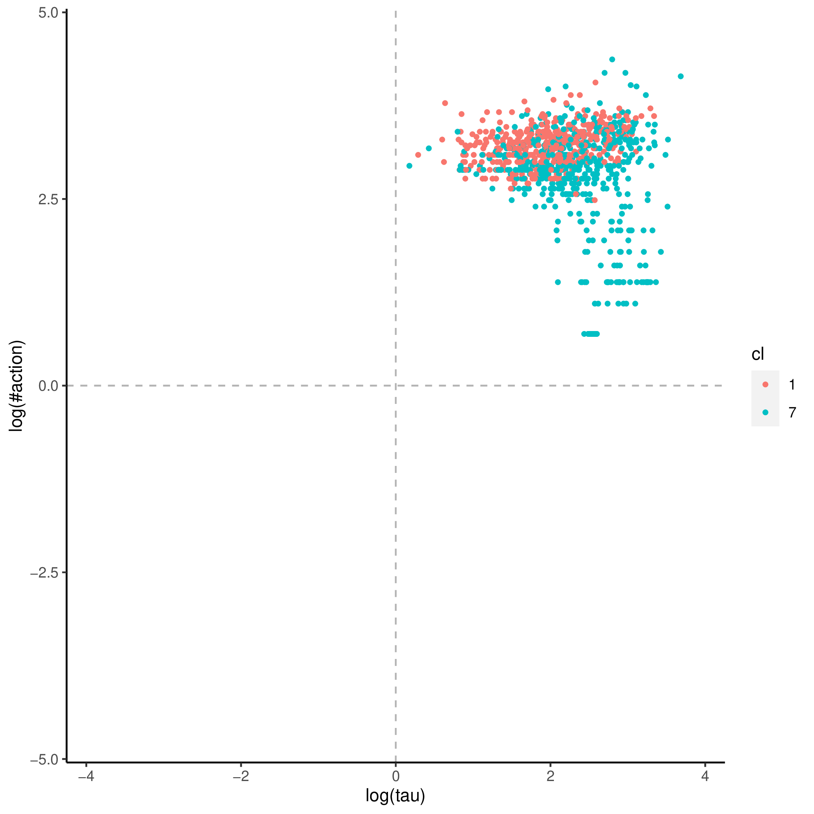
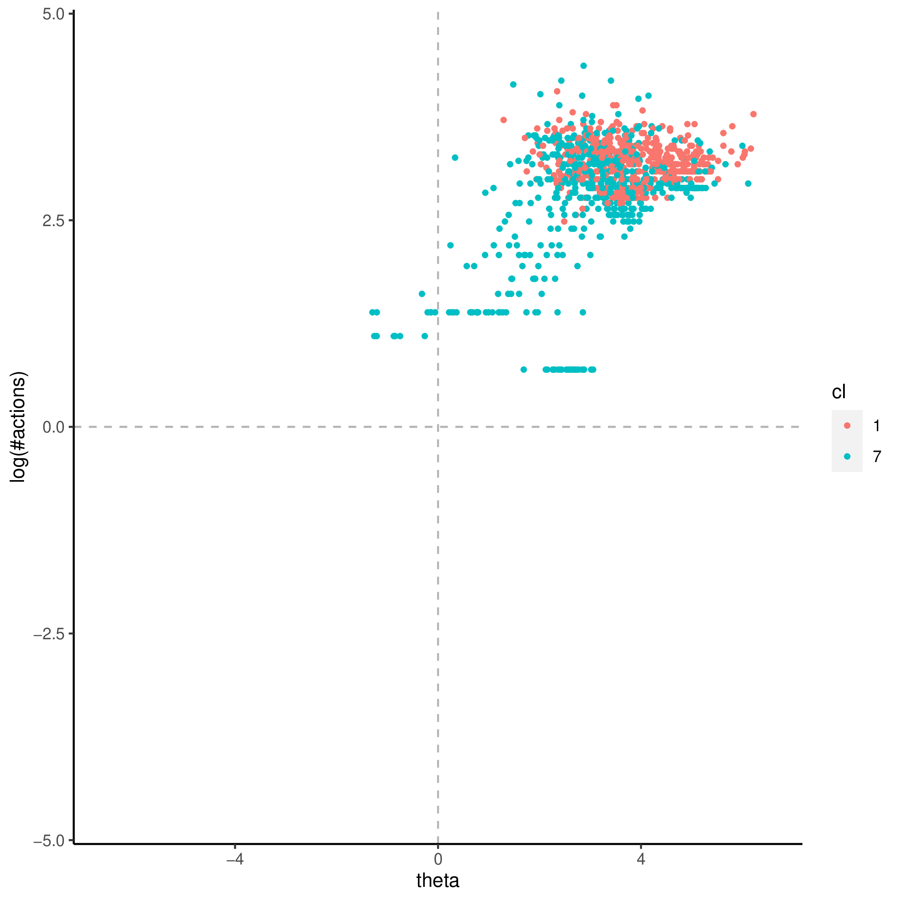
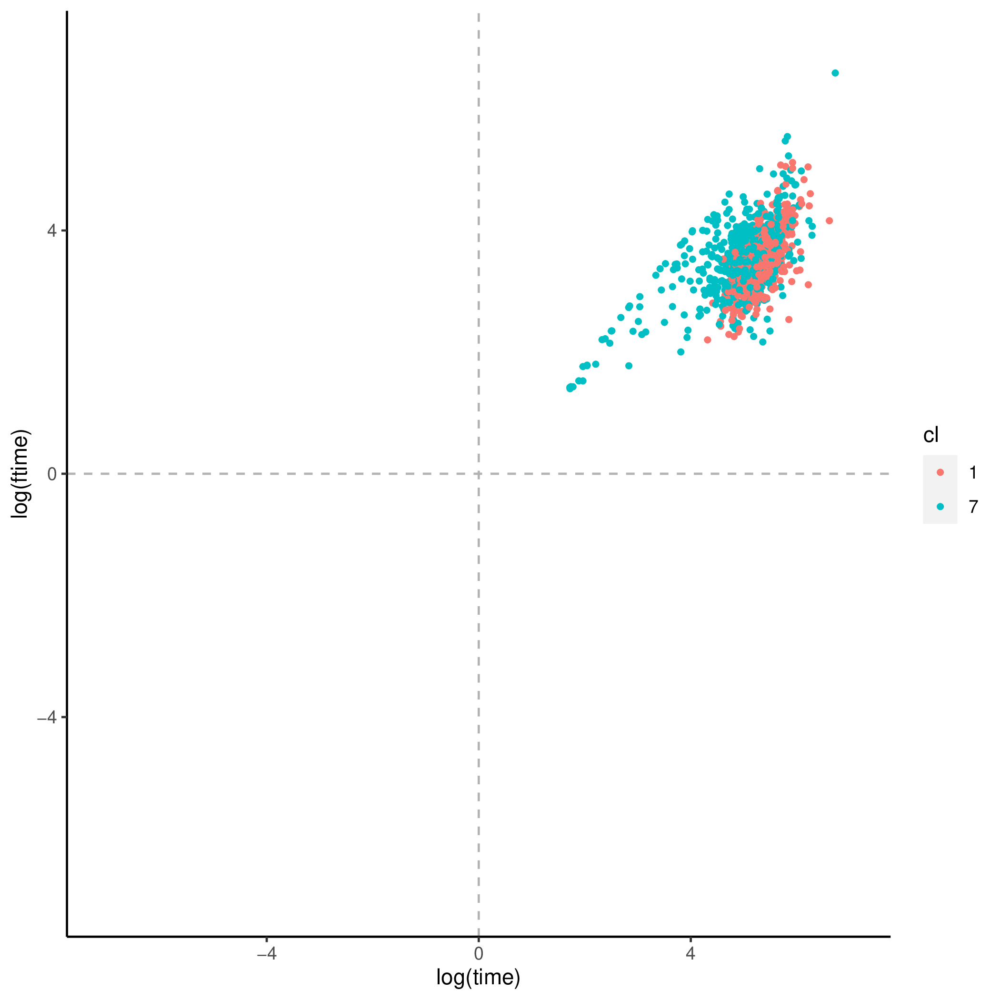
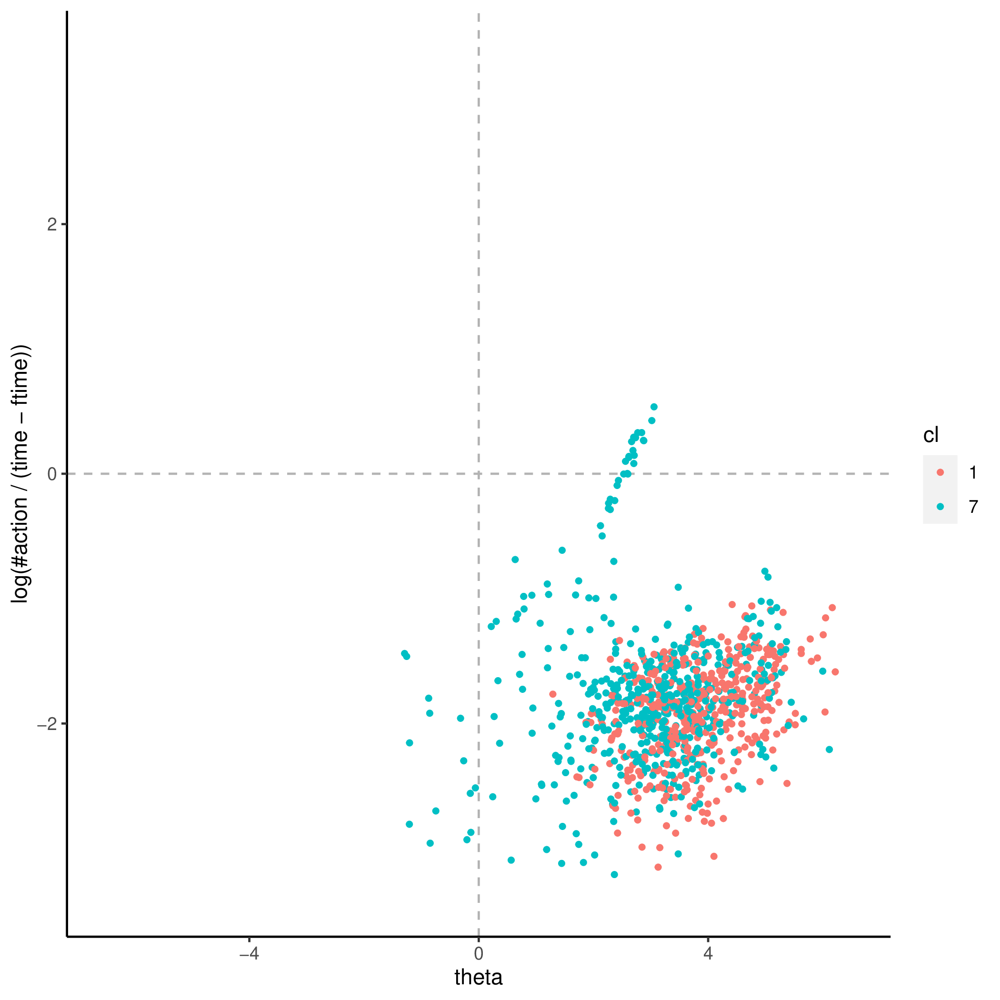
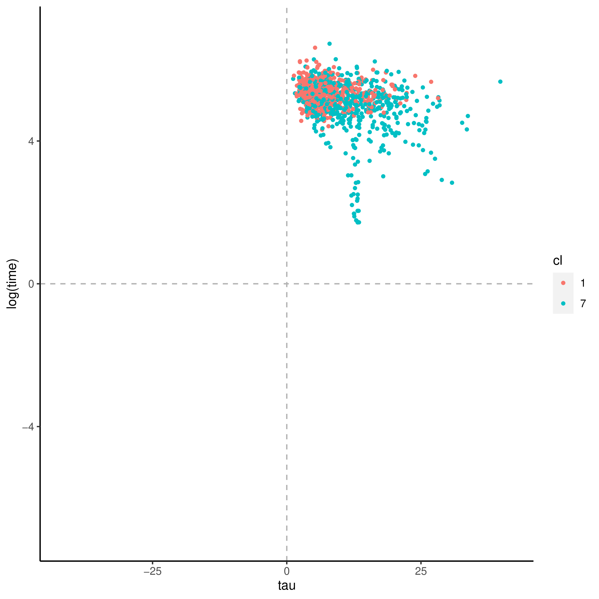
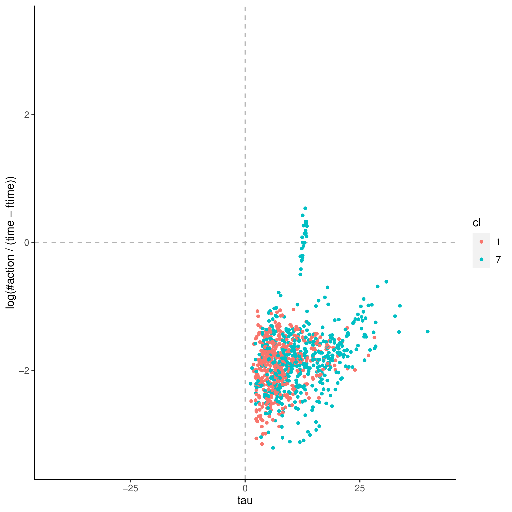

+++
title = "tickets"
author = ["Jonghyun Yun"]
lastmod = 2021-09-21T15:26:52-05:00
draft = false
weight = 1
chapter = true
+++

&tau;'s covaritates:

|Name             |Label                                                                                               |       imp|      pval|
|:----------------|:---------------------------------------------------------------------------------------------------|---------:|---------:|
|WRITHOME         |Index of use of writing skills at home (derived)                                                    | 2.1231496| 0.0198020|
|INFLUENCE        |Index of use of influencing skills at work (derived)                                                | 1.6894554| 0.0396040|
|AGEG5LFS         |Age groups in 5-year intervals based on LFS groupings (derived)                                     | 1.7446838| 0.0495050|
|NFEHRSNJR        |Number of hours of participation in non-formal education for non-job-related reasons (derived)      | 0.8342717| 0.0495050|
|READWORK_WLE_CA  |Index of use of reading skills at work (prose and document texts), categorised WLE (derived)        | 1.4503579| 0.0495050|
|C_Q09_C          |Current status/work history - Years of paid work during lifetime (top-coded at 47)                  | 1.6404999| 0.0594059|
|WRITHOME_WLE_CA  |Index of use of writing skills at home, categorised WLE (derived)                                   | 1.0314101| 0.0693069|
|EARNHRDCL        |Hourly earnings excluding bonuses for wage and salary earners, in deciles (derived)                 | 1.3956484| 0.0792079|
|ICTHOME          |Index of use of ICT skills at home (derived)                                                        | 1.0688005| 0.0891089|
|ICTWORK_WLE_CA   |Index of use of ICT skills at work, categorised WLE (derived)                                       | 0.6859478| 0.1386139|
|READHOME         |Index of use of reading skills at home (prose and document texts - derived)                         | 1.7679788| 0.1485149|
|EARNHRBONUSDCL   |Hourly earnings including bonuses for wage and salary earners, in deciles (derived)                 | 0.9460383| 0.1782178|
|NUMHOME          |Index of use of numeracy skills at home (basic and advanced - derived)                              | 0.9874929| 0.1980198|
|ISIC2C           |Industry classification of respondent's job at 2-digit level (ISIC rev 4), current job (derived)    | 1.1823535| 0.2178218|
|INFLUENCE_WLE_CA |Index of use of influencing skills at work, categorised WLE (derived)                               | 0.4292938| 0.3069307|
|READYTOLEARN     |Index of readiness to learn (derived)                                                               | 0.5313548| 0.3960396|
|READWORK         |Index of use of reading skills at work (prose and document texts - derived)                         | 1.3939640| 0.4752475|
|WRITWORK_WLE_CA  |Index of use of writing skills at work, categorised WLE (derived)                                   | 0.4690732| 0.5247525|
|ISCO2C           |Occupational classification of respondent's job at 2-digit level (ISCO 2008), current job (derived) | 0.8617603| 0.5544554|
|ICTWORK          |Index of use of ICT skills at work (derived)                                                        | 0.6082405| 0.6237624|
|D_Q04_T          |Status at this job or business - six levels (Trend-IALS/ALL)                                        | 0.4182107| 0.6336634|
|WRITWORK         |Index of use of writing skills at work (derived)                                                    | 0.7363190| 0.6336634|
|LEARNATWORK      |Index of learning at work (derived)                                                                 | 0.2285450| 0.9207921|

&theta;'s covaritates:

|Name            |Label                                                                                               |       imp|      pval|
|:---------------|:---------------------------------------------------------------------------------------------------|---------:|---------:|
|ICTHOME         |Index of use of ICT skills at home (derived)                                                        | 0.0873188| 0.0099010|
|C_Q09_C         |Current status/work history - Years of paid work during lifetime (top-coded at 47)                  | 0.0684523| 0.0297030|
|AGEG5LFS        |Age groups in 5-year intervals based on LFS groupings (derived)                                     | 0.0587393| 0.0495050|
|READHOME        |Index of use of reading skills at home (prose and document texts - derived)                         | 0.0792555| 0.0891089|
|NUMHOME         |Index of use of numeracy skills at home (basic and advanced - derived)                              | 0.0733666| 0.0990099|
|READHOME_WLE_CA |Index of use of reading skills at home (prose and document texts), categorised WLE (derived)        | 0.0295889| 0.1089109|
|ICTHOME_WLE_CA  |Index of use of ICT skills at home, categorised WLE (derived)                                       | 0.0288521| 0.1782178|
|NFEHRS          |Number of hours of participation in non-formal education (derived)                                  | 0.0203631| 0.1980198|
|READWORK_WLE_CA |Index of use of reading skills at work (prose and document texts), categorised WLE (derived)        | 0.0321537| 0.2079208|
|WRITHOME        |Index of use of writing skills at home (derived)                                                    | 0.0437597| 0.2178218|
|EDCAT7          |Highest level of formal education obtained (7 categories - derived)                                 | 0.0245782| 0.2277228|
|INFLUENCE       |Index of use of influencing skills at work (derived)                                                | 0.0532552| 0.2673267|
|NUMHOME_WLE_CA  |Index of use of numeracy skills at home (basic and advanced), categorised WLE (derived)             | 0.0241701| 0.2871287|
|EARNHRDCL       |Hourly earnings excluding bonuses for wage and salary earners, in deciles (derived)                 | 0.0314467| 0.3861386|
|WRITHOME_WLE_CA |Index of use of writing skills at home, categorised WLE (derived)                                   | 0.0234279| 0.4059406|
|ICTWORK_WLE_CA  |Index of use of ICT skills at work, categorised WLE (derived)                                       | 0.0226457| 0.4257426|
|ISCO1C          |Occupational classification of respondent's job at 1-digit level (ISCO 2008), current job (derived) | 0.0282249| 0.5049505|
|READWORK        |Index of use of reading skills at work (prose and document texts - derived)                         | 0.0666289| 0.5049505|
|ICTWORK         |Index of use of ICT skills at work (derived)                                                        | 0.0409673| 0.5445545|
|ISCO2C          |Occupational classification of respondent's job at 2-digit level (ISCO 2008), current job (derived) | 0.0372888| 0.6732673|
|WRITWORK        |Index of use of writing skills at work (derived)                                                    | 0.0283248| 0.7722772|
|WRITWORK_WLE_CA |Index of use of writing skills at work, categorised WLE (derived)                                   | 0.0176027| 0.7821782|
|TASKDISC        |Index of use of task discretion at work (derived)                                                   | 0.0217740| 0.8811881|
|ISIC2C          |Industry classification of respondent's job at 2-digit level (ISIC rev 4), current job (derived)    | 0.0180295| 0.8910891|
|LEARNATWORK     |Index of learning at work (derived)                                                                 | 0.0135484| 0.9603960|

