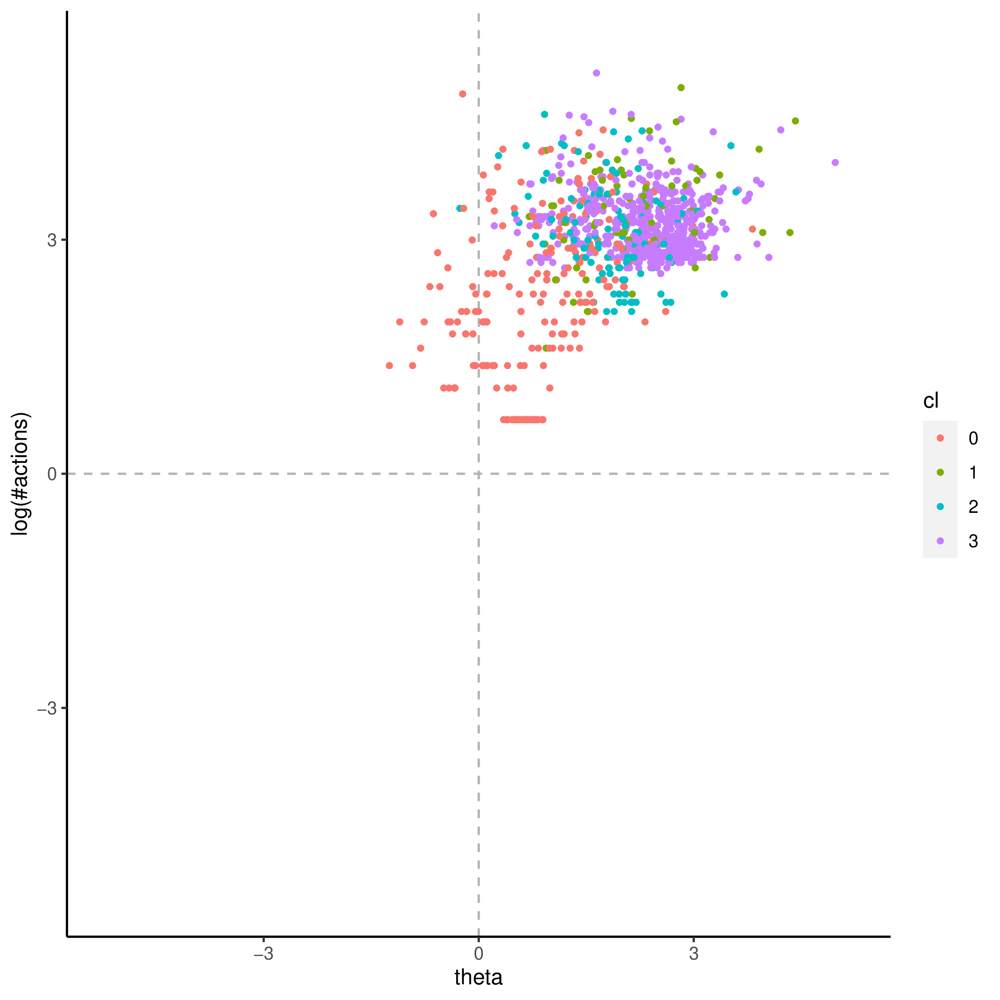
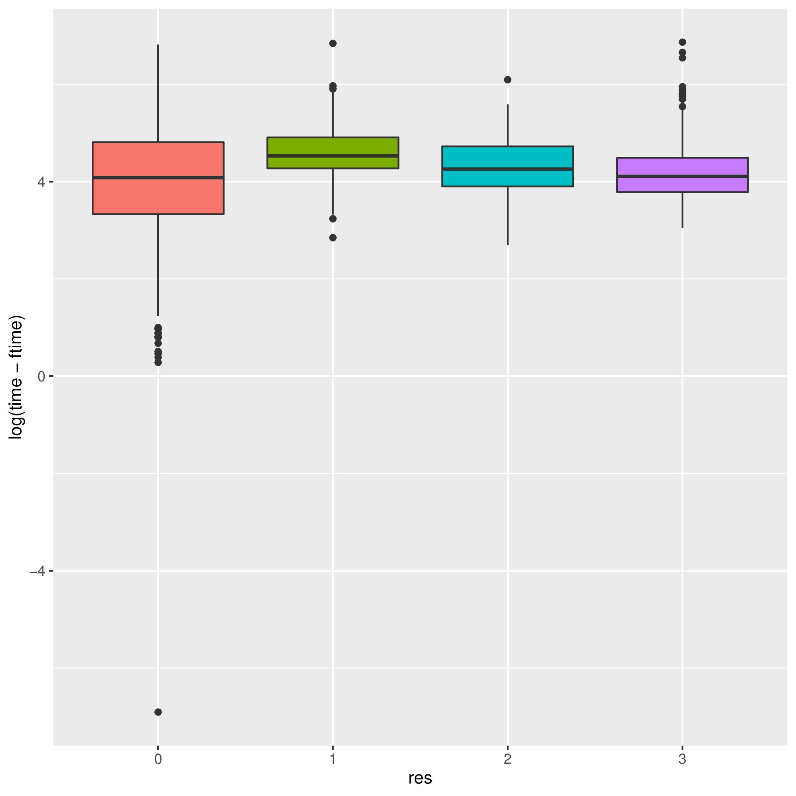
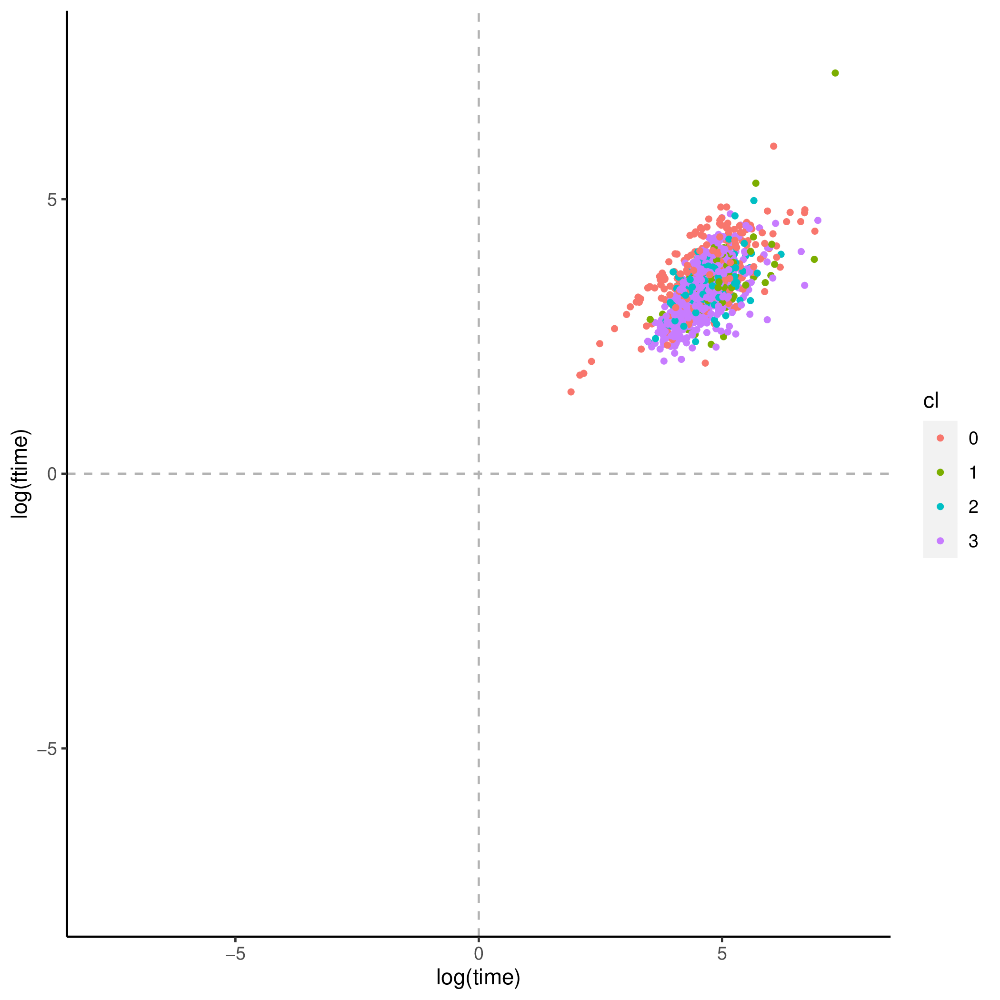
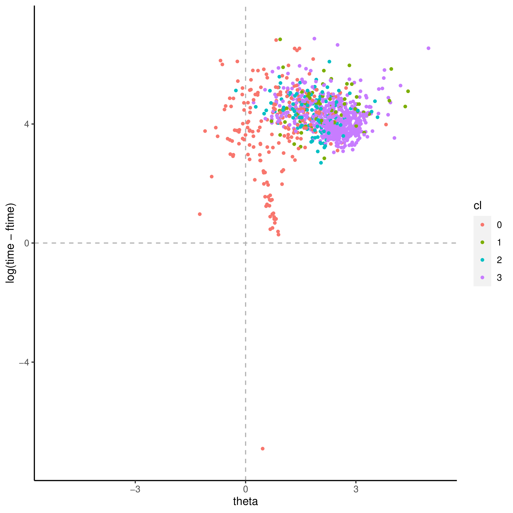
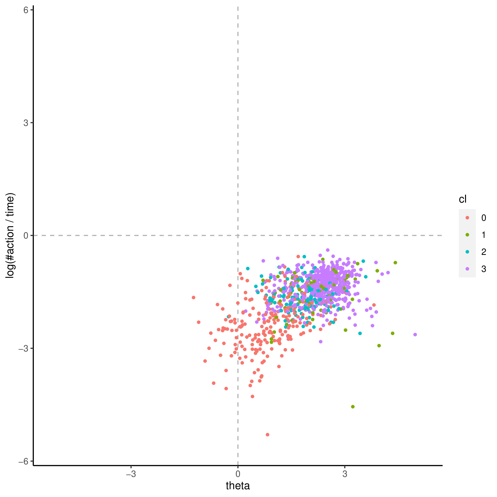
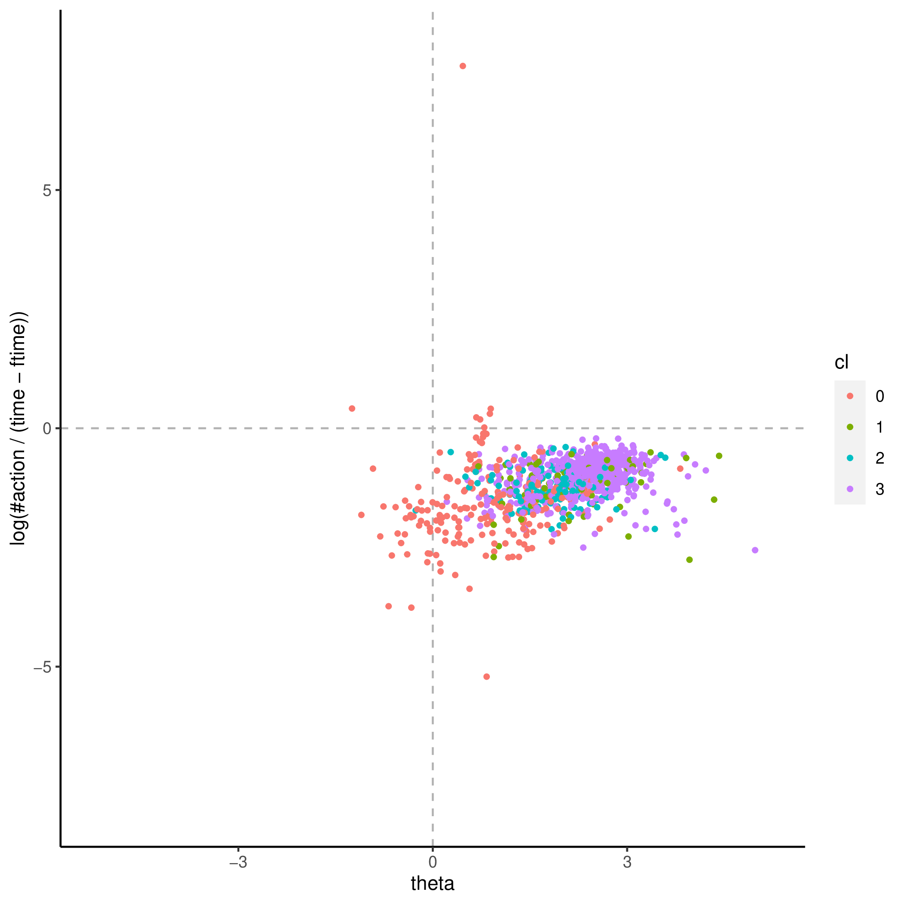
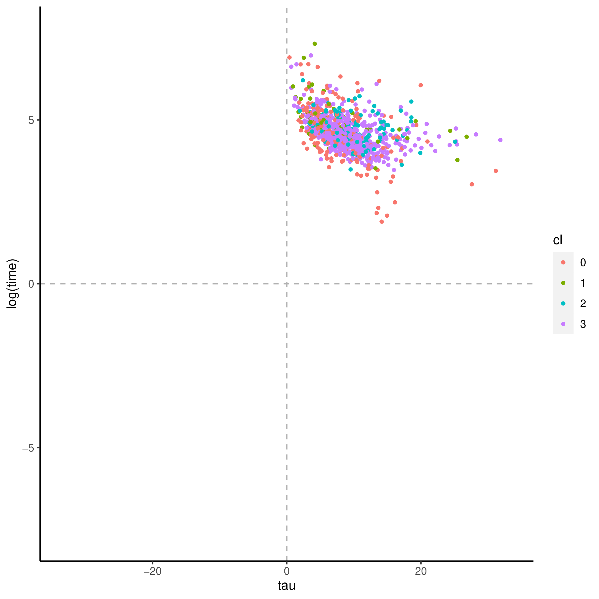
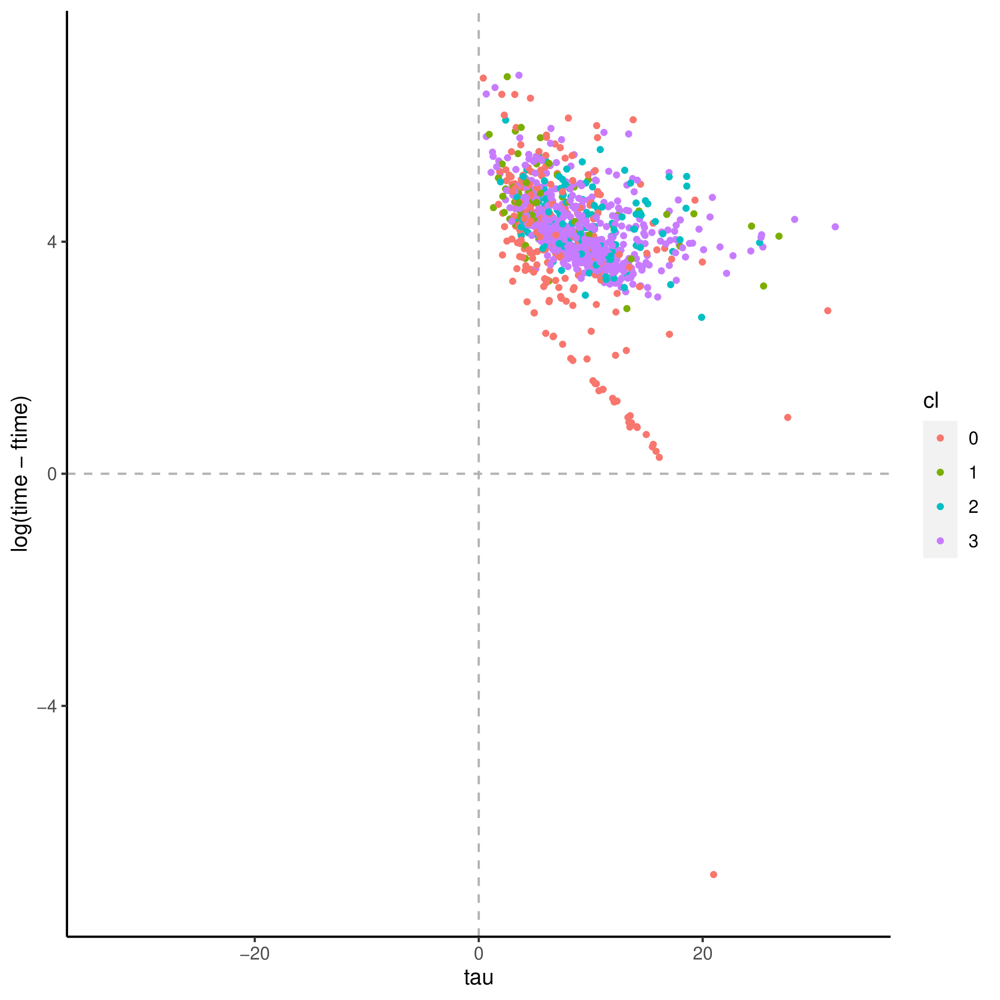
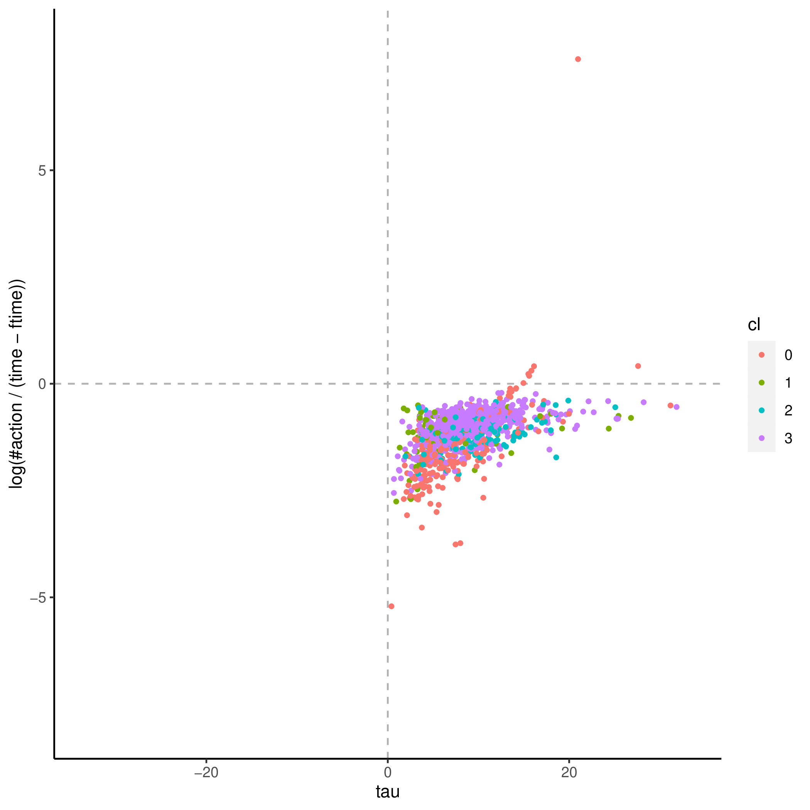

+++
title = "party_invitations-1"
author = ["Jonghyun Yun"]
lastmod = 2021-09-14T11:44:04-05:00
draft = false
+++

```sh
out_dir="party_invitations-1/"
cd $out_dir
cd figure
# convert -density 300 theta_tau_res.pdf theta_tau_res-%d.png
convert -density 300 time_action_more.pdf time_action_more-%d.png
convert -density 300 time_action.pdf time_action-%d.png
```

<figure/theta_tau_res.pdf>









